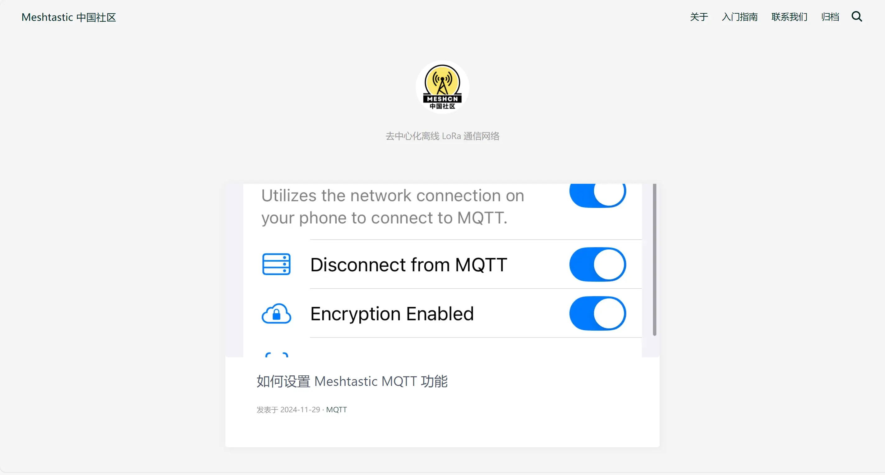

# Meshtastic China 中国社区网站

欢迎来到 Meshtastic China 中国社区网站的官方仓库！这个网站是 Meshtastic China 中国社区的核心平台，提供技术文章和交流。

**Meshtastic China** 网站是一个开放的社区平台，旨在为中国国内 Meshtastic 用户提供支持、信息和交流空间。网站包含了关于 Meshtastic 技术、使用指南以及技术支持的各类内容，是社区成员相互学习、协作创新的主要渠道。

我们致力于打造一个透明、开放的社区平台，让每一位用户都能从中受益，共同推动 Meshtastic 在中国的发展。

- **社区聚集地**：提供最新的社区动态以及技术讨论，促进用户间的沟通与合作。
- **使用文档**：详细的教程和技术文档，帮助用户快速理解和配置 Meshtastic 设备与网络。
- **技术支持渠道**：提供电子邮件支持、微信群等联系途径，解决用户遇到的各种问题。
- **贡献与开放**：鼓励社区成员贡献代码、内容或分享自己的使用经验，推动 Meshtastic 技术的创新与发展。

网站为社区驱动，所有内容和活动都致力于促进技术交流和创新，而非以营利为目的。

## 联系我们

如果您对网站内容或社区有任何疑问或建议，非常欢迎通过 [联系我们页面](https://meshcn.net/contact/) 上提供的邮箱与我们取得联系！我们期待您的声音，让社区变得更加完善。

想与本地的 Meshtastic 爱好者交流、分享经验，共同探索这项技术的无限可能吗？加入我们的 **Meshtastic 中国微信群**，与来自全国的伙伴们一起学习和成长！具体加入方法请访问 [联系我们页面](https://meshcn.net/contact/)。

## 如何贡献

整个网站所有内容开源，托管在你正在看的这个 [repo 仓库](https://github.com/chinamesh/meshtastic-china-www) 上，并通过 **Cloudflare Pages** 实现自动构建与发布，确保网站内容能够实时更新，随时反映社区的最新动态与变化。

我们欢迎社区成员为网站贡献内容，提供 bug 修复、功能增强等各类支持。如果您想参与，请随时 fork 仓库并提交 PR。

如果您想为 Meshtastic China 网站贡献力量，以下是简单的贡献流程：

1. **Fork 仓库**：将仓库克隆到本地，进行您想要的修改。
2. **修改内容**：更新网站内容，修复 Bug 或增强功能。
3. **提交 Pull Request**：完成修改后，提交 PR，我们会及时进行代码审核。

您的贡献将帮助 Meshtastic China 网站更好地服务于社区，推动 Meshtastic 在中国的进一步发展。
