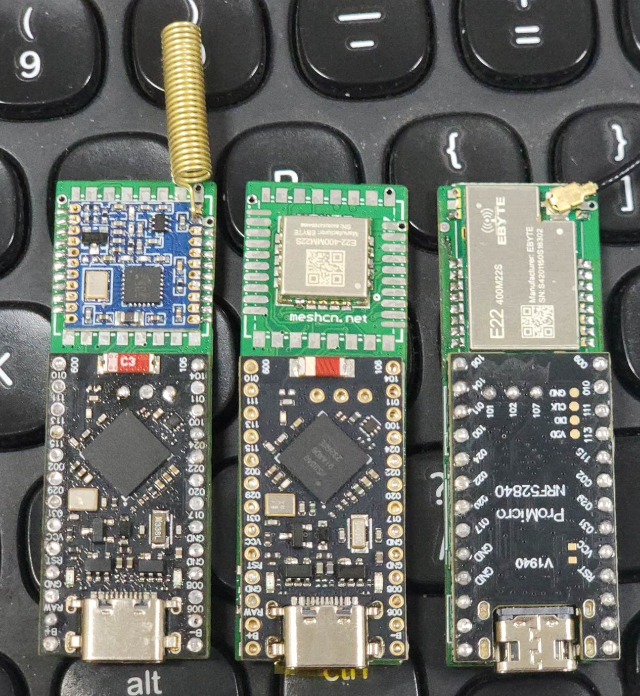
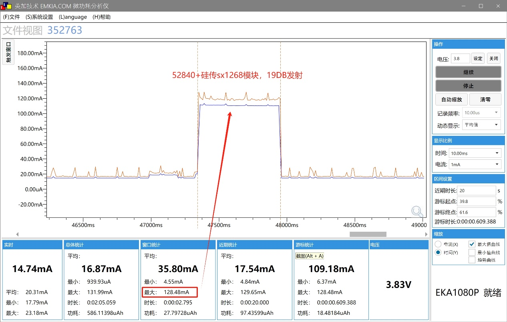
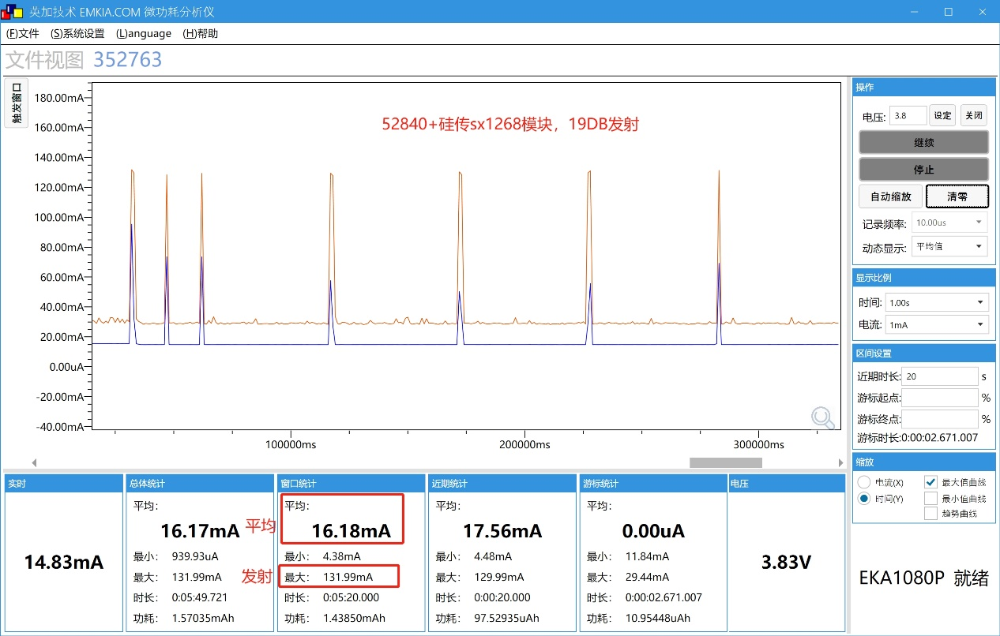
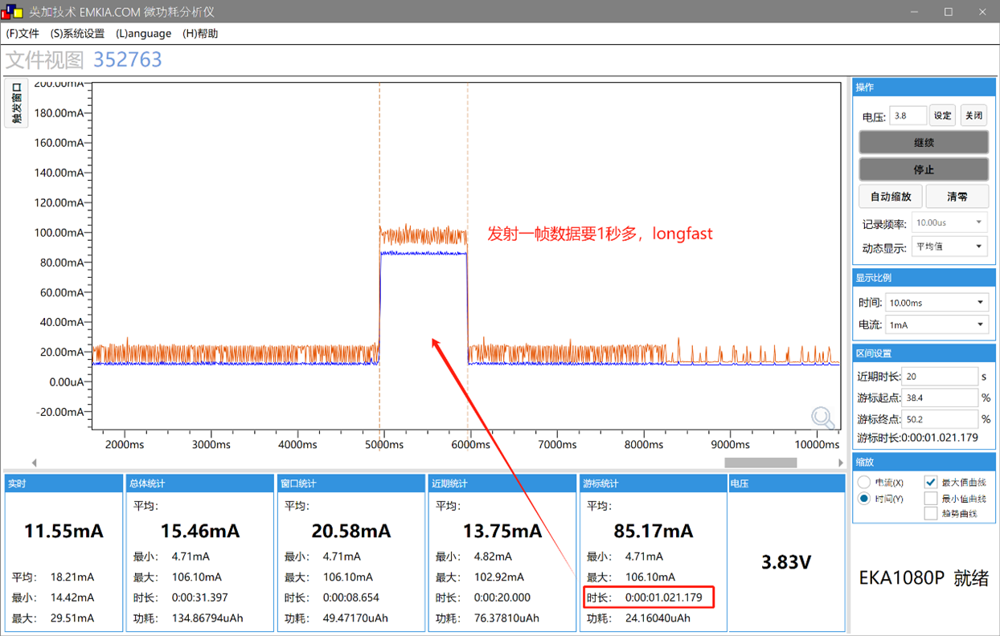
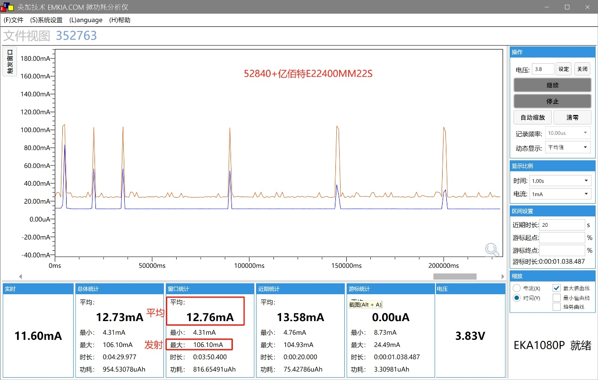
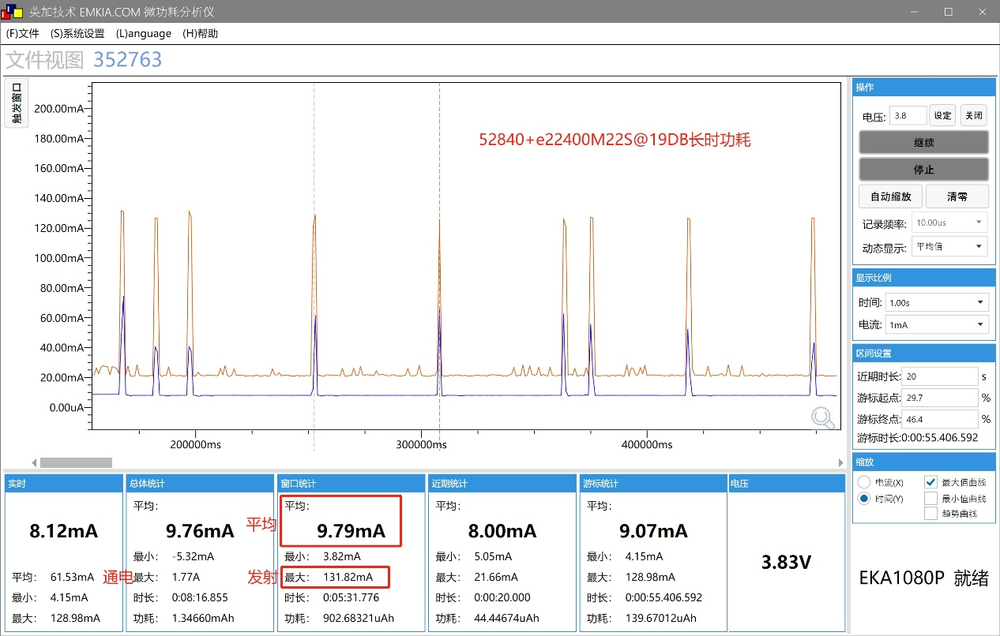
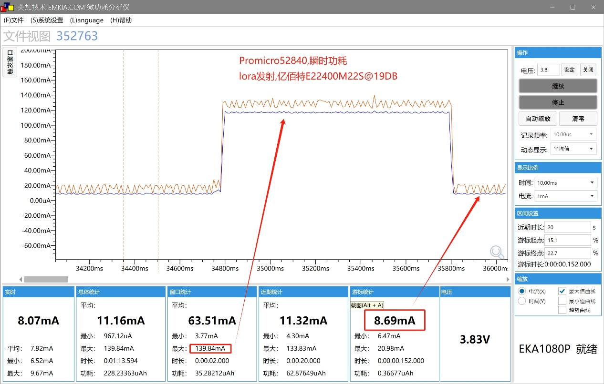



> 在此，特别感谢 Meshtastic 中国社区的资深成员 Yuri Su，他为本文的内容贡献了重要数据、缜密结论和宝贵的测试结果。这篇文章是在他原始稿件的基础上进行扩展而成，所有的数据都来源于他耐心且细致的测试。作为社区投稿的常客，Yuri 多次为大家分享了许多实用经验，他的支持和努力推动了 Meshtastic 项目在中国的发展。一言蔽之，没有 Yuri，就没有这篇文章。
> 
> 为了保证透明性和还原作者原意，原始投稿已被折叠至文章末尾，欢迎有兴趣的朋友点击展开查看。



在 Meshtastic 项目中，功耗是一个关键的设计因素，尤其是当设备需要长时间独立运行时。Meshtastic 作为一个基于 LoRa 技术的开源无线 mesh 通信系统，其设备常常部署在户外、天台楼顶或偏远地区，依赖电池和太阳能供电。因此，测试不同射频模块的功耗表现，对于优化设备的电池续航能力和提升系统的能效至关重要。

首先，[功耗对于太阳能节点的功率预估非常重要](/T114-solar-panel-requirement-calculate/)。在 Meshtastic 的应用场景中，通过测试不同 LoRa 模块的功耗数据，我们可以准确地计算所需的电池容量和太阳能板的功率。例如，如果一个射频模块在接收模式下的功耗较高，那么为确保设备能在没有阳光时持续运行，就需要配置更大的电池容量和更高功率的太阳能板。反之，如果模块在空闲状态下的功耗较低，那么所需的电池容量和太阳能面板的功率要求则会减少，从而降低成本并延长设备的工作时间。

其次，功耗与信号强度、价格之间的平衡是 Meshtastic 设备设计中的另一个重要考虑因素。Meshtastic 的核心目标是实现长距离、低功耗的无线通信，但这并不意味着功耗越低越好。在一些应用场景中，设备可能需要在更远的距离内稳定通信，这就要求射频模块具备更高的发射功率，从而导致更高的功耗。因此，我们必须在功耗、通信距离和成本之间做出权衡。

此外，Meshtastic 的设备通常处于低功耗待机状态，只有在接收到广播包时才会激活并进行数据传输。因此，了解不同模块在接收状态下的功耗非常重要，因为这直接影响到设备在大部分时间内的能耗。



本次测试将重点比较三款国内市场常见的 LoRa 射频模块——硅传 SX1268、亿佰特 E22 400MM22S 和 E22 400M22S，分析它们在 Meshtastic 配置下的功耗差异。

我们将测试它们在不同工作模式下的发射电流、接收电流和平均电流，以便为 Meshtastic 用户提供更准确的电池容量、太阳能供电和设备续航的参考数据。此外，这些测试结果还将有助于我们根据具体需求选择最合适的射频模块，既保证通信质量，又最大限度地提高设备的能效。

## 测试环境

每个 LoRa 射频模块都与一个 Pro Micro nRF52840 开发板相连接，这三个开发板均为相同型号，确保硬件一致性。ProMicro nRF52840 是一款基于 nRF52840 微控制器的开发板，支持低功耗蓝牙（BLE），适合作为 Meshtastic 节点的主控设备。在测试过程中，这些开发板均运行相同的 Meshtastic 固件，并且保持完全相同的配置。

为了进一步模拟实际的 Meshtastic 应用场景，我们采用了以下具体设置：

- 广播间隔：设置为 60 秒，模拟正常的低频信息广播模式。
- 区域（`REGION`）：CN 中国
- 发送模式：LongFast

| 参数                | 数值       |
| --------------------- | ------------- |
| 频率               | 478.875 MHz   |
| 广播间隔           | 60秒          |
| 发送模式           | LongFast      |
| 功率设置           | 19 dBm        |
| 频道数             | 160           |
| 信道宽度           | 250 kHz       |
| 射频增益           | 增强模式      |
| 工作频段           | 470 MHz - 510 MHz |
| 当前限制           | 140 mA        |
| LoRa比特率         | 118.39 bps    |

为了模拟真实的硬件运行状态，每个 LoRa 模块都连接了相应的天线。硅传 SX1268 使用了原装的弹簧天线，而亿佰特的两款模块则配备了它们自带的外部天线。

此外，测试设备在接收状态下运行时间较长，仅在广播间隔触发时进入发射状态，以符合 Meshtastic 节点的实际工作模式。实际情况中，广播间隔为 10800 秒，因此大多数时间模块都处于接收状态。

为了验证配置和获取实时工作状态，使用串口命令行输出了 Meshtastic 的详细运行参数。以下是部分关键输出内容，展示了射频模块的初始化、频率设置以及工作模式：

```powershell
Radio freq=478.875, config.lora.frequency_offset=0.000
Set radio: region=CN, name=LongFast, config=0, ch=35, power=19
myRegion->freqStart -> myRegion->freqEnd: 470.000000 -> 510.000000 (40.000000 MHz)
numChannels: 160 x 250.000kHz
channel_num: 36
frequency: 478.875000
Slot time: 77 msec
Set radio: final power level=19
SX126x init result 0
Frequency set to 478.875000
Bandwidth set to 250.000000
Power output set to 19
Current limit set to 140.000000
Current limit set result 0
Set DIO2 as RF switch, result: 0
Use MCU pin 17 as RXEN and pin -1 as TXEN to control RF switching
Set RX gain to boosted mode; result: 0
SX1268 init success
LoRA bitrate = 118.394310 bytes / sec
```

## 测试结果

在本次测试中，我们对三款 LoRa 射频模块进行了全面的功耗评估，分别是硅传 SX1268、亿佰特 E22 400MM22S 和亿佰特 E22 400M22S。这三款模块代表了市场上广泛使用的 LoRa 射频模块，并且在 Meshtastic 中国社区里中也有着较为广泛的应用。

- 硅传 SX1268：该模块使用了外部天线，在测试时采用了硅传的弹簧天线。由于该模块的发射功率和接收灵敏度相对较高，我们预计其功耗会偏大。
- 亿佰特 E22 400MM22S：该模块使用了原装天线。
- 亿佰特 E22 400M22S：该模块也使用了原装天线，并且同样配备了温补晶振（TCXO）。在理论上，配备温补晶振的模块功耗应该较大，但我们在测试中观察到，它的功耗却比预期的要低。

在测试过程中，每个模块都通过 ProMicro 52840 开发板进行驱动，并且这三款开发板均为同款，确保了测试的公平性与准确性。每款模块的测试环境、配置参数以及天线选择都保持一致，保证了测试结果的可比性。

我们使用微功耗分析仪测量了三款模块在不同工作状态下的功耗，结果如下表所示：

| 名称                | 最大发射电流 | 接收电流 | 平均电流 | 24 小时耗电 |
| ------------------- | ----------- | -------- | -------- | ------- |
| 硅传 SX1268      | 130 mA       | 14.74 mA  | 16.18 mA  | 388 mAh  |
| 亿佰特 E22 400MM22S | 106 mA       | 11.60 mA  | 12.76 mA  | 306 mAh  |
| 亿佰特 E22 400M22S  | 139 mA       | 8.12 mA   | 9.79 mA   | 235 mAh  |

### 硅传 SX1268 功耗








### 亿佰特（Ebyte）E22 400MM22S 功耗



### 亿佰特（Ebyte）E22 400M22S 功耗







## 分析

### 发射电流

从表格中可以看出，三款模块在最大发射电流时的表现差异较大。硅传 SX1268 的发射电流最大，达到了 130mA，而亿佰特 E22 400MM22S 则相对较小，为 106mA，亿佰特 E22 400M22S 则为 139mA。尽管亿佰特 E22 400M22S 配备了温补晶振，但其发射电流并未如预期那样更高，反而较低。


### 接收电流

硅传 SX1268 在接收模式下的功耗最高，达到 14.74mA。亿佰特 E22 400MM22S 和 E22 400M22S 的接收电流分别为 11.60mA 和 8.12mA，其中 E22 400M22S 的接收电流最低，显示其在低功耗接收状态下的表现较为优越。


### 平均电流和 24 小时耗电量

硅传 SX1268 的平均电流为 16.18mA，24小时的耗电量为 388mAh，表现为较高的功耗。亿佰特 E22 400MM22S 的平均电流为 12.76mA，24小时耗电量为 306mAh，稍低于硅传 SX1268。然而，亿佰特 E22 400M22S 的表现最为节能，平均电流仅为 9.79mA，24小时的耗电量为 235mAh，显示出其优越的低功耗特性。

### 结果总结

在最大发射电流方面，E22 400M22S 的表现虽然与硅传 SX1268 类似，但由于其更低的接收电流和较低的平均电流，整体功耗较低。

虽然 E22 400MM22S 配备了温补晶振，但在实际测试中其功耗表现并不如预期那样显著增加，反而显示出它的功耗控制较为高效。

综合来看，亿佰特 E22 400M22S 是功耗最小的模块，其在待机状态下的电流消耗远低于其他两款模块，非常适合需要长时间运行且依赖太阳能供电的场景。

## 实际场景

根据以上测试结果，我们可以推算出所需的电池容量和太阳能板的功率需求。假设每个设备每小时广播一次包，且根据测试数据进行计算。

### 24小时电池需求

在本次测试中，我们设置的广播间隔为 60 秒，这个间隔时间相对较短，且比一般 Meshtastic 中国社区群友常见的设置频率要高。社区中的许多用户选择的广播间隔通常会更长一些，比如 5 分钟、10 分钟，甚至是更长，这意味着实际应用中的功耗可能会低于我们的测试数据。因此，在估算电池需求时，我们需要根据具体的广播间隔以及实际的使用场景进行调整。

以 硅传 SX1268 为例，通过测试得知，每天的耗电量为 388mAh。如果你的设备设置的广播间隔较长，或者设备处于较长时间的接收状态，那么电池的实际耗电量将会比测试结果低。但如果广播间隔较短或设备频繁发射数据，则电池消耗将会增加。在这种情况下，建议将计算值的 3 倍作为电池容量的实际需求，以确保设备能够在没有阳光或者环境不佳的情况下持续稳定运行。

例如，如果每天的耗电量为 388mAh，那么为了应对环境变化和确保设备能够在较长时间内正常工作，建议电池容量为 388mAh × 3 = 1164mAh。这一容量考虑到了可能的实际功耗波动以及环境因素的影响，如天气变化或太阳能充电效率的不稳定，能够为设备的续航提供更大的保障。

### 太阳能板所需功率估算

假设阴天持续 3 天，所需电池容量为 1164mAh × 3 = 3492mAh。若太阳能板能够在 5 小时内充满电池，那么所需太阳能板功率为：3492mAh / 5 = 698mA。按 5V 电压计算，太阳能板功率为：698mA × 5V = 3.49W。这样可以确保设备在长时间无阳光的环境中也能稳定运行。

这也为我们提供了选择太阳能板的初步依据，确保设备即便在较长时间内处于低光照环境下，仍能维持良好的工作状态。




## ProMicro52840主控下各种模块的功耗排名

首先说明一下啊，这个测试是在应用层面进行的，与厂家的测试环境肯定有区别，应该是更加接近实际，然后设置的参数是一致的，看了一下，meshtastic配置为CN，信息广播间隔修改为60秒，其他参数默认，发送模式为LongFast。

 

实际情况广播间隔是10800秒，所以整个模块大部分时间应该是工作在接收状态的。

 

实际参数如下：


```powershell
Start meshradio init

Radio freq=478.875, config.lora.frequency_offset=0.000

Set radio: region=CN, name=LongFast, config=0, ch=35, power=19

myRegion->freqStart -> myRegion->freqEnd: 470.000000 -> 510.000000 (40.000000 MHz)

numChannels: 160 x 250.000kHz

channel_num: 36

frequency: 478.875000

Slot time: 77 msec

Set radio: final power level=19

SX126x init result 0

Frequency set to 478.875000

Bandwidth set to 250.000000

Power output set to 19

Current limit set to 140.000000

Current limit set result 0

Set DIO2 as RF switch, result: 0

Use MCU pin 17 as RXEN and pin -1 as TXEN to control RF switching

Set RX gain to boosted mode; result: 0

SX1268 init success

LoRA bitrate = 118.394310 bytes / sec
```


我这里只测试了3个射频模块，从左到右分别是 硅传，400MM22S，400M22S。

 

我原本以为这里面唯一一个用温补晶振「亿佰特E22 400M22S」功耗会大一些，结果却是反过来。

另外「亿佰特E22 400MM22S」发射电流比较小，不知道实际距离如何，有待测试。（图片没有天线，我测试时把硅传的弹簧天线装上去了）

 

直接总结吧：

| 名称                | 发射电流max | 接收电流 | 平均电流 | 24h耗电 |
| ------------------- | ----------- | -------- | -------- | ------- |
| 硅传sx1268          | 130ma       | 14.74ma  | 16.18ma  | 388mah  |
| 亿佰特E22  400MM22S | 106ma       | 11.60ma  | 12.76ma  | 306mah  |
| 亿佰特E22  400M22S  | 139ma       | 8.12ma   | 9.79ma   | 235mah  |

因为我模拟了至少60秒一个包，实际情况可能会有出入，按照经验电池的容量应该是计算值的3倍，比如24小时耗电100ma，那么我就按照300ma/天。再计算太阳能的情况，可能会持续3天阴天，即300 x 3=900mah的电池比较靠谱。太阳能板的计算是按照5小时能够充满比较稳，即900/5=180ma，180ma x 5v=0.9W。




