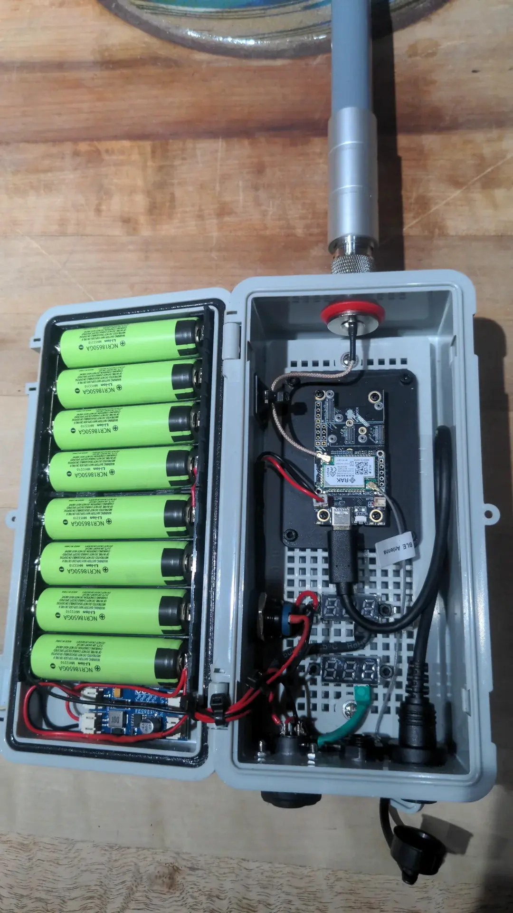
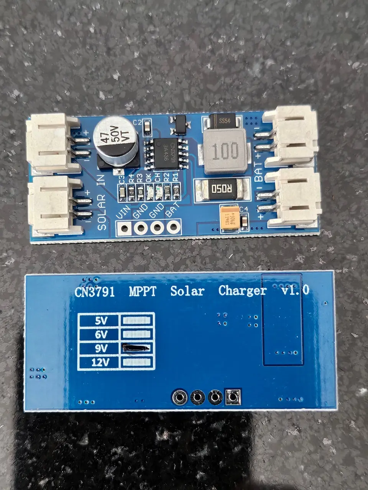

这篇文章会使用 [Heltec T114 作为案例](https://meshcn.net/heltec-t114-portable-meshtastic-node/) 讨论我如何制作太阳能节点。

当我们选择用 Heltec T114 构建太阳能供电节点时，经常面临两个问题：
1. 直接使用 T114 自带的太阳能输入接口，还是额外使用 MPPT 控制器？
2. 应该选择多大功率的太阳能板？电流、电压应该选择多少？

经过实验得出，T114 自带太阳能输入接口和 MPPT 控制器相比，两者在效率和适用性上差异显著。

更重要的是，为两种方法选择合适规格的太阳能板，需要进行科学的计算，包括考虑设备需求和冗余系数。

## 效率：T114 默认太阳能输入接口 vs MPPT 控制器

在构建太阳能供电系统时，如何最大化利用太阳能板的输出功率是一个关键问题。Heltec T114 提供了一个默认的太阳能输入接口，支持直接连接太阳能板。然而，这种方式由于缺乏动态优化机制，在效率和性能上有明显的局限性。相比之下，外置的 MPPT 控制器能够通过最大功率点追踪技术（MPPT，Maximum Power Point Tracking），显著提升能量转化效率，充分发挥太阳能板的性能。

为了便于理解，我们将在下文详细对比 T114 默认接口和 MPPT 控制器的效率表现，并通过数据和公式逐步展示这些结论的计算依据。

### 默认太阳能输入接口

Heltec T114 的默认太阳能输入接口并非高效能量转换电路，而是简单的充电电路：
- 固定电压要求：至少 4.2V 才能开始充电，推荐电压范围为 5V-6V。
- 输入功率限制：无法动态优化太阳能板的输出，因此利用率低。

[实际测试](https://youtu.be/FcQzAxWBN7A) 中：
- 使用 1W、6V 的太阳能板时，充电电流仅为 31mA。
- 充电功率计算如下：
  $$
  P_{\text{充电}} = V_{\text{电池}} \times I_{\text{充电}} = 4.2 \text{V} \times 0.031 \text{A} = 0.13  \text{W}
  $$
- 太阳能板输出功率为 1W，则效率为：
  $$
  \text{效率} = \frac{P_{\text{充电}}}{P_{\text{太阳能板}}} \times 100 = \frac{0.13}{1} \times 100 = 13 \%
  $$

### 把 T114 接上外置控制器

MPPT 控制器通过动态调节输入电压和电流，实现最大功率点追踪 MPPT（Maximum Power Point Tracking），高效提取太阳能板的输出功率：
- 宽电压适应范围：通常支持 3V-18V，甚至更高。我建议选择 6V 规格的 MPPT 控制器。
- 动态优化：能自动调整电压与电流关系，使太阳能板始终工作在最佳功率输出点。

实际测试中：
- 使用相同的 1W、6V 太阳能板时，充电电流可以达到 100-200mA。
- 取中间值 150mA 计算充电功率：
  $$
  P_{\text{充电}} = V_{\text{电池}} \times I_{\text{充电}} = 4.2 \text{V} \times 0.15 \text{A} = 0.63 \text{W}
  $$
- 太阳能板输出功率为 1W，则效率为：
  $$
  \text{效率} = \frac{P_{\text{充电}}}{P_{\text{太阳能板}}} \times 100 = \frac{0.63}{1} \times 100 = 63\%
  $$

### 效率对比总结

| 对比项            | T114 默认接口        | MPPT 控制器       |
|-----------------------|-------------------------|-----------------------|
| 充电电流          | 31mA                   | 100-200mA            |
| 效率              | 13%                    | 63%-90%              |
| 适应太阳能板电压范围| 4.2V-6V                | 3V-18V               |
| 推荐使用场景      | 简单应用，低功耗设备    | 高效率需求，高性能应用 |

## 二、如何计算太阳能板规格

先说结论：

| 输入方式       | 最低功率需求 | 推荐太阳能板最低功率规格 | 推荐电压范围 |
|--------------------|-----------------|-----------------|-----------------|
| T114 默认接口 | 2.3W           | 3W             | 5V-6V          |
| MPPT 控制器   | 0.48W          | 1W             | 5V-6V          |

以下讲解这个结论如何得出。为 T114 配备合适的太阳能板，需要考虑以下因素：
1. 设备每日能量需求：包括 T114 自身的功耗和负载功耗。
2. 日照时间：当地每日有效日照时间。
3. 冗余系数：考虑阴雨天气或光照不足时的能量储备。

### 计算 T114 的每日能量需求及太阳能板规格

为确保 Heltec T114 在太阳能供电下能够稳定运行，首先需要明确设备的每日能耗，然后结合供电方式和效率，计算出太阳能板的额定功率和规格。

在一些环境条件较为严苛，或者需要系统具备更高冗余度的情况下，可以通过以下方法调整参数，使系统即便在阴雨天气持续时间超出预期或雨季更加频繁的情况下，依然能够正常运行：

- 调整待机电流假设值为更高范围。目前假设值为 9 毫安（mA），但 nRF52 系列的平均待机电流通常在 9 mA 到 15 mA 之间。  
- 将每日平均有效日照时间的假设值调低（例如，从 4 小时减少到更保守的值）。  
- 增大冗余系数 $K_{\text{冗余}}$ 的取值。例如，目前取值为 $1.5$，可以根据需求适当增加。  
- 假设更低的系统效率。根据初步实验，自带的太阳能接口的充电效率约为 $13\%$，而 MPPT 充电器（通常使用 CN 系列的 IC）的效率约为 $63\%$。

通过这些保守的假设和调整，可以有效提高太阳能节点的可靠性，确保系统在极端条件下仍能稳定运行。

#### 1. T114 的每日能量需求计算

T114 的功耗非常低。以其平均待机电流约 $ 9 \text{mA} $ 为例，假设其运行所需电池电压为 $ 3.7 \text{V} $（T114 典型值），则其每日能量需求可通过以下公式计算：
$$
E_{\text{需求}} = V_{\text{电池}} \times I_{\text{待机}} \times T_{\text{每日工作时间}}
$$
若设备全天候运行（24小时），代入相关参数：
$$
E_{\text{需求}} = 3.7 \text{V} \times 0.009 \text{A} \times 24 \text{h} = 0.8 \text{Wh}
$$
因此，T114 每日需要约 $ 0.8 \text{Wh} $ 的电能。

#### 2. 太阳能板输出功率需求计算

要满足 T114 的每日能量需求，太阳能板的输出功率需要与当地的日照条件相匹配。假设当地每日平均有效日照时间为 $ 4 \text{小时} $，太阳能板的输出功率可以通过以下公式计算：
$$
P_{\text{太阳能板}} = \frac{E_{\text{需求}} \times K_{\text{冗余}}}{T_{\text{日照}}}
$$
其中：
- $ K_{\text{冗余}} $：冗余系数，用于预防阴雨天气或光照不足，建议取值 1.5-2。
- $ E_{\text{需求}} = 0.8 \text{Wh} $。
- $ T_{\text{日照}} = 4 \text{小时} $。

假设冗余系数 $ K_{\text{冗余}} = 1.5 $，代入公式得：
$$
P_{\text{太阳能板}} = \frac{0.8 \times 1.5}{4} = 0.3 \text{W}
$$
因此，为满足 T114 的每日能量需求，最低需要功率为 $ 0.3 \text{W} $ 的太阳能板。

#### 3. 结合不同输入方式调整太阳能板规格

不同的输入方式（T114 默认接口或 MPPT 控制器）会影响太阳能板的效率，因此需要分别计算所需太阳能板的功率。

1. **使用 T114 默认接口**  
   Heltec T114 默认的太阳能输入接口效率较低，仅约 $ 13\% $。为了弥补效率损失，太阳能板需要提供更高的功率，其计算公式为：
   $$
   P_{\text{太阳能板，默认接口}} = \frac{P_{\text{需求}}}{\text{效率}}
   $$
   代入效率 $ 13\% $ 和需求功率 $ 0.3 \text{W} $：
   $$
   P_{\text{太阳能板，默认接口}} = \frac{0.3}{0.13} \approx 2.3 \text{W}
   $$
   **推荐规格**：选择额定功率为 $ 3 \text{W} $、电压为 $ 6 \text{V} $ 的太阳能板，以确保有足够冗余。

2. **使用 MPPT 控制器**  
   MPPT 控制器效率较高，通常可达 $ 63\% $。相比 T114 默认接口，所需太阳能板功率较低。计算公式为：
   $$
   P_{\text{太阳能板，MPPT}} = \frac{P_{\text{需求}}}{\text{效率}}
   $$
   代入效率 $ 63\% $ 和需求功率 $ 0.3 \text{W} $：
   $$
   P_{\text{太阳能板，MPPT}} = \frac{0.3}{0.63} \approx 0.48 \text{W}
   $$
   **推荐规格**：选择额定功率为 $ 1 \text{W} $、电压为 $ 6 \text{V} $ 的太阳能板即可满足需求。

#### 4. 太阳能规格对比总结

| **输入方式**       | **最低功率需求** | **推荐功率规格** | **推荐电压范围** |
|--------------------|-----------------|-----------------|-----------------|
| **T114 默认接口** | $ 2.3 \text{W} $ | $ 3 \text{W} $ | $ 5 \text{V} - 6 \text{V} $ |
| **MPPT 控制器**   | $ 0.48 \text{W} $ | $ 1 \text{W} $ | $ 5 \text{V} - 6 \text{V} $ |

通过以上计算，可以根据实际使用场景选择合适的太阳能板和输入方式。

如果预算和效率要求较高，建议优先选择 MPPT 控制器；若追求简单安装和低成本，T114 的默认接口也能满足基本需求。

## 三、注意事项 ⚠

在使用 Heltec T114 进行太阳能供电时，需要注意以下几个关键点，以确保系统的稳定性和效率。首先，在选择太阳能板时，建议考虑增加功率冗余系数，通常取 1.5 至 2 倍的需求功率。在阴雨天或冬季，光照条件通常会较差，实际输出功率可能远低于额定值。冗余设计可以有效应对这种情况，确保设备在低光照条件下仍能正常运行。我设计自己的太阳能节点，使用了 3 倍的需求功率，冗余越多越安全。

其次，需要警惕商家的虚标问题。在市场上，一些太阳能板的标称功率和实际输出可能存在较大差距。因此，强烈建议在购买太阳能板后，使用万用表在太阳光充足的情况下测量其实时电流和功率。这一步骤可以帮助确认太阳能板的真实性能是否符合预期，从而避免使用低效率的产品影响整个系统的可靠性。

另外，为了保护电池，建议添加电池保护模块（BMS）。BMS 能够在电池过充或过放时自动断开电路，防止电池损坏。尤其是在长期户外使用的情况下，电池电压可能在夜晚或光照不足时过度下降，导致电池性能衰减甚至损坏。使用 BMS 可以有效延长电池的使用寿命。

最后，需要特别注意太阳能板的电压范围。Heltec T114 默认太阳能接口设计的电压范围为 5V 至 6V，过高的输入电压（如 12V）可能会损坏设备。尤其是在使用较大功率的太阳能板时，更应确保电压符合设备的规格要求。如果需要使用电压范围较宽的太阳能板，建议额外搭配 MPPT 控制器，以对电压和电流进行优化调整，既能保护设备，又能提高充电效率。

综上所述，通过合理的冗余设计、严谨的性能测试、电池保护模块的应用，以及合规的电压选择，可以确保 Heltec T114 的太阳能供电系统高效稳定地运行，无论是在晴天还是阴天都能满足设备的用电需求。