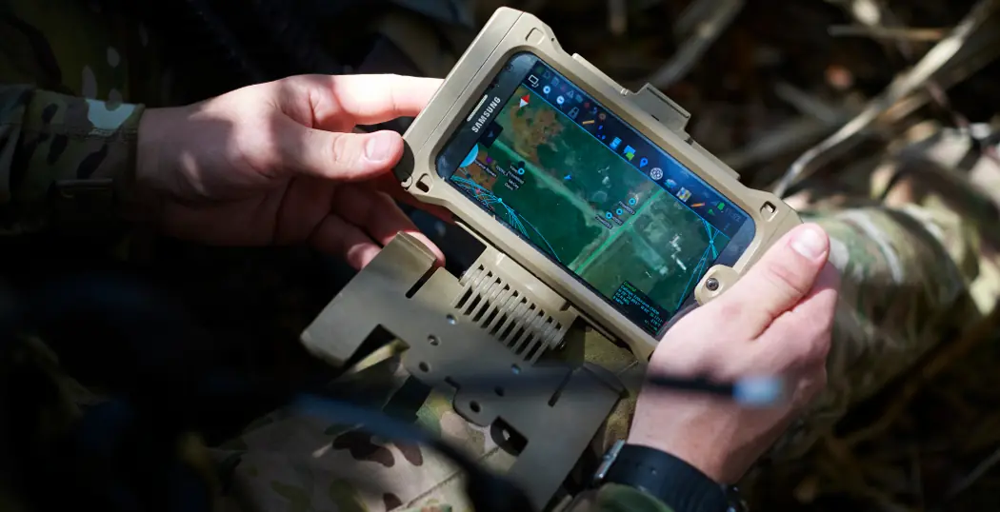
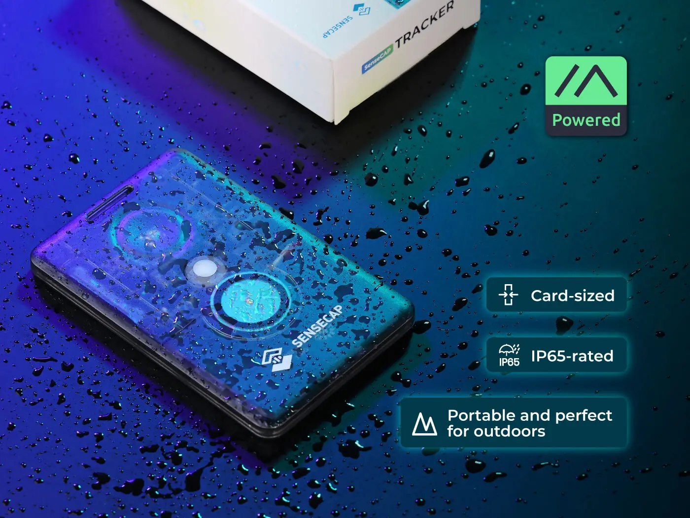
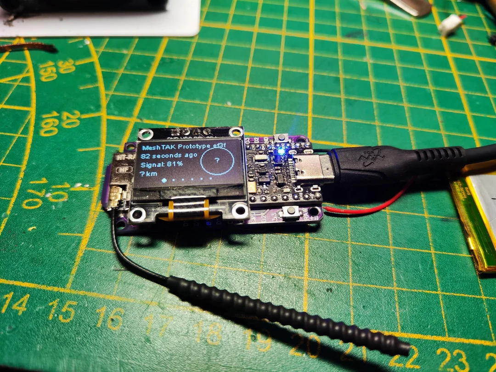
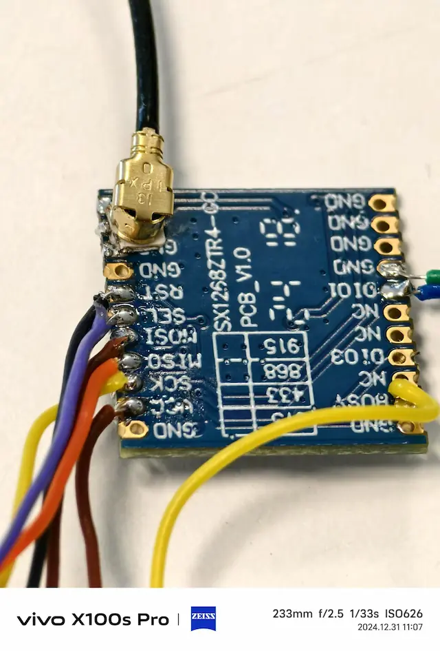
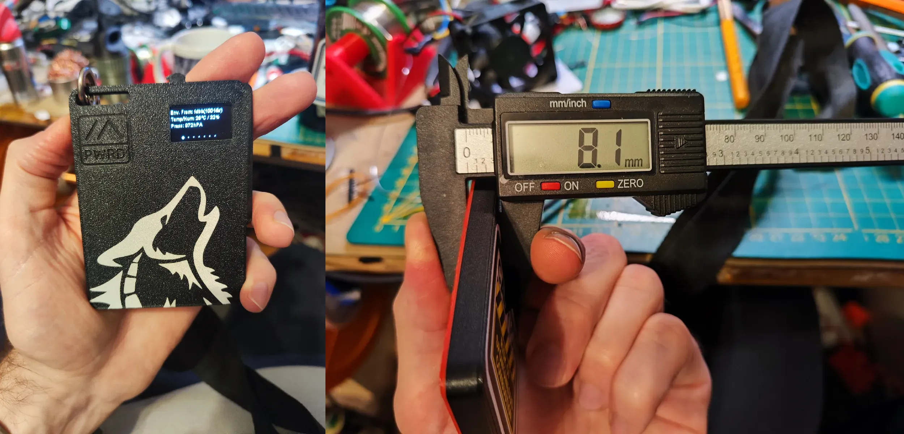

2024 年的最后一天，我们终于可以稍微松口气，放下手里的电烙铁，抹掉飞线上的助焊剂（焊武帝们：你们真的放下了吗？）。

回顾这一年，我们不仅在人数上从 70 飞跃到 140+，还意外地吸引了 Heltec、EByte、Seeed Studio 等厂商加入群聊，让他们一边围观我们的操作，一边感慨「用户真厉害，搞得我们都有点跟不上了」。

与此同时，社区内 DIY 的热潮也让无数「焊武帝」们登上了舞台，用二十几条飞线焊出了一个个充满奇迹的设备。

接下来，让我们一起重新翻开这一年的「Meshtastic 史记」，回顾那些高光时刻和精彩的梗，顺便也展望一下即将到来的 2025。Mesh On，开始了！

## 一、人数暴涨：140 人的热闹

两个月前，我们的 [微信群](/contact/) 还只有几十个人，彼时的 Meshtastic 中国社区更像一个小型技术讨论组，聊得最多的是几位老成员围绕节点部署展开的深度交流。为了让新手更快上手，我 [完成了所有 Meshtastic App 的中文翻译](/announcement-Chinese-translations-hundred-percent/)，进一步降低了语言障碍，让越来越多的新用户敢于尝试、参与讨论。

谁能想到，这一年时间里，社区人数竟然突破了 140 人，直接翻了两倍多！

这是一种什么概念？用群友的话来说，「以前群里聊得热闹的时候，一天也就两三百条消息；现在，消息量轻松破千，每天一不小心聊着聊着就聊到了凌晨。」  

### 覆盖中国大地：更多城市节点的亮起

人数的快速增长带来了更广泛的节点覆盖。2024 年，广州、深圳、杭州、上海依旧是热点城市，用户数量持续攀升，而武汉作为后起之秀，也在今年点亮了更多 Meshtastic 节点。

更令人惊喜的是，广西、黑龙江、辽宁这三个省份，首次在 Meshtastic 网络地图上亮起了光点。

社区的吸引力不仅局限于国内。这个月，我们迎来了两位来自非洲的特殊群友，他们的加入让 Meshtastic 的应用场景从技术极客的「小作坊」扩展到了广阔的国际舞台。他们的故事，既充满挑战，也展示了 Meshtastic 的无限潜力。

### 非洲农场主：让大农场有了「信号」

其中一位群友是一位来自非洲的国人农场主，他在群里分享了自己的特殊需求：「我的农场非常大，但通讯条件极差，当地连 2G 信号都没有。」他说，「我希望能用 Meshtastic 构建一个通信网络，让工作人员和设备之间实现快速沟通，从而提升农场管理效率和安保。」

这番话立刻引起了群友们的关注，大家纷纷为他出谋划策。有人建议使用高增益天线，增加节点间的覆盖范围；有人提议部署太阳能供电设备，保证节点在农场偏远区域的长期工作；有人提出在边界处增加人在传感器，通过 Meshtastic 自带的 Detection Sensor Module 自动触发警报信息；还有人热情地为他设计了一套完整的节点布局方案，帮助他最大化地利用 Meshtastic 的通信能力。

这位农场主的分享，也让群友们第一次深入了解了非洲农场的独特环境。他谈到农场的高温干燥气候对设备散热的严峻考验，还幽默地补充：「更别提野生动物可能随时来‘拜访’，把我的设备当玩具。」另一方面，他表示当地完全没有无线电监管，简直是群里无线电爱好者的理想国。

而这位农场主对 Meshtastic 的期待也非常高：「如果项目顺利，我会在农场所有重要区域都部署 Meshtastic 网络，结合 StarLink 技术，完成覆盖」。

### 非洲安全从业者：守护中国企业的屏障

另一位非洲群友则从事安全工作，致力于帮助中国企业在非洲的运营环境中获得更好的保护。他的计划则更为宏大：结合 Meshtastic 和 ATAK（Android Team Awareness Kit）技术，部署到当地的军警系统中。

在非洲，许多区域的通信条件极其有限，但突发事件却时有发生，如何快速应对和协调资源，始终是一个难题。而 Meshtastic 的特性——低功耗、远距离、无需运营商支持的点对点通信网络，正好填补了这一空白。  

他的计划是利用 Meshtastic 为军警系统提供低成本、高可靠性的通信支持，帮助他们快速响应突发状况，为中国企业及其员工提供更及时的安全保护。他解释道：「在非洲，许多地方没有信号，Meshtastic 的通信方案可以绕过这些基础设施瓶颈，真正实现哪里需要，哪里有信号。」  

群友们听完后，纷纷为他的创意点赞，更是热情地提供各种技术建议：  
- 优化节点的隐蔽性：用伪装外壳隐藏设备，防止被破坏。  
- 利用太阳能供电：确保设备在偏远地区的长时间运行。  
- 与无人机结合：通过空中节点扩大覆盖范围，实现区域监控。  

如果 Meshtastic 和 ATAK 的结合方案在非洲取得成功，将不仅是对中国企业的一大助力，也可能为其他国家和地区提供示范性解决方案。

## 二、厂家围观团扩容

### 新成员加入：从 EByte 到 Heltec 的产品经理

今年，Meshtastic 中国社区不仅吸引了更多用户，还吸引了厂商的目光，许多厂商代表亲自加入了群聊。

继 [上次趣闻中提到的 EByte 工程师](/announcement-ebyte-out-stock-70-people-community/) 之后，Heltec 和 Seeed Studio 的产品经理也纷纷加入社区，让原本的极客群顿时多了一些「科班色彩」。  

Heltec 的产品经理一进群就开始了「加班模式」，对用户提出的硬件疑问进行详尽解答。有一次，群友无意间在 Heltec T114 上发现了两个空白焊盘，立刻发到群里讨论。正巧，Heltec 的产品经理在场，大家才得知，这两个焊盘原来是设计给 RTC 和闪存 Flash 使用的，但在当前版本中并未激活。这番解答让群友大呼过瘾，纷纷感慨：「有产品经理在群里，真是硬核玩家的福音！」

与 Heltec 的技术硬核路线不同，Seeed Studio 的产品经理豆花在群里被冠以「召唤之神」的称号。原因很简单，她家的 SenseCap T100-E 设计得太棒了——这款卡片大小的便携 Meshtastic 节点，集成了 GPS、传感器、蜂鸣器、防水功能，甚至还有 1-2 天的续航时间。其外观小巧精致、功能丰富，简直满足了所有 Meshtastic 玩家对便携设备的幻想。

唯一的问题是，T100-E 当前仅支持 915 MHz 频段，而国内需要的 470-510 MHz 频段并未覆盖。于是，每天都有群友在讨论 T100-E 什么时候登录国内市场，豆花自然也成了被「许愿」最多的产品经理之一。

面对群友的花式许愿和召唤，豆花不得不站出来安抚大家的情绪：「支持 470 MHz 的版本，已经在我们公司内部提案了！大家稍安勿躁。」这样的回应虽然没有让大家立刻得到想要的产品，却让群友们看到了希望，纷纷表示「盼着新版本的 SenseCap 早日上市！」

厂商的加入让社区对产品的需求更加直接，甚至形成了「用户倒逼研发」的现象。比如，群友对 T100-E 的热情反馈，很可能会让它成为 470 MHz 版本提案通过的重要推动力。

然而，并非所有厂商都这么积极。社区曾尝试联系 Lilygo，希望能把他们的产品经理拉进群里。然而，Lilygo 的客服只回复了一句「我们会转达」，之后便再无下文。相比于 Heltec 和 Seeed Studio 的火速反馈，Lilygo 的「沉默回应」显得格外失望。

## 第三部分：焊武帝的崛起与 DIY 热潮

### faketec 项目：DIY 的新巅峰

在 DIY 热潮的推动下，2024 年的 Meshtastic 中国社区掀起了围绕 faketec 项目 的一场狂欢。这个开源项目起源于 GitHub，旨在以极低成本打造一款兼容 Meshtastic 的 nRF52 硬件节点。它充分利用市面上大量的 ProMicro nRF52 开发板，通过设计一个简单的扩展 PCB，将硬件搭建的难度和成本降到了极低。

faketec 的设计亮点让它成为了社区讨论的热点：  
- 尺寸兼容：板子的大小与 Heltec LoRa32 v2 和 v3 完全一致，可以直接使用现有的外壳。  
- 模块化扩展：支持 HT-RA62、RA-01SH、Ebyte E22 等主流 LoRa 模块，还能通过侧边的 I2C 接口连接屏幕，轻松实现信息显示。  
- 极致性价比：ProMicro 开发板约 10-20 元人民币，LoRa 模块约 20-30 元，其他元件加起来差不多 70-100 元，总成本仅为 Heltec T114 的三分之一到一半。  

这样的性价比和灵活性，让 faketec 成为 Meshtastic 用户 DIY 的不二之选。

后续社区也会陆续编写 faketec 相关教程和案例分享。

### 焊武帝的崛起：飞线的艺术

虽然 faketec 项目已经足够简单，但一些社区大神却并不满足于常规玩法。他们选择直接在贴片 IC 和模块之间飞线连接，省去 PCB 的使用。这种自虐式的焊接操作不仅挑战技术极限，还意外成为了一种艺术行为。

焊接完成的硬件照片被上传到群里，画面上十几根到二十几根飞线纵横交错，形成了极具冲击力的电子艺术画。而这些大神也被大家戏称为*焊武帝*（永远的谐音梗），成为社区中备受瞩目的存在。

群友调侃焊武帝的经典语录：  
> 「飞这么多线，不怕短路吗？」  
> 「焊武帝的眼睛肯定是 2.0 的视力吧，不然连脚位都找不到。」  
> 「焊接一时爽，调试火葬场。」  

但玩笑归玩笑，群友们对焊武帝的钦佩却是发自内心的。他们不仅展现了高超的焊接技术，更体现了对 Meshtastic 项目的极大热情。

### fakeCAP：卡片式设计的流行

社区还对 faketec 的外壳设计项目——fakeCAP 非常感兴趣。

这款外壳的灵感来源于 Seeed Studio 的 SenseCap T100-E，采用了便携的卡片式设计，但在功能上更进一步： 
- 新增旋钮和按键：支持快速操作 Meshtastic 的 canned message（预设消息） 功能，极大提升了实际使用的便捷性。
   
- 屏幕扩展：板载 OLED 屏幕接口，支持实时显示节点信息。  

faketec 和 fakeCAP 在社区的流行，是 Meshtastic 社区创造力和协作精神的体现。从硬件组装到外壳设计，再到飞线的「艺术」，社区用户用行动证明了：生命不息，折腾不止。

每一位焊武帝都会认同：「DIY 的乐趣，不只是做出一个硬件，而是把它变成你脑海中的那个样子。」

## 四、内容创作与技术传播

为了帮助社区成员快速找到所需的资源，Meshtastic 中国社区在本月上线了全新的栏目导航，进一步提升了用户体验。现在，读者可以通过网页右上角的导航栏，方便地访问以下栏目：  
- 📚 教程：涵盖从设备选择到固件刷写的全流程指导。  
- 💡 案例：展示群友们的真实部署案例，激发更多创意。  
- 📢 公告：及时了解社区的最新动态。  

这一改进让社区网站的内容组织更加清晰，也为新手提供了更直观的导航路径。

2024 年 12 月，社区博客持续发布了许多优质内容，其中几篇文章尤其受欢迎：  
1. 《[太阳能 Meshtastic 节点：自带太阳能接口 vs MPPT？太阳能板规格如何选？](https://meshcn.net/T114-solar-panel-requirement-calculate/)》
   这篇文章深入解析了太阳能供电方案，详细比较了不同太阳能接口和 MPPT 控制器的优势，还教大家如何选择合适的太阳能板。

2. 《[Meshtastic 设置私有频道说明](https://meshcn.net/meshtastic-private-channel-setup/)》
   广州群友 Yuri Su 贡献的这篇文章，详细讲解了如何设置私有频道，帮助许多用户解决了加密通信的难题。  

3. 《[【精简版】新手快速接入 Meshtastic MQTT 官方服务器](https://meshcn.net/short-tutorial-mqtt-android/)》
   另一篇由 Yuri Su 编写的文章，以简单明了的方式，指导读者使用 Android App 设置 MQTT。这篇文章被无数 MQTT 安卓新手称为「入坑第一救星」，也让 MQTT 功能更易于被普通用户接受和使用。在此，我们特别感谢广州群友 Yuri Su 的无私贡献。

本月，除了以上热门文章外，还有许多技术文章和趣味分享让人印象深刻：  
- 实用性内容：从《如何远程管理 Meshtastic 节点》到《三大新手常见错误》，这些文章为不同层次的用户提供了针对性指导。
- 科普向内容：《解锁天线增益与驻波的奥秘》和《从 dB 到 dBm 无线电信号的深入分析》为技术爱好者打开了无线电的知识大门。
- 趣味内容：《给你的 Meshtastic 加上可爱 Emoji 吧！》这样的文章，让技术爱好者也能体验到趣味十足的小细节。

这些丰富的内容，不仅帮助新手顺利入门，也让资深玩家找到新的灵感，充分体现了 Meshtastic 社区技术与创意齐飞的精神。

通过教程、案例和博客分享，Meshtastic 中国社区正在逐步形成一个知识库，为无线通信爱好者提供了从入门到精通的一站式服务。未来，我们期待看到更多社区小伙伴参与内容创作、分享部署案例，让 Meshtastic 的无线网络信号，不仅连接设备，也连接起每一位用户的热情与智慧。

## 五、展望 2025

在 2024 年，Meshtastic 中国社区之所以能快速发展，不仅是因为技术的吸引力，更是因为这个社区充满了热情和幽默。

2025 年，我们希望继续保持这样的氛围，让新手感受到包容与帮助，让资深玩家找到乐趣与挑战。

Meshtastic 不仅是一个技术项目，更是一个解决实际问题的平台。它在偏远地区带来的通信支持、在农场中的管理应用，以及在安全场景中的重要作用，都让我们看到了技术背后的社会价值。

这一年，我们用 LoRa 信号和焊锡构建社区。2025 年，让我们一起将 Meshtastic 的信号传播得更远。

Mesh On，新年快乐！