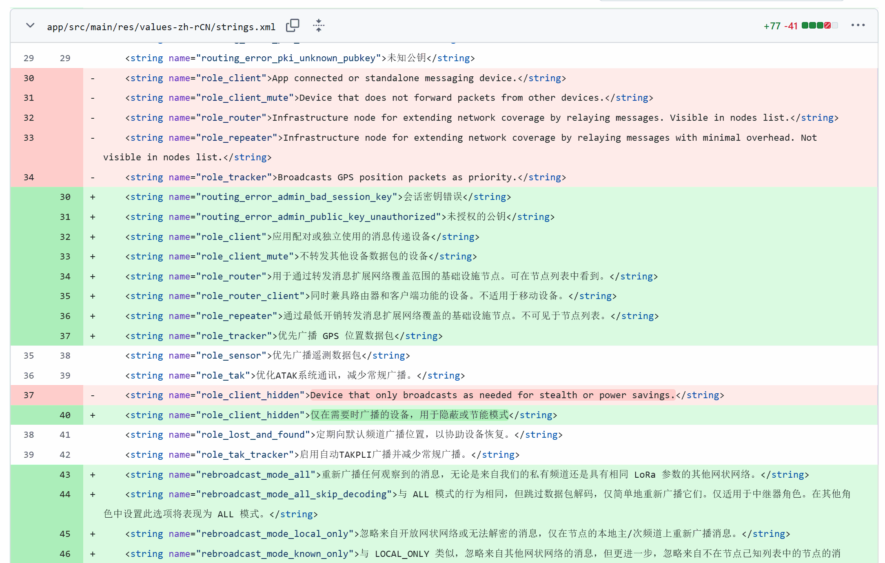
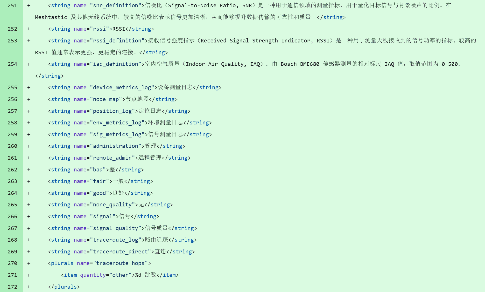

亲爱的 Meshtastic 中文社区小伙伴们：今天，我怀着激动和自豪的心情，分享一个小突破——**Meshtastic 安卓应用的简体中文翻译现已完成 100%！** 🎉

刚开始做这项工作的时候，翻译进度只有 61%，还有 568 个词条没有完成。中文社区的伙伴告诉我，很多人用英文界面时会感到不太方便。这让我感触很深，因为我意识到，Meshtastic 本可以帮助更多的人，如果它能用大家熟悉的母语去呈现的话。

于是，我开始在自己的每一个空闲时间里，打开 Crowdin 平台，翻译那些未完成的词条。有时候是工作间隙的一小段时间，有时候是晚上的休息时光，甚至在睡觉前，我都会忍不住再翻译几条。

不过，翻译的过程远比我想象中更复杂。我常常担心：*这些翻译是否足够通顺？是否能够让其他中文用户理解？* 为了确保翻译的准确性和贴合度，我经常在 Meshtastic 的微信群中向社区伙伴们征求意见。遇到难解的技术术语时，我们会一起讨论，比如「Hops」、「Client Role」、「Negative Acknowledgment」应该如何翻译才能既准确又不生硬。这些交流让我感受到，这是一个集体的努力，而不只是我一个人的工作。

今天，当我终于看到「100% 完成」的标志时，我感到无比欣慰。这不仅是一项任务的完成，更是一份献给社区的礼物。

## 为什么这件事如此重要？

在很久以前，知识曾是少数特权阶层的专属。只有祭司、贵族或士大夫才能接触到人类智慧的书籍和资源。哪怕是几十年前，没有互联网的时候，拥有一套百科全书也是一件奢侈的事情，只有经济条件优渥的家庭才能负担得起。

然而，如今，互联网让这一切都发生了改变。知识不再被锁在昂贵的书本里，也不再被某些特定阶层垄断。它是开放的、免费的，触手可及的。只要有一部智能手机，任何人都可以浏览 Wikipedia，学习各种技能，甚至深入了解科学技术。

但还有一道障碍依然存在，那就是**语言**。

不会英文的人，往往无法接触到互联网中大部分的技术和信息资源。但不懂英语并不代表他们不够努力，而更多是因为缺乏学习英语的机会或资源的限制。作为开源社区的一员，我深感有责任尽自己的一份力量，帮助消除这种因语言造成的壁垒。

翻译对我来说不仅仅是将词句从一种语言转换为另一种语言，更是为人们之间架起沟通的桥梁。语言不该是一道墙，而应该是一座桥。这次翻译工作，就是我为这座桥添砖加瓦的一点小小贡献。

## 下一步

下一步我计划为 iOS 版本的 Meshtastic 应用贡献翻译。与 Android 版本不同，iOS 的翻译不再依赖像 Crowdin 这样的便捷网页平台，而是需要通过 XCode 来打开和修改文件。由于我目前没有 Mac 电脑，这无疑增加了操作的复杂性。期待后续能找到方法解决。

对于所有的中文用户来说，我希望这次翻译能让你们在使用 Meshtastic 的过程中感受到更多的便利和亲切感。对于整个 Meshtastic 社区，我非常感激有这样的一个平台，让像我这样平凡的人也能通过自己的努力为社区带来改变。

最后，我也想对正在读这篇文章的你们说：如果你曾经想为开源项目贡献一份力量，请大胆去尝试。或许只是翻译几句文字，或是分享一些使用建议，你的每一份努力，都会为这个世界带来不同。

谢谢大家让我有机会成为这个旅程的一部分。永远相信美好的事情即将发生。

> 题图来自 Jefferson Santos