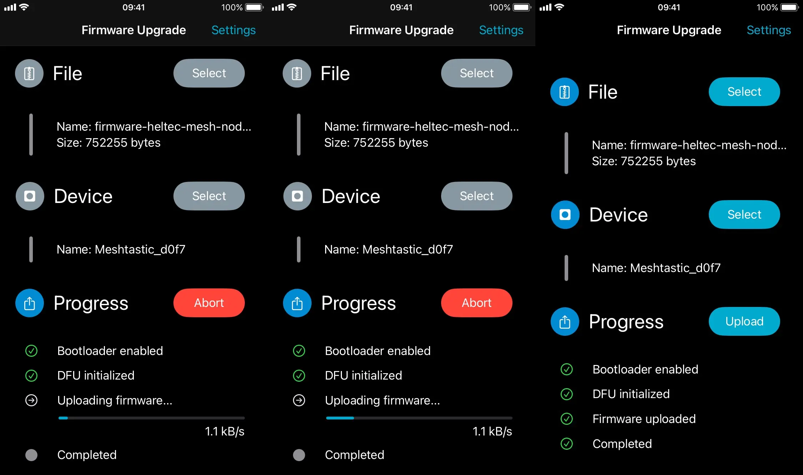

在物联网设备和远程监控领域，固件更新是一个不可忽视的重要环节。许多长续航 Meshtastic 设备，如 Lilygo T-Echo、[Heltec T114](/heltec-t114-portable-meshtastic-node)，以及社区热门的开源高性价比硬件 [Faketec PCB](/announcement-2024-last-day-annual/#faketec-项目：DIY-的新巅峰)，都采用了 Nordic 的 nRF52 芯片。

对于这些设备，蓝牙 OTA（Over-the-Air）更新是一种灵活高效的方式。通过手机 App，无需数据线连接，也无需直接接触设备，就能无线更新固件。这种方法在设备安装在屋顶、树木、电线杆等难以触及的地方时，尤其显得便利。无需拆卸和接触设备，便可轻松完成固件升级，彻底解放双手。

但即便蓝牙 OTA 极具优势，其更新过程也并非一帆风顺。许多用户在实际操作中，可能会遭遇传输中断、设备连接失败，甚至上传速度缓慢等问题。

为了解决这些困扰，本教程将详细讲解如何通过蓝牙 OTA 对 nRF52 芯片设备进行固件更新，同时提供一系列避坑指南和问题解决方案，让你的更新过程更加顺畅无忧！

## 对比 DFU 模式和蓝牙 OTA

在更新 nRF52 设备固件时，平时经常使用的 DFU（Device Firmware Update）方法（俗称 U 盘大法）和蓝牙 OTA 是两种主要选择。它们各有优劣，但在某些特定场景下，蓝牙 OTA 的优势尤为明显。

| 特性              | DFU 烧录方法                                                                 | 蓝牙 OTA 烧录方法                                                      |
|-----------------------|---------------------------------------------------------------------------------|---------------------------------------------------------------------------|
| 使用场景          | 适用于在桌面或设备容易接触的场景。                                                | 适用于难以接触或远程安装的设备，如屋顶太阳能传感器、山上树上节点等。                     |
| 操作步骤          | 通过 USB 数据线连接设备，将固件文件拖拽到设备识别出的「U盘」中，即可完成更新。            | 使用支持蓝牙的手机或平板，通过指定应用进行固件文件的无线传输和安装。            |
| 硬件依赖          | 必须有 USB 接口，并需要物理连接设备与电脑。                                            | 仅需要蓝牙模块支持 OTA，无需物理连接。                                       |
| 软件工具          | 不需要额外的软件，只需文件管理工具即可操作。                                           | 需要安装 Nordic Semiconductor 的蓝牙固件更新 App                     |
| 便捷性            | 更新过程快速，但需要设备接近电脑，操作受物理位置限制。                                     | 更新更灵活，可随时随地完成，但依赖蓝牙信号的稳定性。                           |
| 硬件兼容性        | 部分低功耗设计的设备可能没有 USB 接口，不支持此方法。                                     | 只要设备支持蓝牙通信并加载支持 OTA 的固件版本，即可使用。                       |
| 更新速度          | 通常较快，二十秒左右能完成                                     | 较慢，蓝牙传输速度通常为 1 KB/s 左右，可能耗时数分钟至十分钟。                  |
| 可靠性            | 高，传输中断风险小，更新失败几率低。                                              | 蓝牙连接稳定性对成功率影响较大，可能需要调整数据包大小或重试。                   |
| 更新文件格式      | 通常为 `.uf2` 格式，直接拖放即可。                                                     | 必须为专用的 OTA 格式的 `.zip` 文件，需要通过应用选择和加载。                     |
| 易用性            | 操作简单，无需学习成本，适合新手用户。                                                | 需要了解蓝牙应用的使用方法，但学习成本较低。                                   |

## 第三部分：准备工作

在开始蓝牙 OTA 更新之前，需要进行充分的准备工作，以确保整个过程顺利无误。以下是更新前需要完成的硬件、软件和固件准备工作。

### 硬件需求

1. 使用 nRF52 芯片作为 MCU 的 Meshtastic 设备，而非 RP2040 或 ESP32。
   > Meshtastic 设备的 MCU 应该怎么选择？快速理解 [RP2040、nRF52 和 ESP32 特点和优劣](/device-choice-guide/#关键特性的比较与选择因素) ？ 

2. 手机或平板电脑。iOS 和 Android 系统均可，后续教程将分别针对这两种系统进行操作说明。

3. 电源稳定性。在固件更新过程中，目标设备需要保持充足电量，避免因电量不足导致中途更新失败。建议连接稳定的电源。

### 软件需求

根据您的手机操作系统，安装以下工具：

1. Android 安卓用户  
   下载并安装 Nordic Semiconductor 提供的安卓 nRF Connect App（推荐使用旧版本 4.24.3）。这是一个功能强大的应用程序，适用于蓝牙设备管理和固件更新。您可以从 [Nordic 官方 GitHub](https://github.com/NordicSemiconductor/Android-nRF-Connect/releases/tag/v4.24.3) 下载安卓 APK App，或从 [Google Play 商店下载](https://play.google.com/store/apps/details?id=no.nordicsemi.android.mcp) 。

2. iOS 用户  
   从苹果 [App Store](https://apps.apple.com/us/app/nrf-device-firmware-update/id1624454660) 下载并安装 iOS nRF Device Firmware Update (DFU) 应用。这是专为 Nordic 设备设计的固件更新工具，支持蓝牙 OTA 更新。

   > 注意：请确保您使用的是正确的应用程序。

   在 iOS 上，Nordic 提供多个工具，容易混淆。请务必确认您下载的是 nRF Device Firmware Update (nRF DFU) 应用，而不是类似的 nRF Connect 或其他应用程序。只有 nRF DFU 应用支持固件的 OTA 上传功能，而 nRF Connect 则用于设备扫描和调试。混用可能导致更新失败或无法找到相关功能。

### 固件准备

1. 下载正确的固件  
   前往可靠的下载源获取固件文件，例如 [Meshtastic 官网下载页面](https://meshtastic.org/downloads) 或 [GitHub Releases](https://github.com/meshtastic/firmware/releases)。确保选择与设备型号匹配的固件版本，并下载 OTA 格式的压缩包文件（通常以 `-ota.zip` 结尾）。

2. 解压缩固件文件  
   下载后，将压缩包文件解压到本地文件夹中。对于安卓和苹果用户，固件文件应包含在解压后的文件夹内。从 GitHub Releases 页面下载的固件文件通常是一个包含多个设备固件的压缩包（如 `firmware-nrf52840-版本号.zip`）。这个压缩包内会包含适配不同设备的多个 `-ota.zip` 文件，如 `firmware-heltec-mesh-node-*-ota.zip`。
   
   需要注意的是：**Nordic 的蓝牙更新 App 在选择固件时，要求直接选择 `-ota.zip` 文件，而不是再解压 `-ota.zip`**。所以，当你下载固件后，只需解压第一层的 `firmware-nrf52840-版本号.zip`。

## 第四部分：蓝牙 OTA 更新的详细步骤

在完成硬件、软件和固件的准备工作后，我们可以正式开始蓝牙 OTA 更新过程。根据您的移动设备操作系统，以下是 Android 和 iOS 的具体操作步骤。

### 在 Android 设备上进行蓝牙 OTA 更新
1. 打开 nRF Connect 应用  
   启动已安装的 nRF Connect App（推荐版本 4.24.3）。进入应用后，切换到 `Scanner` 标签页。

2. 连接目标设备  
   确保目标设备已处于蓝牙广播模式（通常可以通过设备上的特定操作如按下某个按钮激活）。在应用中，点击 `Scan` 按钮搜索附近的蓝牙设备。当目标设备的名称出现在列表中时，点击设备名称进行连接。

3. 启动 DFU 模式  
   在连接成功后，点击应用右上角的 DFU 图标（通常为一个下载箭头的形状）。系统会要求选择固件文件。

4. 选择正确的固件文件  
   浏览本地存储，找到解压后的 OTA 固件文件（文件名通常以 `-ota.zip` 结尾）。选择该文件并确认。

5. 开始固件更新  
   在确认固件文件后，应用会启动 OTA 更新过程。这时，请保持手机和目标设备在蓝牙范围内，并避免任何操作中断。整个更新过程通常需要几分钟时间。

6. 确认更新完成  
   更新完成后，设备会自动重启并加载新的固件。您可以通过再次扫描设备名称，验证其广播信息以确认固件已更新成功。

### 在 iOS 设备上进行蓝牙 OTA 更新

1. 打开 nRF DFU 应用  
   启动已安装的 nRF Device Firmware Update 应用。进入主界面后，点击 `Select File` 按钮以选择固件文件。

2. 选择固件文件  
   在文件管理界面，找到解压后的 OTA 固件文件（文件名以 `-ota.zip` 结尾）。点击选择该文件。

3. 连接目标设备  
   应用会自动扫描附近的蓝牙设备。当目标设备出现在列表中时，点击设备名称以建立连接。

4. 调整数据包设置（如必要）  
   如果您在前几次尝试时遇到更新失败，可以进入应用的设置界面调整数据包大小：
   - 启用 `Packet Receipt Notification`。
   - 将默认的数据包大小从 23 减小到 5。这可以有效解决蓝牙连接不稳定的问题。

5. 开始更新  
   确认设备连接和固件选择后，点击 `Start` 开始固件更新。与 Android 一样，请确保手机和目标设备在蓝牙范围内，并避免操作中断。

6. 防止屏幕熄灭  
   iPhone 默认的自动锁屏时间较短（通常为 30 秒到 1 分钟）。在更新过程中，请暂时将 `自动锁屏` 设置为 `永不`，以避免屏幕关闭导致蓝牙连接中断。

7. 完成更新并验证  
   更新完成后，目标设备将自动重启。您可以通过扫描设备的蓝牙广播信息或运行测试功能，确认更新是否成功。

通过上述步骤，无论是 Android 还是 iOS 用户，都可以顺利完成蓝牙 OTA 更新。在操作过程中，如果您遇到问题，请不要担心。接下来，我们将详细讲解一些常见问题及其解决方法，帮助您轻松应对潜在的挑战。

## 第五部分：常见问题及解决方法

尽管蓝牙 OTA 更新为设备固件升级带来了极大的便利，但在实际操作中，用户可能会遇到一些常见问题。以下是这些问题的详细描述及解决方法。

### 问题 1：传输中断
现象：更新过程中，传输进度条卡住或直接显示失败提示。

原因分析：
1. 蓝牙信号不稳定，例如设备与手机距离过远或存在干扰源。
2. 数据包大小设置不当，导致设备无法处理传输数据。

解决方案：
- 优化蓝牙环境：确保手机和目标设备之间无障碍物，距离控制在 1 米以内，避免在有大量其他蓝牙设备干扰的环境中操作。
- 调整数据包大小：对于 iOS 用户，进入 nRF DFU 应用的设置界面，启用 `Packet Receipt Notification`，将默认数据包大小从 23 减少到 5。如果问题仍然存在，可尝试进一步减小数据包大小。

### 问题 2：更新失败
现象：固件更新完成后设备无法正常启动，或更新过程无法完成。

原因分析：
1. 选择了错误的固件版本或不兼容的文件格式。
2. 固件文件在下载或传输过程中被破坏。

解决方案：
- 检查固件来源：确保从官方可靠渠道下载固件文件，例如 Meshtastic 官网或 GitHub Releases 页面。
- 验证文件完整性：比对固件的哈希值或校验码，以确保文件未损坏。
- 选择正确的文件格式：确认固件文件是专为蓝牙 OTA 设计的 `-ota.zip` 格式，而不是其他类型的固件文件。

### 问题 3：上传过程中屏幕熄灭
现象：在上传过程中，手机屏幕熄灭，导致更新中断。

原因分析：
大多数手机的默认自动锁屏时间较短（通常为 30 秒或 1 分钟），屏幕熄灭后，蓝牙连接可能会中断。

解决方案：
- 临时调整自动锁屏设置：对于 iOS 用户，进入 `设置 > 显示与亮度 > 自动锁定`，将锁屏时间设置为 `永不`。对于 Android 用户，可在 `显示` 设置中找到类似选项。
- 避免多任务操作：在更新过程中保持应用处于前台运行，不进行其他多任务操作。

## 总结

蓝牙 OTA 更新为 nRF52 设备提供了一种无需数据线的固件升级方式，尤其适用于那些山区、天台难以直接接触的设备。

我们鼓励您将自己的实践经验和技巧分享至 [Meshtastic 中国社区群](/contact)，与其他用户一起推动 Meshtastic 发展。