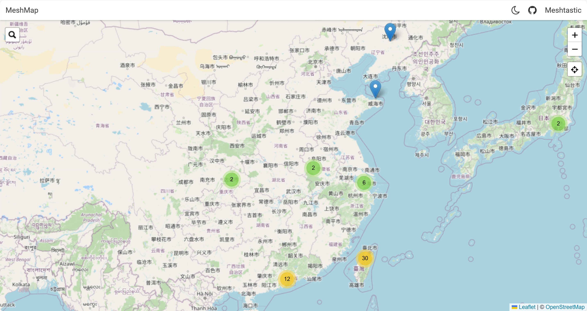
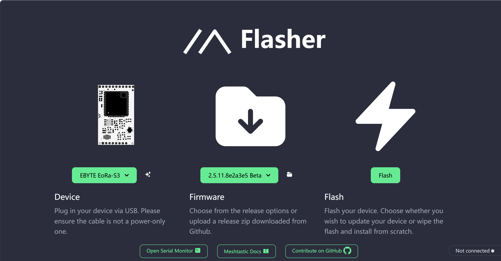
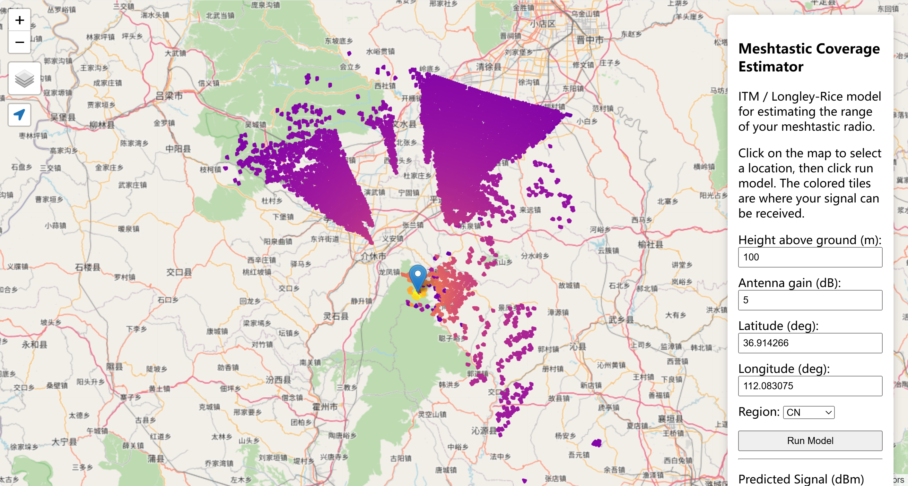

如果你刚刚开始接触 Meshtastic，可能会感到有些迷茫，不知道从哪里开始。为了帮助你快速上手，构建自己的无线 Mesh 网络，下面是一些必备的资源和工具，帮助你掌握 Meshtastic 的基础知识并优化你的设备配置。这些资源都经过精心挑选，确保无论你是新手还是有一定经验的用户，都能顺利入门并深入探索 Meshtastic 的潜力。

## Meshtastic 节点地图 - [meshmap.net](https://meshmap.net/)

当你开始使用 Meshtastic 构建自己的无线 Mesh 网络时，了解网络中其他节点的位置和状态是非常重要的。[meshmap.net](https://meshmap.net/) 提供了一个接近实时的地图，展示了通过官方 Meshtastic MQTT 服务器接收到的所有位置报告节点。

### 核心功能：

`meshmap.net` 显示了全球范围内的 Meshtastic 节点，并且实时更新节点的位置数据。每分钟更新一次位置，确保网络状态始终是最新的。当一个节点超过 24 小时没有更新位置时，它将被自动从地图中移除。这样可以避免过时的节点信息干扰你对当前网络的理解。

地图不仅展示了通过官方 MQTT 服务器上传的节点信息，还包括通过其他节点中继转发的设备。这意味着即使你没有直接接触某个节点，只要它通过其他设备间接连接到网络，你也能在地图上看到它的位置。这对于大规模部署 Meshtastic 网络或者检查你的设备是否在正确的区域非常有用。

此外，你还可以通过节点的名称或 ID 搜索特定的设备，这样可以帮助你快速定位到某个设备或网络中的其他用户。如果你有多个设备或打算在不同区域部署 Meshtastic 网络，这个工具将非常有帮助。

## 官方在线固件刷写工具 - [flasher.meshtastic.org](https://flasher.meshtastic.org/)

固件的安装和更新是使用 Meshtastic 设备的第一步。许多新手可能在刷机过程中遇到一些问题，不知道如何安全地为设备刷入最新的固件。为此，Meshtastic 提供了一个非常方便的在线刷写工具 [flasher.meshtastic.org](https://flasher.meshtastic.org/)，它可以帮助你轻松完成这一过程。

flasher.meshtastic.org 是一个完全基于 Web 的工具，意味着你无需安装任何额外的软件。只要打开浏览器并连接你的设备，就可以开始刷机。这对于初学者来说尤其方便，不需要复杂的配置或命令行操作。

该工具支持多种设备，包括：
- Espressif ESP32 系列
- Nordic nRF52 系列
- 树莓派 Raspberry Pi 系列

除了固件刷写，工具还内置了串行监视器。这意味着你可以在刷机过程中实时查看设备的状态，帮助你发现并解决可能出现的任何问题。如果设备没有按预期启动，或者刷机过程中出现错误，串行监视器将为你提供详细的日志信息，帮助你快速排查故障。

对于不熟悉传统刷机工具的用户来说，flasher.meshtastic.org 提供了一个简单、直观的解决方案，确保你能够轻松更新设备固件。

## Meshtastic 中国社区官网 - [meshcn.net](https://meshcn.net/)

这里厚脸皮推荐我们自己一下——正是你正在看的这篇文章来源。

Meshtastic 是一个全球性的开源项目，而在中国，我们有一个专门的社区网站——[meshcn.net](https://meshcn.net/)，它为中文用户提供了大量有价值的教程、技术文档和讨论资源。

在 meshcn.net 上，你可以找到从基础入门到高级使用的各类教程。无论你是刚接触 Meshtastic，还是希望优化你现有的设备设置，网站上都有详尽的步骤指南帮助你完成设备配置、固件安装、Mesh 网络搭建等操作。对于新手来说，这些教程将帮助你避免常见的错误，快速掌握 Meshtastic 的基本用法。

## Meshtastic 信号覆盖规划工具 - [meshplanner.mpatrick.dev](https://meshplanner.mpatrick.dev/)

如果你想要规划一个稳定的 Meshtastic 网络，信号覆盖范围的预测和优化是不可或缺的。[meshplanner.mpatrick.dev](https://meshplanner.mpatrick.dev/) 提供的信号覆盖规划工具可以帮助你根据不同的地理位置、天线设置和设备参数，预测网络的覆盖范围和信号强度。

这个工具使用了 `ITM` / `Longley-Rice` 模型来预测无线电信号的传播范围，考虑了多种影响因素，比如地形、发射功率和天线增益等。你只需输入你的地理位置，并选择相应的设备和天线设置，工具便会生成一张信号强度地图，帮助你预估网络的覆盖范围。

这个工具的一个重要特点是它能够模拟不同的地形情况。无论你是在城市环境、山区，还是平原地带，它都能准确反映地形对信号传播的影响。特别是在复杂环境中，Meshtastic 网络的覆盖效果可能受到山脉、建筑物等障碍物的干扰，使用这个工具能够让你更好地规划网络布局。

通过预测不同配置下的信号传播效果，你可以选择最合适的发射功率和天线增益，确保你的设备能够覆盖到预期区域并保持稳定的信号强度。如果你打算构建一个大型的 Meshtastic 网络，或是想要在特定区域内优化网络覆盖，这个工具无疑是一个非常实用的资源。

## 总结

通过以上的资源和工具，你将能够轻松构建、管理和优化你的 Meshtastic 网络。从实时的节点地图到简单易用的固件刷写工具，再到精准的信号覆盖规划，所有这些工具都将帮助你提升网络的稳定性和性能。无论你是 Meshtastic 的新手还是有一定经验的用户，这些资源都能帮助你更好地理解和使用 Meshtastic。

- [meshmap.net](https://meshmap.net)：实时查看 Meshtastic 节点位置和网络状态。
- [flasher.meshtastic.org](https://flasher.meshtastic.org)：在线刷写 Meshtastic 设备固件，确保设备始终处于最新状态。
- [meshcn.net](https://meshcn.net)：获取中文教程和技术支持，加入 Meshtastic 中国社区。
- [meshplanner.mpatrick.dev](https://meshplanner.mpatrick.dev)：根据地理位置和设备参数预测信号覆盖范围，帮助你优化网络规划。