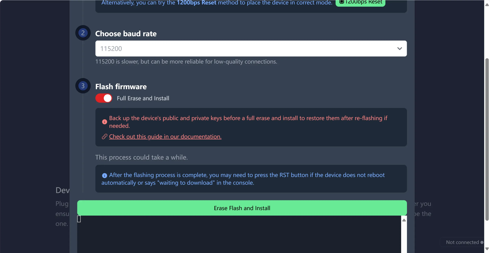
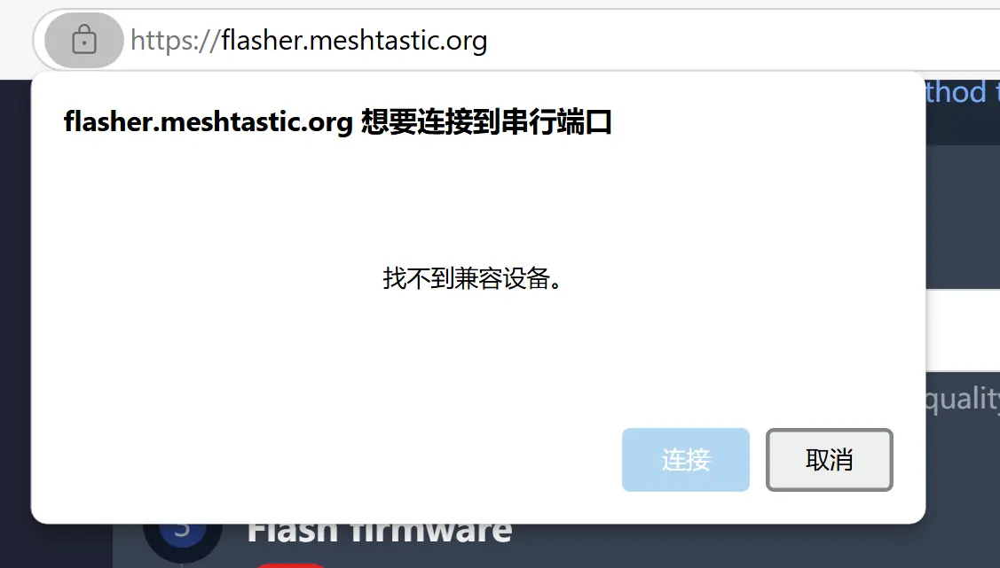

本文将详细介绍如何通过 Meshtastic 官方在线工具，为亿佰特 Ebyte EoRa-S3 模块烧录 Meshtastic 固件。整个过程简单易懂，适合不同技术水平的用户操作。

## 准备工作

在开始烧录之前，请确认以下物品已准备齐全：
1. 一台能够运行 Google Chrome 浏览器的电脑。
2. 一根支持数据传输的 Type-C 数据线。
3. 一块 `Ebyte EoRa-S3-400TB` / `Ebyte EoRa-S3-900TB` 模块。
   > 在中国使用 LoRa，建议购买 `400TB`，这个型号为 470 MHz 频段，符合国内法规要求。
4. 可靠的网络连接。最好是启动了 “science” 上网工具。

确保您的模块可以正常连接到电脑，并具备基础操作能力。

## 操作步骤

### 第一步：打开 Meshtastic 在线烧录工具

首先，在 Google Chrome 浏览器中打开 [Meshtastic Flasher](https://flasher.meshtastic.org/) 网站。进入页面后，您将看到一个用户友好的界面，用于选择设备和固件版本。

### 第二步：选择设备

在页面的设备下拉菜单中，选择 `Ebyte EoRa-S3`。这一选项是专门为 Ebyte EoRa-S3 系列模块设计的，可以确保烧录过程顺利完成。

### 第三步：选择固件版本

在固件版本选择框中，选择最新的 **Stable（稳定版）**。稳定版是经过广泛测试的版本，适合绝大多数用户使用。

### 第四步：确认烧录

点击页面中的 **Flash** 按钮后，系统会弹出一个更新日志页面，显示此版本固件的更新内容。在快速浏览后，滚动至页面底部并点击 **Continue** 按钮，确认继续烧录操作。

### 第五步：将模块设置为烧录模式

为了使模块进入烧录模式，请按住模块上的 **BOOT** 按钮，同时将模块通过 USB 数据线连接到电脑。此操作将模块置于下载模式，使其能够接受固件烧录。

### 第六步：启用完整擦除选项

在页面的烧录选项中，找到 **Full Erase and Install**。点击该选项以启用完整擦除功能，此时按钮会变成红色，表示已经激活此功能。启用该选项后，固件烧录过程将完全覆盖设备的存储空间，确保新的固件正常运行。

### 第七步：选择串口并开始烧录

点击页面中的 **Erase Flash and Install** 按钮，Chrome 浏览器将弹出一个 **Web Serial** 窗口。在弹出的窗口中，选择您的设备对应的串口（一般情况下只有一个选项可以选择）。完成串口选择后，工具将自动开始擦除设备上的现有数据并安装新的 Meshtastic 固件。

## 烧录完成后的检查

当工具提示烧录成功后，拔下设备的 USB 数据线并重新连接模块，确保其能够正常启动。启动后，您可以使用 Meshtastic App 连接设备，进行网络配置和测试。

## 常见问题及解决方法

1. **无法检测到设备的串口**  
如果浏览器未能识别设备的串口，请确保 USB 数据线支持数据传输，而非仅支持充电的线缆。此外，检查模块是否正确进入了烧录模式。

2. **烧录失败**  
若烧录失败，可能是由于未启用 **Full Erase and Install** 选项，或者 USB 数据线或接口存在问题。建议更换 USB 数据线或尝试其他 USB 接口。

3. **模块烧录后无法启动**  
如果模块在烧录完成后无法正常启动，可能是因为固件版本不兼容。建议重新选择最新的稳定版固件并再次烧录。