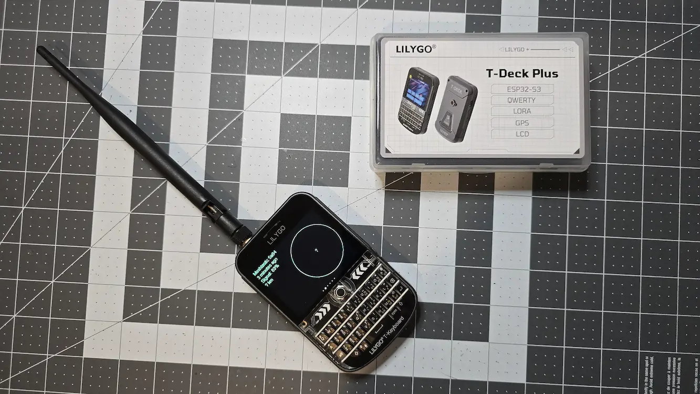

> 本文核心内容来自社区活跃贡献者 [朱哲](https://github.com/zhuzhe1983) 。原文发布在 [Bilibili 平台](https://www.bilibili.com/opus/1001867994447478787)。

Lilygo T-Deck 是一款集成了 Wi-Fi、蓝牙及扩展接口的物联网开发板，配备了较大的彩色屏幕，使其在 Meshtastic 项目中具备优良的显示和用户交互能力。然而，Meshtastic 默认的嵌入式系统界面（TFT 屏幕体验）并没有充分利用 T-Deck 的硬件能力。为了解决这一问题，社区开发了 Meshtastic FancyUI，这是一款专为 T-Deck 屏幕优化的 UI，旨在提供接近 Meshtastic App 的用户体验。

目前，此 UI 在 Meshtastic 2.5.3 版本基础上运行，虽然具备许多改进，但仍存在某些功能限制，例如单聊功能存在问题。对于普通用户，建议根据实际需求决定是否刷写此固件。

所有链接均在文末。

## 方法一：使用 M5Stick-Launcher（推荐方法）

这一方法通过使用 SD 卡和 M5Stick-Launcher 固件进行安装，便于切换其他固件和未来升级，适合大多数用户。

### 所需工具
1. 一张 SD 卡（建议 8G 容量）。
2. 一根 USB 数据线，用于连接 Lilygo T-Deck 和电脑。
3. 电脑（Windows、Mac 或 Linux 均可）。
4. 需要科学上网环境时，可选择百度网盘下载所需文件。

### 刷机步骤

#### 1. 准备 SD 卡
- 将 SD 卡插入电脑，用 FAT32 文件系统格式化 SD 卡，确保其清洁无误。
- 从教程提供的 百度网盘 下载以下固件文件：
  - firmware-t-deck-2.5.3.bfe99b2-update.bin
  - 如果需要，也可以同时下载配置文件，用于设置 Wi-Fi 账号和屏幕方向。

#### 2. 进入刷机模式
- 用 USB 数据线将 Lilygo T-Deck 连接到电脑。
- 按住设备上的 圆球键（侧边小圆按键），然后按下左侧的 Reset 键，进入刷机模式。此时，设备屏幕可能变暗或不显示内容，这是正常现象。

#### 3. 安装 M5Stick-Launcher 固件
- 打开以下网址，使用在线工具刷入 M5Stick-Launcher 固件：  
  [M5Stick-Launcher 固件在线安装](https://bmorcelli.github.io/M5Stick-Launcher/flash0.html)
- 如果无法科学上网，可以从百度网盘下载 M5Stick-Launcher 固件，并通过离线工具（如 ESP Web Tool）刷入。链接在文末。
- 固件安装完成后，设备会自动重启进入 M5Stick-Launcher 界面。如果屏幕显示倒置，可通过 SD 卡中的配置文件修改方向。

#### 4. 拷贝 Meshtastic 固件到 SD 卡
- 将之前下载的 `firmware-t-deck-2.5.3.bfe99b2-update.bin` 拷贝到 SD 卡的根目录。
- 如果需要，可以同步修改配置文件，填写 Wi-Fi 账号和密码，以便设备联网后自动连接网络。

#### 5. 安装 Meshtastic 固件
- 将 SD 卡重新插入 Lilygo T-Deck。
- 在 M5Stick-Launcher 界面中，选择 Meshtastic 固件，按照提示安装 `firmware-t-deck-2.5.3.bfe99b2-update.bin`。
- 安装完成后，设备会重启并进入 Meshtastic 系统。
- 注意： 重启过程中不要按任何按键，系统会自动完成初始化。

#### 6. 后续更新固件
- 后续如需安装或更新其他固件，可通过 M5Stick-Launcher 的 Web UI 完成上传和安装，无需再取出 SD 卡。这大大简化了固件管理流程。

## 方法二：直接烧录刷写 Meshtastic 固件（适合开发者）

这一方法更为直接，适合熟悉开发工具的用户。该方法不需要使用 SD 卡，而是通过 USB 数据线直接将固件烧录到设备。

### 所需工具
1. 从 Lilygo 官方 Github 下载以下文件：
   - T-Deck_UnitTest_241004.bin  
     [下载地址](https://github.com/Xinyuan-LilyGO/T-Deck/tree/master/firmware)
   - firmware-t-deck-2.5.3.bfe99b2-update.bin（可从百度网盘下载）。
2. 在线刷机工具：[ESP Web Tool](https://esp.huhn.me/) 或 Lilygo 提供的 `flash_download_tool_3.9.7_0.zip`。

### 刷机步骤

#### 1. 进入刷机模式
- 用 USB 数据线连接 Lilygo T-Deck 到电脑。
- 按住设备上的 圆球键，然后按左侧 Reset 键，进入刷机模式。

#### 2. 使用 ESP Web Tool 烧录刷写固件 firmware
- 打开 [ESP Web Tool](https://esp.huhn.me/)。
- 分两次刷写固件，确保地址设置正确：
  1. 第一次刷机： 地址 `0x0`，选择 `T-Deck_UnitTest_241004.bin`。
  2. 第二次刷机： 地址 `0x10000`，选择 `firmware-t-deck-2.5.3.bfe99b2-update.bin`。
- 如果在第二次刷机过程中设备出现绿屏问题，可以通过右侧电源开关完全关闭设备后再次尝试。

#### 3. 使用离线工具刷机（可选）
- 如果需要，可下载 Lilygo 提供的 `flash_download_tool_3.9.7_0.zip`。
- 解压工具后，通过类似方式刷写固件。
- 注意： 此方法需要手动配置地址和文件路径，适合熟悉 ESP-IDF 的开发者。

## 刷机后的功能体验
1. 更优化的用户界面： Meshtastic Fancy UI 专为 T-Deck 的大屏幕设计，界面布局更接近 App 的体验，交互更加友好。
2. 功能限制： 由于目前 Fancy UI 基于 Meshtastic 2.5.3，某些新功能暂不可用，例如单聊功能仍存在问题。
3. 未来可升级性： 使用 M5Stick-Launcher 的用户可通过 Web UI 无缝升级到新版本固件。

## 资源链接汇总
1. 固件及工具下载：
   - 百度网盘链接：[固件下载](https://pan.baidu.com/s/1iwOov21AV066g3u7h-jQTg?pwd=su89)（提取码：`su89`）
2. 在线刷机工具：
   - [M5Stick-Launcher 在线安装](https://bmorcelli.github.io/M5Stick-Launcher/flash0.html)
   - [ESP Web Tool](https://esp.huhn.me/)
3. 官方参考资料：
   - [Lilygo Github 固件库](https://github.com/Xinyuan-LilyGO/T-Deck/tree/master/firmware)
4. 社区讨论及反馈：
   - [Reddit 讨论](https://www.reddit.com/r/LilyGO/comments/1fg3eva/tested_the_new_meshtastic_fancy_ui_for_tdeck/)
   - [Jeff Geerling 博客](https://www.jeffgeerling.com/blog/2024/realizing-meshtastics-promise-t-deck)

### 注意事项
- 刷机存在一定风险，请确保已备份重要数据。
- 如果在刷机过程中遇到问题，请参考上述工具的官方文档或社区支持。

如有进一步问题，请随时提出！