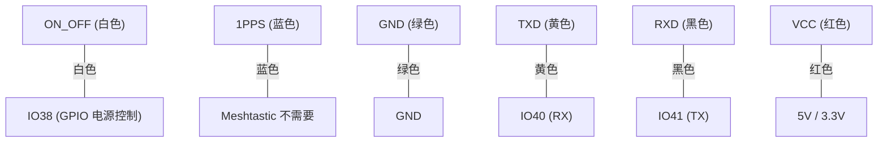

本文提供了一份 **亿佰特 EByte E108-GN03D GPS 模块** 与 **EByte EoRa-S3 开发板** 连接的详细教程，并使用**Meshtastic 固件**实现 GPS 数据显示。通过本教程，您将学会如何连接和配置 GPS 模块，使其可以将经度、纬度和海拔数据发送到 Meshtastic 设备的 OLED 屏幕上。

## 第一步：参考文档

在开始之前，建议先获取 GPS 模块和开发板的规格书及电路图，以便了解它们的引脚配置和连接方法。以下是相关文档的链接：

1. **EByte E108-GN03D GPS 模块用户手册**：[下载链接](./gps-module-ebyte-eora-s3-CN/E108-GN03+Series_UserManual_EN_V1.1.pdf)  
2. **EByte EoRa-S3 开发板用户手册**：[下载链接](./gps-module-ebyte-eora-s3-CN/EoRa_PI_UserManual_CN_v1.0(2).pdf)  
3. **EByte EoRa-S3 开发板电路图**：[下载链接](./gps-module-ebyte-eora-s3-CN/EoRa%20PI开发板原理图.pdf)  

这些文档对核对引脚、接线和电压要求非常重要。

## 第二步：核对 GPS 模块的引脚和线序

在连接 GPS 模块和开发板之前，请务必核对 GPS 模块的引脚定义和线序。由于不同供应商可能使用不同的线缆颜色，**请勿盲目依赖线缆颜色的通用示例**。您需要通过规格书或供应商提供的资料进行确认。

以下是 E108-GN03D GPS 模块的引脚定义：

| 引脚编号 | 引脚名称 | 功能说明                          |  
|----------|----------|-----------------------------------|  
| 1        | ON_OFF   | 电源控制（高电平时工作正常）       |  
| 2        | 1PPS     | 每秒脉冲（Meshtastic 不需要）       |  
| 3        | GND      | 接地                              |  
| 4        | TXD      | 数据输出（GPS → MCU）             |  
| 5        | RXD      | 数据输入（MCU → GPS）             |  
| 6        | VCC      | 电源输入（2.7–5.5V）              |  

## 第三步：将 GPS 模块连接到 EoRa-S3 开发板

接线时，需要将 GPS 模块的引脚连接到 EoRa-S3 开发板的 GPIO 引脚。以下接线表是本教程的示例，您可以根据需要选择其他 GPIO 引脚，但需确保在 Meshtastic 设置中正确配置相应引脚。

| GPS 引脚 | 线缆颜色 | EoRa-S3 GPIO 引脚 | 功能说明                     |  
|----------|----------|-------------------|------------------------------|  
| ON_OFF   | 白色     | IO38              | 电源控制                     |  
| 1PPS     | 蓝色     | 不连接            | Meshtastic 不需要            |  
| GND      | 绿色     | GND               | 公共接地                     |  
| TXD      | 黄色     | IO40              | GPS 模块向开发板发送数据（RX）|  
| RXD      | 黑色     | IO41              | 开发板向 GPS 模块发送数据（TX）|  
| VCC      | 红色     | 5V                | 电源供电                     |  

**注意事项**：  
1. 请再次确认 GPS 模块的引脚定义和线缆颜色。  
2. 确保 VCC 和 GND 的连接正确，以免损坏模块。

## 第四步：配置 Meshtastic 固件

硬件连接完成后，需要在 Meshtastic 固件中设置正确的 GPIO 引脚，以便设备能够识别 GPS 模块。

1. 打开 **Meshtastic Web UI** 或使用 **Meshtastic 应用程序**连接设备。
2. 进入 GPS 模块配置页面。
3. 设置以下 GPIO 引脚：
   - **接收引脚（RX）**：设置为 `16`（连接到 GPS 模块的 TXD 引脚）。  
   - **发送引脚（TX）**：设置为 `15`（连接到 GPS 模块的 RXD 引脚）。  
   - **启用引脚**：设置为 `37`（连接到 GPS 模块的 ON_OFF 引脚）。  
4. 保存配置并重启设备。

## 第五步：测试 GPS 模块

连接和配置完成后，测试 GPS 模块是否正常工作。

测试步骤：
1. 启动 EoRa-S3 开发板。  
2. 等待 GPS 模块搜索卫星（可能需要几分钟，视天空开阔度而定）。  
3. 检查 Meshtastic 设备的 OLED 屏幕是否显示以下数据：  
   - **经度和纬度**：如 `37.7749` 和 `-122.4194`。  
   - **海拔**：如 `50.3 m`。

常见问题排查：
- 如果没有 GPS 数据，请检查以下内容：
  1. 确认接线无误，特别是 TX 和 RX 引脚。  
  2. 核实 Meshtastic 设置的 GPIO 引脚是否正确。  

## 总结

连接 GPS 模块后，Meshtastic 设备可实现以下功能：
1. 实时共享位置，与其他 Meshtastic 用户交换位置信息。  
2. 在 OLED 屏幕上显示经度、纬度和海拔数据。  
3. 在导航、跟踪和户外活动中提供位置数据支持。
4. 更新设备时间 RTC

本教程介绍了如何将 **EByte E108-GN03D GPS 模块**连接到 **EByte EoRa-S3 开发板**并运行 Meshtastic 固件。通过仔细核对引脚、正确连接和配置固件，您的 Meshtastic 设备可以有效利用 GPS 数据增强功能。如果遇到问题或希望扩展功能，请随时寻求帮助！