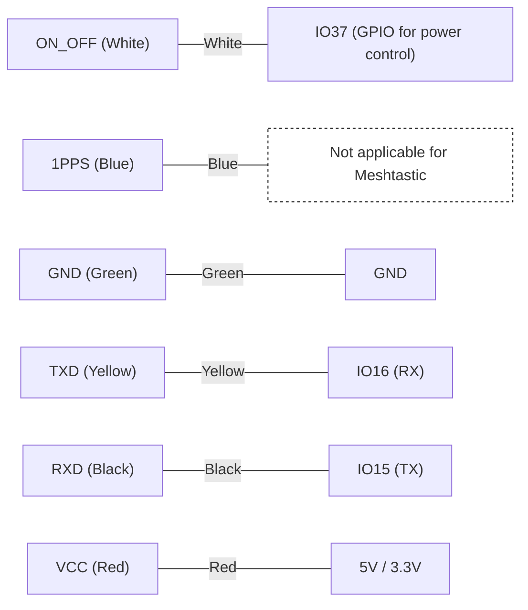
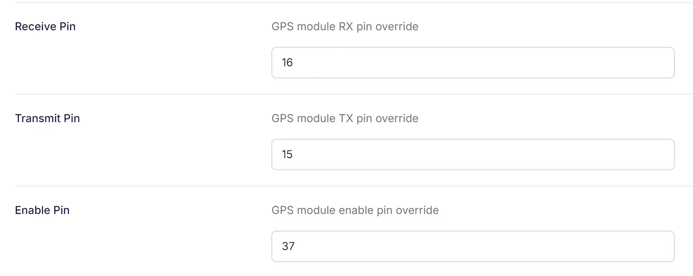

This tutorial provides a detailed, step-by-step guide to connect the **EByte E108-GN03D GPS module** to the **EByte EoRa-S3 development board** with **Meshtastic firmware**. By the end of this guide, your GPS module will deliver location data (latitude, longitude, and altitude) to be displayed on the OLED screen of your Meshtastic device.

## Step 1: Reference Documents

Before you begin, it’s essential to have access to the datasheets and schematics of the GPS module and development board to understand their pin configurations and connections. Below are the relevant links:

1. **EByte E108-GN03D GPS Module Datasheet**: [Download Here](./gps-module-ebyte-eora-s3/E108-GN03+Series_UserManual_EN_V1.1.pdf)
2. **EByte EoRa-S3 Development Board Datasheet**: [Download Here](./gps-module-ebyte-eora-s3/EoRa_PI_UserManual_CN_v1.0(2).pdf)
3. **EByte EoRa-S3 Development Board Schematics**: [Download Here](./gps-module-ebyte-eora-s3/EoRa%20PI开发板原理图.pdf)

These documents are crucial for verifying pinouts, wiring connections, and voltage requirements.

## Step 2: Verify Wire Colors and GPS Pinout

Before connecting the GPS module to your EoRa-S3 board, double-check the wire colors and pin mapping of your GPS module. Merchants may use different color sequences for wires, so **never assume wire colors match the provided examples without verification**. Cross-reference the datasheet or consult your supplier for accurate information.

Here is the E108-GN03D GPS pinout for reference:

| Pin Number | Pin Name | Function                  |
|------------|----------|---------------------------|
| 1          | ON_OFF   | Power control (keep high for normal operation) |
| 2          | 1PPS     | 1 Pulse Per Second (not required for Meshtastic) |
| 3          | GND      | Ground connection         |
| 4          | TXD      | Data output (GPS → MCU)   |
| 5          | RXD      | Data input (MCU → GPS)    |
| 6          | VCC      | Power supply (2.7–5.5V)   |

## Step 3: Connect the GPS Module to the EoRa-S3 Board

The wiring involves connecting the GPS module pins to GPIO pins on the EoRa-S3 board. The **GPIO pins used in this tutorial are just examples** that work for this setup. **Feel free to use other GPIO pins** if they are more convenient for your application. Be sure to enter the correct GPIO assignments in the Meshtastic settings later.

Here is an example:

| GPS Pin | Wire Color | EoRa-S3 GPIO Pin | Description                |
|---------|------------|------------------|----------------------------|
| ON_OFF  | White      | IO37             | GPIO pin for power control |
| 1PPS    | Blue       | Not connected    | Not required for Meshtastic |
| GND     | Green      | GND              | Common ground              |
| TXD     | Yellow     | IO16             | Data sent to the EoRa-S3 board (connect to RX pin) |
| RXD     | Black      | IO15             | Data received from the EoRa-S3 board (connect to TX pin) |
| VCC     | Red        | 5V               | Power supply (use a stable 5V pin on the EoRa-S3 board) |

The following Mermaid diagram shows the wiring connections between the GPS module and the EoRa-S3 board:

**Notes**:
- Double-check the wire colors and GPS pinouts.
- Ensure VCC and GND connections are correct to avoid damaging the GPS module.

## Step 4: Configuring Meshtastic Firmware

After connecting the hardware, you need to configure the Meshtastic firmware to use the correct GPIO pins for the GPS module.

1. Open the **Meshtastic Web UI** or connect using the **Meshtastic app**.
2. Go to the GPS module configuration section.
3. Assign the GPIO pins for **RX**, **TX**, and Enable:
   - **Receive Pin (RX):** Set to `16` (connected to the GPS module's TXD pin).
   - **Transmit Pin (TX):** Set to `15` (connected to the GPS module's RXD pin).
   - **Enable Pin:** Set to `37` (connected to the GPS module's ON_OFF pin).
4. Save the configuration and restart the device.

### Notes:
- You can use different GPIO pins as long as they are specified correctly in the Meshtastic settings.
- The 1PPS pin does not need to be connected for Meshtastic to work.

## Step 5: Testing the GPS Connection

After wiring and configuring the firmware, test the GPS module to ensure it is working correctly.

### Steps:
1. Power on the EoRa-S3 board.
2. Wait for the GPS module to acquire satellites. This may take up to a few minutes, depending on the location and sky visibility.
3. Check the OLED screen on the Meshtastic device:
   - **Latitude and Longitude**: Verify that the device displays coordinates like `37.7749` and `-122.4194`.
   - **Altitude**: Verify the altitude reading (e.g., `50.3 m`).

### Debugging:
If the GPS data is not displayed:
1. Recheck the wiring connections, especially the TX and RX lines.
2. Verify that the GPIO pins in the Meshtastic settings match your wiring.

## Practical Applications

With the GPS module connected, the Meshtastic device can now:
1. Share your real-time location with other Meshtastic users.
2. Display altitude, latitude, and longitude on the OLED screen.
3. Use the location data for navigation, tracking, and outdoor activities.
4. Update device time RTC.

## Conclusion

This tutorial demonstrated how to connect and configure the **EByte E108-GN03D GPS module** with the **EByte EoRa-S3 board** running Meshtastic firmware. By carefully checking the wiring and configuring the firmware, your Meshtastic device can now effectively use GPS data for enhanced functionality. Always double-check wire colors and pin mappings, and feel free to use different GPIO pins as per your setup requirements.

If you encounter any issues or want to expand the functionality, feel free to reach out for further assistance!