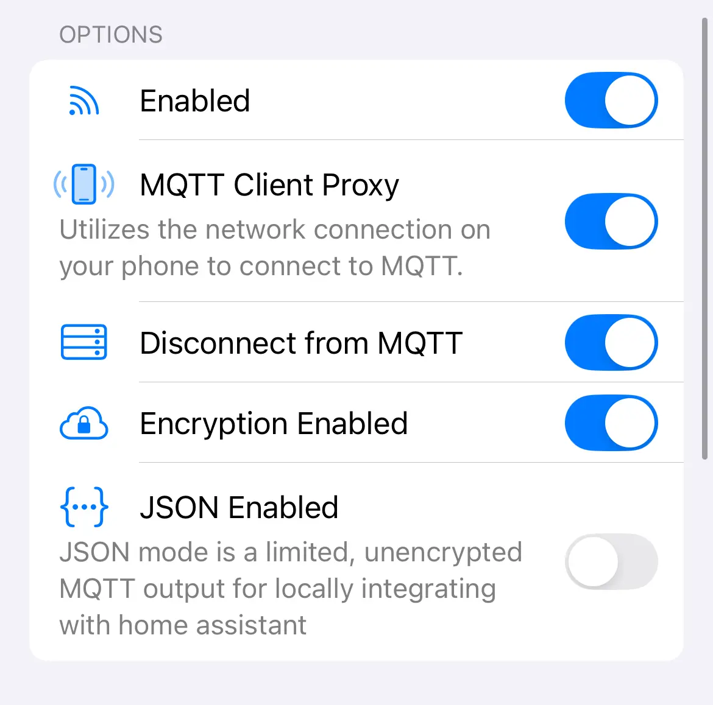
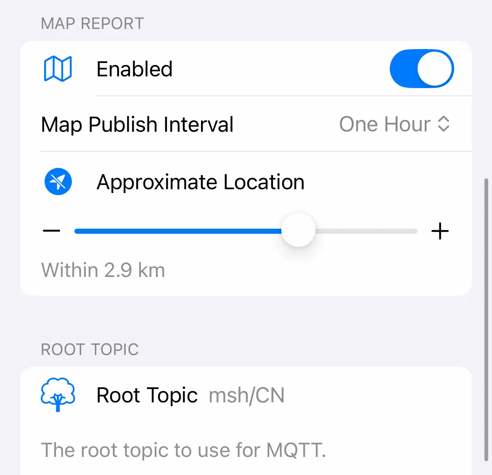

在这个教程中，我们将逐步介绍如何在 Meshtastic 中配置 MQTT，以便将您的设备与互联网连接，从而使本地 Mesh 网络中的用户可以与外部用户进行通信。

MQTT 是 Meshtastic 的内置功能，通过以太网或 WiFi 将节点连接到本地互联网。对于完全孤立的用户来说，这是一种获取更多节点联系的方式。然而，启用 MQTT 时，你可能会将整个网络的通信流量广播到公共互联网，包括消息和位置信息。因此，建议根据实际需要谨慎启用此功能。

目前，中国使用 Meshtastic 的用户数量较少（不足 100 人）。在这种情况下，为了让初学者有更好的使用体验，可以考虑启用 MQTT 功能。这将有助于新用户更快地接收到回复，而不会因为附近没有其他 LoRa 节点而陷入长时间的等待。

我们将基于个人经验，详细解释每个设置项的作用和配置步骤。

## 前置条件

- Meshtastic 固件尽量是最新版本，确保支持 MQTT 配置。
- MQTT 服务器：可以使用 Meshtastic 官方的 MQTT 服务器，或者自己搭建一个自定义的 MQTT 服务器。

## MQTT 配置

### 1. 访问 MQTT 设置
打开 Meshtastic 应用，在主界面找到“设置”选项，进入 **Module Configuration** 下的 **MQTT Config**。

对于 **iOS** 用户，路径为：`设置` -> `Module Configuration` -> `MQTT Config`。
对于 **Android** 用户，路径也类似。

### 2. 启用 MQTT 模块

- **Enabled（启用）**：将此选项设置为 **开启**，启用 MQTT 模块，使设备可以将消息转发到 MQTT 服务器。
  - **作用**：启用后，设备会通过 MQTT 协议与其他设备或服务器进行通信。
  
### 3. 启用 MQTT 客户端代理

- **MQTT Client Proxy（MQTT 客户端代理）**：
  - **nRF 设备**：若设备为 nRF 型号（例如 nRF52），由于其不能直接连接到互联网，需要使用手机的互联网连接来转发数据，因此需要开启此选项。
  - **ESP32 设备**：如果你使用的是 ESP32 并且它通过 Wi-Fi 连接到互联网，**请关闭此选项**。因为 ESP32 本身可以直接连接到 MQTT 服务器，无需依赖手机的互联网连接。
  
  - **作用**：启用客户端代理功能后，设备将通过手机的网络连接与 MQTT 服务器进行通信。这对于大多数使用 nRF 设备的用户来说是必需的。

### 4. 启用 MQTT 连接

- **Connect to MQTT（连接 MQTT）**：将此选项设置为 **开启**，使设备能够连接到指定的 MQTT 服务器。
  - **作用**：这项设置允许设备通过 MQTT 协议与网络上的其他设备进行通信。

### 5. 启用加密

- **Encryption Enabled（启用加密）**：将此选项设置为 **开启**，确保数据在传输过程中是加密的。
  - **作用**：启用加密后，所有通过 MQTT 传输的消息将进行加密，提高通信的安全性。尤其在公共网络中传输时，强烈建议开启加密。

### 6. 启用 JSON 数据格式

- **JSON Enabled（启用 JSON）**：将此选项设置为 **关闭**，因为 JSON 数据格式并不适用于所有 Meshtastic 设备，尤其是 nRF52 平台不支持 JSON。
  - **作用**：JSON 格式的数据虽然便于与其他系统进行集成，但由于某些平台的限制，这个功能在此处关闭。

### 7. 配置地图报告

地图报告功能可以帮助你跟踪和显示 Meshtastic 节点的位置。在启用此功能后，节点会定期向 MQTT 服务器报告其位置和其他相关信息。

- **Enabled（启用地图报告）**：将此选项设置为 **开启**，启用地图报告功能。
  - **作用**：开启后，设备会定期将其位置信息（包括名称、ID、精度等）发送到 MQTT 服务器，并可供在线地图服务使用。

- **Map Publish Interval（地图发布间隔）**：设置为 **1小时**，这意味着每一小时设备会向服务器报告一次位置。
  - **作用**：这个时间间隔可以根据需要进行调整，较短的间隔将增加数据流量和系统负担，较长的间隔则减少更新频率。

- **Approximate Location（位置精度）**：设置为 **2.9KM** 或 **5.8KM**，用以平衡隐私保护与位置精度的需求。
  - **作用**：选择较低的精度（如 2.9KM）有助于保护隐私，同时依然能够提供附近设备的大致位置。如果对隐私要求较高，可以选择较大的精度。

### 8. 配置 MQTT 服务器

- **Server Address（服务器地址）**：如果使用 Meshtastic 官方的 MQTT 服务器，地址为 `mqtt.meshtastic.org`。
  - **作用**：这是 Meshtastic 默认的 MQTT 服务器地址，可以通过它将数据转发到互联网。

- **Username（用户名）**：填写 `meshdev`。
  - **作用**：这是 Meshtastic 官方 MQTT 服务器的默认用户名，用于身份验证。

- **Password（密码）**：填写 `large4cats`。
  - **作用**：这是 Meshtastic 官方 MQTT 服务器的默认密码，用于身份验证。

- **TLS Enabled（启用 TLS）**：将此选项设置为 **关闭**，由于 Meshtastic 官方服务器不使用 TLS 加密，关闭此选项。
  - **作用**：关闭 TLS 后，连接将以明文传输数据，适用于默认服务器设置。如果你使用的是自定义 MQTT 服务器并希望使用加密连接，可以选择开启。

## Channel Config 通道频道配置

### 1. 配置默认通道

在 Meshtastic 中，通道决定了通信的数据传输路径。以下是默认通道的配置：

- **Name（通道名称）**：留空，使用默认名称。
- **Key Size（密钥大小）**：选择 **Default（默认）**。
- **Key（密钥）**：填入 `AQ==`，这是 Meshtastic 默认的加密密钥。
- **Channel Role（通道角色）**：选择 **Primary（主通道）**，这是与外部通信的主要通道。

### 2. 配置通道的上行和下行

- **Position Enabled（启用定位）**：将此选项设置为 **开启**，使设备能够发送其位置信息。
  - **作用**：启用位置功能后，设备可以向其他设备发送其当前的地理位置，用于地图报告和网络管理。

- **Approximate Location（位置精度）**：设置为 **2.9 KM** 或 **5.8 KM**，选择较低的精度有助于保护隐私。
  - **作用**：与 MQTT 配置中的位置精度一致，这里的设置将影响节点报告位置的隐私保护。

- **Uplink Enabled（启用上行）**：将此选项设置为 **开启**，允许设备将数据从本地 Mesh 网络传输到 MQTT 服务器。
  - **作用**：启用上行后，设备将能够向外界发送消息（例如通过互联网与其他节点通信）。

- **Downlink Enabled（启用下行）**：将此选项设置为 **开启**，允许设备从 MQTT 服务器接收数据。
  - **作用**：启用下行后，设备将能够接收来自外部网络的消息，并将其转发到本地 Mesh 网络中的其他节点。