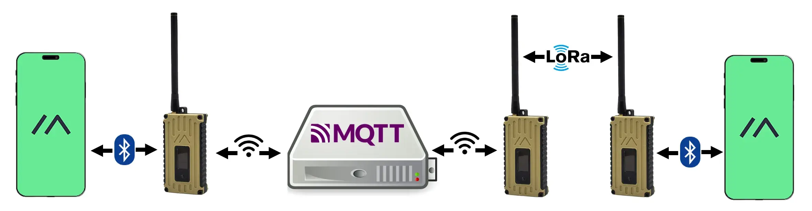
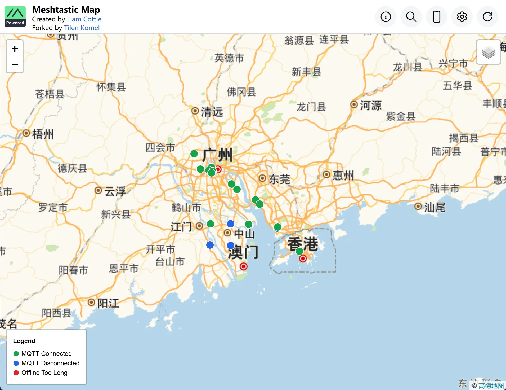
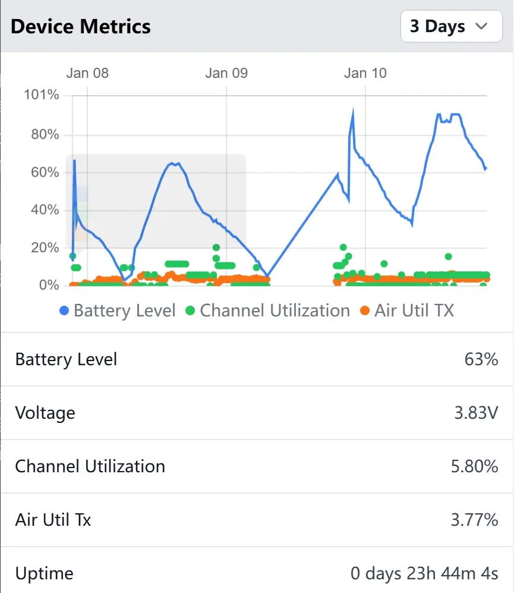
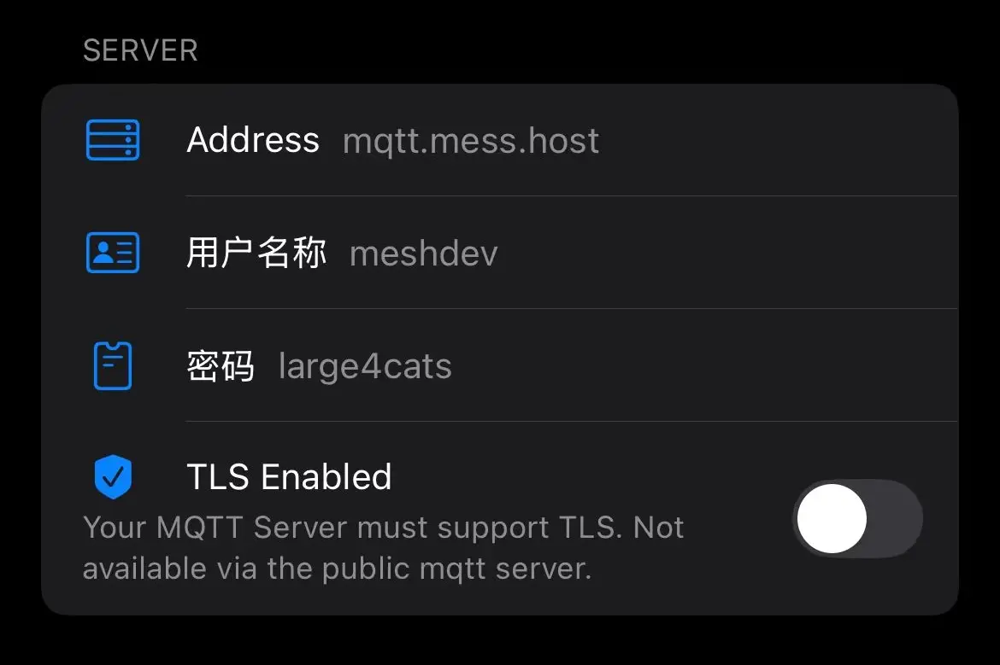
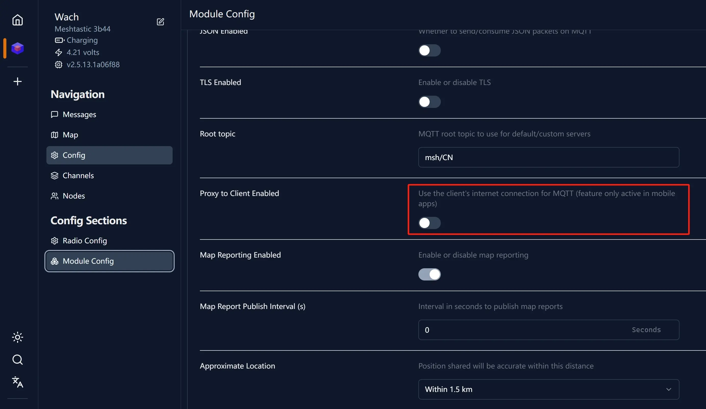
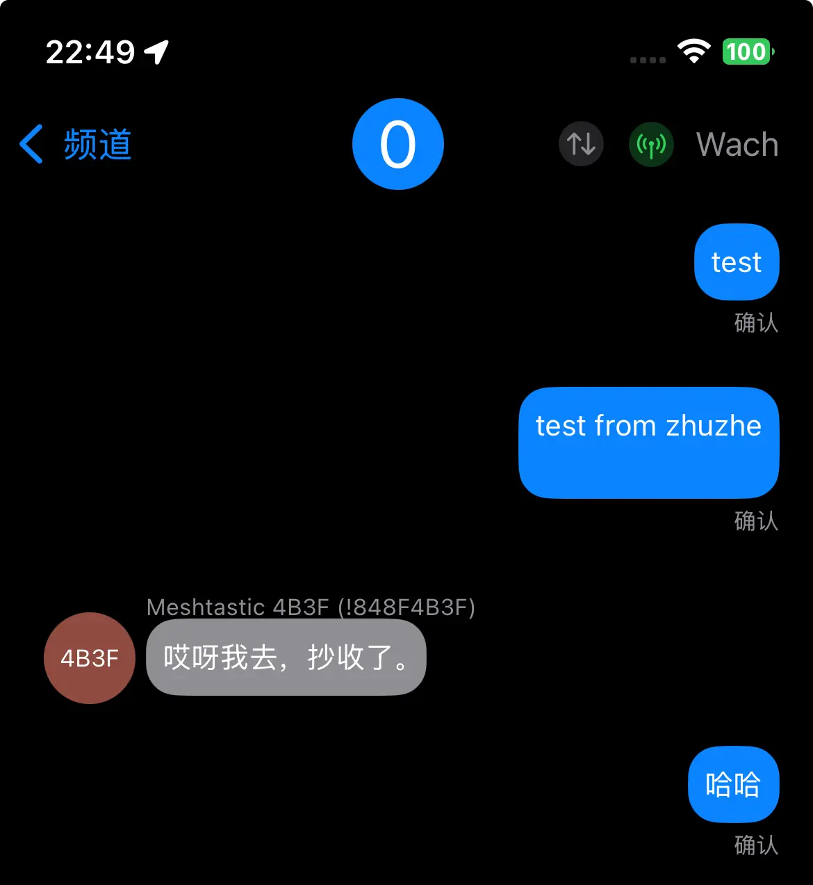
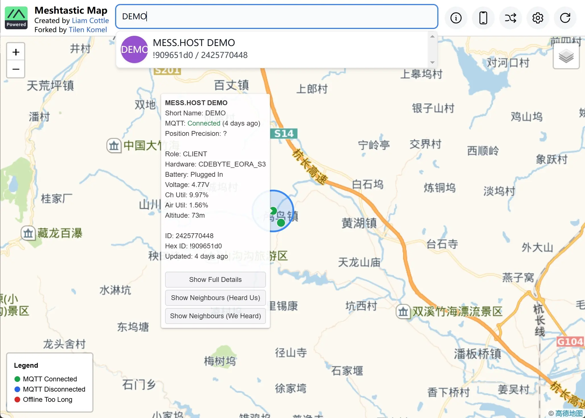
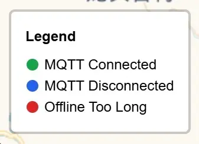
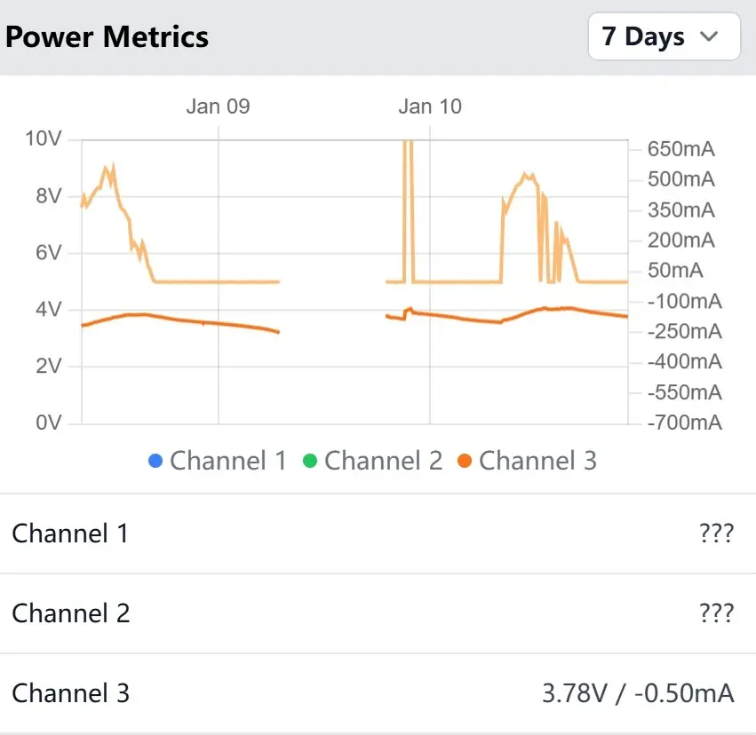
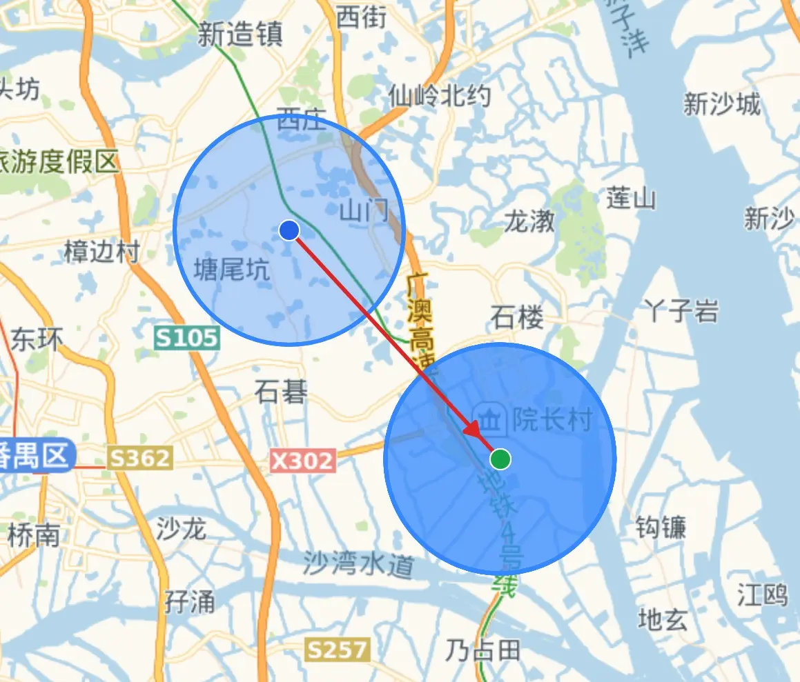

> 投稿来自社区群成员*朱哲*。谢谢他的耐心整理和分享。这个国内的 MQTT 服务器正是由他创建和维护。

不少 Meshtastic 玩家可能连接过官方的 MQTT 服务器，那为什么需要连接 MQTT 服务器呢？使用 MQTT 服务器有以下几个优点：

1. 连接其他地区的玩家：中国地大物博，地形复杂，很难通过mesh网络连接全国的用户，那异地联通的时候，MQTT就成了唯一的选择。而且不仅直接连接上MQTT的玩家可以跟远处的玩家通信，而且其他通过mesh网络和你连接的玩家也可以通过你中转消息到MQTT服务器。
  

1. 方便了解本地玩家的分布：在地图上可以很直观的看到现有玩家的分布情况，可以根据现有玩家的分布，有计划的补充高处的节点，方便高效扩展节点覆盖，弥补盲区。
  

1. 方便观察自己远程节点的状态：地图上不仅能够显示节点的GPS定位也能显示诸如电量，电压，温度等其他传感器的信息。如果你放在天台上的一个节点，由于长期光照不足，导致电压过低，那么是时候上去给他冲个电了。
  

很多 Meshtastic 新手默认选择了官方 Public MQTT 服务器。然而，国外服务器虽然用户众多，但会出现访问较慢、服务器压力大甚至完全无法访问的问题。

## 中国国内的 MQTT 服务器

幸运的是，由活跃社区成员*朱哲* 维护的 MESS.HOST 网站最近提供了一个**国内的 MQTT 服务器**，经过近一个月的测试，正式投入使用。

服务访问速度较快，也非常稳定，欢迎大家使用。

而且内地地图已替换为高德地图，这加快了地图加载速度，同时更方便中国大陆玩家找到所在城市。

## 如何连接 MESS.HOST 服务器？

### 已连接官方 MQTT 服务器的玩家

只需将官方 MQTT 服务器地址从 `mqtt.meshtastic.org` 更改为 `mqtt.mess.host`（留意到前缀是一致的，只有后缀不同），账号密码和其他信息保持不变，非常简单！

### 从未连接过任何 MQTT 服务器的玩家

需要修改 MQTT 服务器地址，同时参考以下教程进行配置：《[如何连接 Meshtastic MQTT](/how-to-connect-meshtastic-mqtt/)》

配置完成后：
- 通过蓝牙连接设备：设备信息通过蓝牙上传至手机网络，再发送到 MQTT 服务器。
- 通过 Wi-Fi 连接设备：设备与周围玩家的消息直接通过内置 MQTT 客户端上传到服务器。

> **注意**：在 Wi-Fi 模式下上传 MQTT 时需关闭相关设置。
> 

### 测试连接

如果你服务器配置成功，那么赶快打开你的 Meshtastic 终端设备，在 Public 频道（公频）里面吼上一嗓子，问问看有没有朋友CQ吧？

## 常见问题（FAQ）

### 如何确认配置是否正确？
打开网址 [map.mess.host](https://map.mess.host)，搜索设备名称或 HEX 编号后四位。如果能找到设备，说明已正确连接。

如果没有显示设备的话，那说明可能配置还有问题，建议返回之前的文章，再检查一遍设置。

### 为什么无法访问 [map.mess.host](https://map.mess.host)？

可能是 DNS 服务器更新过慢。建议将电脑或路由器的 DNS 设置为 `119.29.29.29` 或 `223.5.5.5`。

### 地图上的蓝点/绿点/红点是什么意思？

- 🟢 绿点：通过 MQTT 连接的设备。（MQTT Connected）
- 🔵 蓝点：当前未连接的设备。（MQTT Disconnected）
- 🔴 红点：长时间未连接的设备。（Offline Too Long）

### 如何查看设备传感器/telemetry信息？

首先在搜索框里通过搜索找到自己的设备，点击设备名称，就可以在左侧浮层上看到设备的详细信息，上下滚动可以看到自己设备的详细信息，包括电压/电流/电池等其他传感器信息。你也可以通过这个手机温湿度，气压等。

你也可以通过右上角的分享按钮将你的节点分享给你的好友。

### 如何在地图上找到哪些设备是通过 MESH 网状网络连接到我的？

首先你需要上报你的GPS信息，并打开 Module Config - Neighbor Info 下面的相关设置。 等一会之后就可以在地图上点击的你设备，在气泡最下面点击” Show Neighbours (We Heard) ” 。这样就能看到通过MESH网络, 要注意的是，如果对方没有GPS信息或者没有打开Neighbor Info的设置，你们之间的Neighbor info也不会出现在地图上，只会出现在你的本地节点数里面。

### 如何联系管理员？

如果你有需求，你可以通过邮件 feudum#qq.com（把 `#` 替换成 `@`） 发邮件给管理员。部分开发计划已经在安排中，如地图界面汉化，添加使用小工具等。

也欢迎大家关注 [MESS.HOST](https://www.mess.host) 获取更多关于meshtastic设备的信息。
