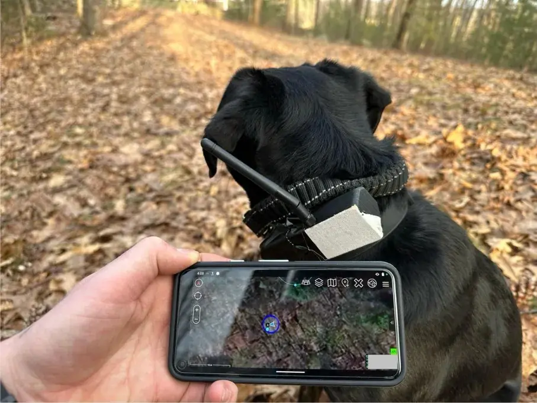

Meshtastic 和 ATAK 的结合，为团队提供了一种低成本、高效的方式，在无 4G、5G 蜂窝信号或 Wi-Fi 环境下实现地理位置共享和即时通信。

这种搭配尤其适用于需要离网通信的场景，例如户外探险、打猎、灾害应急、军事模拟（MilSim）或其他需要通过网状（Mesh）网络实时共享信息的任务。

一位位于非洲的 Meshtastic China 社区群友，打算将 Meshtastic 和 ATAK 应用于安保系统，为当地的紧急响应和安防资源调度提供了可靠的通信支持。想了解更多关于非洲农场和军警场景中的精彩应用？别错过我们的年度总结文章——《[2024 的 Meshtastic 中国社区：搞笑、有料、充满创意](/announcement-2024-last-day-annual/)》！

在本教程中，我们将详细介绍如何配置和使用 Meshtastic 与 ATAK 插件，让您的团队在偏远地区也能保持高效协作。

## 设置

### 安装软件

在开始配置之前，您需要确保以下两款软件已经正确安装。

#### ATAK

首先是 ATAK 应用的安装。

您可以通过 [t.gov](https://www.tak.gov/) 官方网站下载最新版本的 ATAK。这是官方认可的权威发布渠道，提供了最新版本的安装包。但请注意，访问和下载需要提前注册一个账户。

如果您更习惯通过 Google Play 商店获取应用，也可以直接搜索 ATAK 并下载。不过，使用此途径时需要留意所下载版本是否支持您计划使用的插件，以免出现兼容性问题。

#### Meshtastic

其次是 MeshTastic 安卓应用的安装。

这款应用可以通过多个渠道获取，包括 Google Play 商店、F-Droid 平台或 MeshTastic 的 [GitHub 仓库](https://github.com/meshtastic/Meshtastic-android)。无论是新设备还是已有设备，始终推荐更新到最新固件版本，以充分利用最新的功能改进和优化。

完成上述软件安装后，您的设备便已准备好进入下一步配置流程。

### 配置 MeshTastic 设备

在设备和应用程序准备就绪后，接下来的步骤是配置 MeshTastic 设备以适配 ATAK 插件。这个过程主要包括设置频段、调整设备角色以及验证基本通信。

首先，需要连接设备并选择适当的频段。打开 MeshTastic 安卓应用并与设备连接。如果设备是首次使用，应用会要求您手动设置 LoRa 频段。对于中国的用户，通常会选择 470 MHz 频段，而美国的用户则更常使用 900 MHz 频段。这一步的设置对于确保设备在本地合法使用和优化通信性能至关重要。

接下来，需要调整设备的角色以适配 ATAK 插件的功能。在应用的设备设置页面（Device Settings）中，将默认的设备角色从 「Client」 模式切换为 「TAC」。这种角色调整会让设备优先处理与 ATAK 通信相关的数据流量，从而实现更高效的团队协作。完成设置后，记得保存配置并重启设备，以确保所有更改生效。

最后，为了确认设备配置是否正确，建议使用 MeshTastic 应用进行一次基本通信测试。尝试发送一条简单消息，并检查其他设备是否能够成功接收到消息。如果测试结果显示通信正常，则表明设备已经为后续的 ATAK 配置做好了准备。 

如果您需要更详细的 Meshtastic 配置指南，可以访问 MeshCN 博客中的 [相关文章](https://meshcn.net/archives/)，获取更多实用技巧和深入教程。

### 安装 MeshTastic ATAK 插件

ATAK 插件是让 MeshTastic 与 ATAK 数据打通的关键。

不过，这里可能要让苹果用户失望了，因为 ATAK 插件并不支持 iOS 平台。不过别担心，从二手平台如闲鱼上入手一部安卓手机是个不错的选择，而且价格通常十分实惠。

反正 ATAK 主要用于户外高强度环境，使用二手安卓机即便损坏也不会让人太过心疼——经济耐操。

1. 前往 [MeshTastic ATAK 插件的 GitHub 页面](https://github.com/meshtastic/ATAK-Plugin/releases) 下载最新的插件版本。
2. 将插件安装到您的安卓设备。如果您的设备提示 「未知来源应用」，请在设置中允许相关权限。
3. 安装完成后，不要急着打开插件，下一步我们将直接在 ATAK 中加载。

### 配置 ATAK 应用并加载插件

接下来，我们需要在 ATAK 应用中激活插件：

1. 打开 ATAK 应用，进入左上角的菜单（汉堡菜单）。
2. 找到 Plugins（插件）选项。
3. 在插件列表中找到 MeshTastic ATAK 插件。如果插件显示为 「未加载」（Not Loaded），点击加载。
4. 加载成功后，插件状态会变为 「已激活」（Active）。

### 测试 MeshTastic 与 ATAK 的集成效果

插件加载完成后，可以通过 ATAK 应用中的 GeoChat 功能测试集成效果：

1. 打开 GeoChat 页面。
2. 尝试发送一条测试消息。这条消息会通过 MeshTastic 的 LoRa 网状网络发送，而非 Wi-Fi 或 TCP/IP。
3. 在其他连接设备上查看消息是否成功接收。如果一切正常，您还可以尝试回复消息以测试双向通信。

消息测试通过后，您可以进一步探索 MeshTastic 和 ATAK 的更多功能，比如位置共享（PLI）或任务协作。

## 提高通信效率的优化建议

为了让 MeshTastic ATAK 插件在 LoRa 网络中实现最佳性能，可以从多个方面对系统进行优化。这些建议将帮助用户在不同使用场景中提高通信效率，并确保网络运行的稳定性和可靠性。

首先，保持软件版本的更新至关重要。开发者在每个版本中都会对 GeoChat 和 PLI（位置共享）的通信逻辑进行优化，例如引入了更高效的数据包处理机制（wire-optimized packets）。这些改进显著提升了数据传输效率，并减少了网络中的延迟。因此，建议用户定期检查并更新到最新版本，以获得更优质的使用体验。

其次，根据实际使用环境调整 LoRa 参数也是优化通信的重要手段。通过合理设置信道带宽（Bandwidth）和传输速率（Spreading Factor）等关键参数，可以在通信范围和速度之间找到最佳平衡。例如，在需要覆盖更远距离时，可以适当降低传输速率，而在高密度环境中则应优先考虑较高的数据传输速度。不同场景下的优化配置能够显著提升设备间的通信效率。

最后，合理规划网状网络的拓扑结构也不可忽视。过多的中继设备虽然可能扩展网络覆盖范围，但也会引入不必要的延迟，降低整体通信效率。因此，用户应根据任务需求谨慎决定设备数量和位置，避免因冗余设备导致的资源浪费和性能下降。

## Meshtastic 与 ATAK 插件的工作原理

除了基本的使用操作，我们来进一步探索 Meshtastic 与 ATAK 插件的技术细节。

这些内容对于想要充分发挥 Meshtastic 与 ATAK 结合功能的小伙伴们尤为重要！

### ATAK 插件功能

Meshtastic 官方 ATAK 插件的主要作用有以下三点：

1. 绑定 Meshtastic Android 应用的 `IMeshService` 服务：通过绑定该服务，插件可以使用 Meshtastic 的通信接口，发送 LoRa 消息。

2. 拦截 ATAK 的 CoT 数据：插件通过 ATAK 提供的 `PreSendProcessor` 接口，截取所有即将发送的 CoT（Cursor on Target）数据包，并将它们通过 LoRa 网络发送。

3. 监听 Meshtastic Android 应用的广播：插件通过 `ATAK_PLUGIN` 端口监听来自 Meshtastic 应用的广播数据包，从而接收并解析 LoRa 网络中的消息。

### Meshtastic Android 应用的作用

在使用 ATAK 插件时，Meshtastic Android 应用不仅是一个配置工具，更是整个系统正常运作的核心部分：

- IMeshService 服务的中继：Meshtastic 应用提供了一个 `IMeshService` 接口，所有 Meshtastic 到 ATAK 的消息通信均通过此接口实现。

- 广播与接收同步：Meshtastic 应用负责将设备上的消息广播到 LoRa 网络，同时接收网络中的消息并转发到 ATAK 插件。

确保 Meshtastic 应用始终在后台运行是插件正常工作的基础。如果应用未运行或崩溃，ATAK 插件将无法绑定 IMeshService 服务，导致通信中断。

### 使用场景

插件的工作模式决定了它的适用场景，其中主要分为两种常见的使用模式：团队通信和独立位置广播。每种模式在实际应用中都有其独特的优势和适用范围。

第一种模式是团队通信。

这种模式下，多个设备通过 ATAK 插件进行通信，形成一个高效的协作网络。为了确保通信正常，每台设备都需要运行 Meshtastic Android 应用，并对 LoRa 通信参数进行正确配置。

插件在这个过程中扮演着桥梁的角色，它负责拦截 ATAK 应用中的所有 CoT（Cursor on Target）数据，并通过 LoRa 网络进行转发。这样，即使在没有传统通信网络支持的情况下，团队成员之间依然可以保持实时的信息同步与交流。

第二种模式是独立位置广播，也称为 Standalone TAK Tracker 模式。

在这种情况下，设备被设置为 `TAK_TRACKER` 模式，可以独立地广播自己的位置信息（PLI），即使没有运行 ATAK 应用。

Meshtastic 设备通过 LoRa 网络发送位置数据，而 ATAK 应用则可以直接接收到这些信息。但需要注意的是，为了确保位置广播的成功，所有设备必须位于相同的 Meshtastic 信道中。这种模式非常适合那些需要实时位置追踪但不需要复杂通信功能的场景，例如个人探险或者简化团队部署。

这两种模式的灵活性为用户提供了更多选择，可以根据具体需求调整设备和网络的配置，从而实现最佳的离网通信体验。

## 常见问题解答

### Q：为什么 ATAK 插件的图标是红色？

图标红色表示插件未能绑定到 Meshtastic 应用的 IMeshService 服务。

这可能是因为：
- Meshtastic 应用未运行或已崩溃；
- 插件安装版本与 ATAK 版本不匹配。

### Q：如何调试未连接的问题？  

检查以下几项：
1. 确保 Meshtastic 应用后台运行；
2. 检查插件是否正确安装并激活；
3. 确认设备设置为 `TAK` 角色。

## 总结

从设备准备到插件配置，再到实际的消息测试，我们完成了 MeshTastic 和 ATAK 的全流程打通。通过 ATAK 的强大功能，您可以在 LoRa 网络中实现更多可能性。

Meshtastic 与 ATAK 的结合为离网场景下的团队协作开辟了一片新天地。无论是 GPS 地理位置共享还是即时通信，这种解决方案都能在技术与实际需求之间找到平衡，让使用者在荒野探险、应急救援甚至军事模拟中如虎添翼。

未来，我们会持续关注插件的更新动态，并为社区带来更多教程。希望这篇文章能帮上忙！

如果在操作过程中遇到问题，欢迎随时 [加入 Meshtastic 中国社区](/contact/) 与我们交流。

---

#### 参考

本文的内容主要参考了以下两份权威资料：《Meshtastic ATAK Plugin》视频（来自 Meshtastic 官方 YouTube 频道）和 Meshtastic 官方文档中的 ATAK Plugin 部分。

这些资料为 Meshtastic 与 ATAK 的集成提供了详尽的指导和实践案例，是本文内容的主要来源。

如果您希望深入了解或获取更多操作细节，强烈建议直接阅读这些官方资源：  

- 《Meshtastic ATAK Plugin》，来自 Meshtastic 官方 YouTube 频道：[https://www.youtube.com/watch?v=PZOkaiSqKaM](https://www.youtube.com/watch?v=PZOkaiSqKaM)  
- 官方文档：ATAK Plugin：[https://meshtastic.org/docs/software/integrations/integrations-atak-plugin/](https://meshtastic.org/docs/software/integrations/integrations-atak-plugin/)  