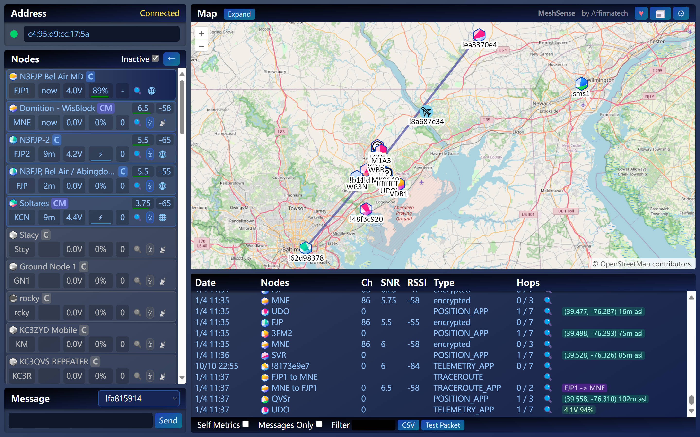
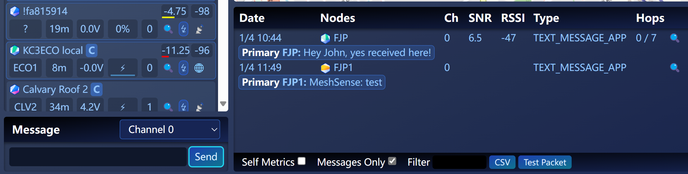
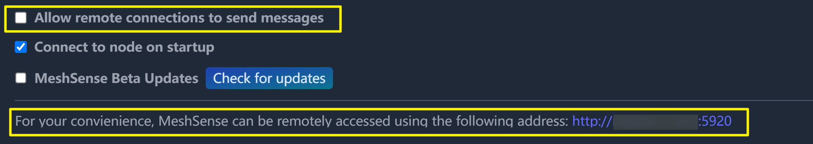
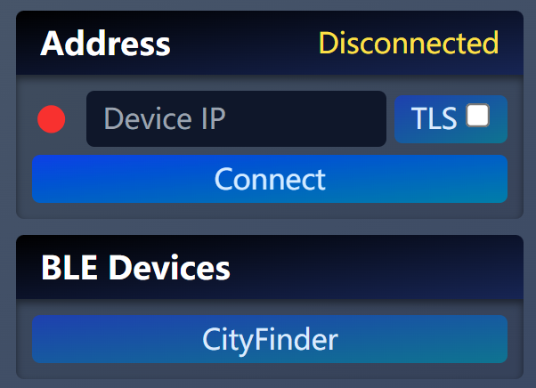
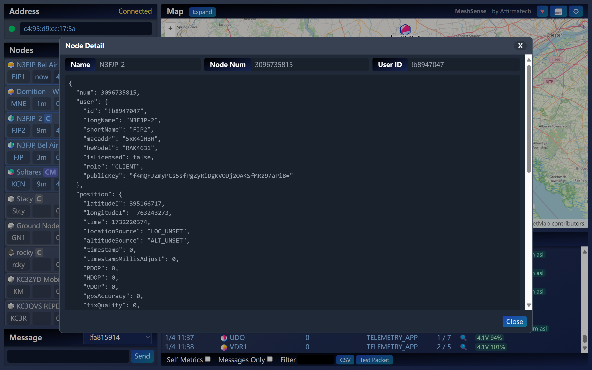

Meshtastic 的 iOS、安卓和 Web 客户端功能强大，但在桌面端领域却长期留有空白。一款功能全面、持续更新的桌面工具，一直是用户们翘首以盼的利器。

虽然 Meshtastic 曾推出 [Network Management Client](https://github.com/meshtastic/network-management-client) 短暂填补过这一空白，但这个工具在 2023 年 7 月 27 日后就停止更新。我试用过一段时间，结果问题频出，bug 横飞，体验实在让人抓狂。

就在这种背景下，[MeshSense](https://affirmatech.com/meshsense) 横空出世。这是一款开源的第三方 Meshtastic 桌面客户端，其功能之丰富、更新之迅速，成为 Meshtastic 工具生态中不可或缺的一部分。

## 什么是 MeshSense？

MeshSense 是一款 [完全开源](https://github.com/Affirmatech/MeshSense) 的 Meshtastic 桌面客户端，适用于 Windows、Linux 和 Mac 系统。它的设计初衷是为桌面用户提供一款功能强大、界面友好且便于操作的工具，让用户可以轻松管理 Meshtastic 网络。无论你是一个家庭固定节点的拥有者，还是需要实时监控网络的户外团队成员，MeshSense 都能满足你的需求。

这款工具的核心在于其直观的图形化界面，它能实时显示网络的状态，包括每个节点的信号质量、跳数、位置等信息。同时，它还支持消息收发功能，并提供多种高级设置，让用户可以根据自身需求对网络进行细致管理。更重要的是，MeshSense 支持蓝牙和 WiFi 两种连接方式，灵活适配不同的使用场景。

相比停滞更新的官方工具，MeshSense 凭借持续的社区支持和快速的功能迭代，从初期的基础版本迅速发展为 Meshtastic 桌面管理的首选工具。

## 核心功能

### 动态地图：实时了解网络健康

MeshSense 的一大亮点是其强大的网络监控功能。通过直观的图形界面，你可以实时了解网络中每个节点的状态，包括其信号噪声比（SNR）、RSSI、跳数和 GPS 位置。对于那些在复杂地形中构建网络的用户，这种全面的指标展示能够极大提升网络优化效率。

MeshSense 提供清晰的动态网络地图功能，自动绘制拓扑并实时更新节点连接状态。对于那些未知位置的节点，MeshSense 会在地图上用问号标注，帮助用户快速识别潜在的网络问题或未配置的节点。此外，1.0.16 版本引入了环境数据采集功能。如果你的节点支持，它还能显示温度、湿度等数据，为你的网络管理提供更全面的信息。

值得一提的是，MeshSense 的地图状态具有记忆功能。无论你关闭软件还是重启设备，地图的状态都会被保存下来，无需每次重新设置。这种贴心的设计，极大地减少了用户的操作负担，让网络管理更加高效。

### 高效消息：告别漏报与复杂操作

作为 Meshtastic 网络的核心功能之一，消息传递在 MeshSense 中得到了很好的体现。用户可以直接通过 MeshSense 界面向网络中的节点或频道发送消息，无需切换到其他工具。

而收到新消息时，MeshSense 提供了音效提醒功能，确保重要信息不会错过。对于那些需要记录和分析通信记录的用户，MeshSense 还支持将消息记录导出为 CSV 文件，方便后续处理。

### 设备连接与兼容性

MeshSense 支持蓝牙和 WiFi 两种连接方式。对于需要短距离连接的用户，蓝牙是一个理想的选择。

而对于希望实现更远距离稳定连接的用户，则可以通过 WiFi 输入节点的 IP 地址完成连接。如果你的节点支持 TLS，加密连接也能轻松开启，进一步提升网络的安全性。

在兼容性方面，MeshSense 支持多种平台，包括 Windows、Linux 和 Mac（包括 M1/M2 芯片）。这种跨平台支持让用户可以在任意设备上运行 MeshSense，无需担心兼容性问题。

### 专业功能与远程访问

对于那些需要高级功能的用户，MeshSense 也提供了诸多亮点。例如，其无界面模式（Headless）可以通过命令行运行软件，非常适合在服务器环境中进行网络监控。此外，用户可以通过设置访问密钥（`ACCESS_KEY`）限制远程操作权限，确保网络安全。

远程访问功能同样值得一提。如果你将一台电脑连接到家庭固定节点，MeshSense 允许你通过其他终端远程查看网络状态。这种设计对需要随时了解网络健康状况的用户而言尤为实用。

## 为什么选择 MeshSense？

MeshSense 的出现完美填补了 Meshtastic 桌面端的空白。虽然 Meshtastic 官方已经为 iOS、安卓和 Web 平台提供了功能丰富的客户端，但桌面端工具始终是一个短板。

MeshSense 以开源、功能丰富和持续更新的优势，迅速成为 Meshtastic 桌面端用户的理想选择。从 2024 年 7 月初次发布至今，MeshSense 的开发团队已经推出了多次更新，每次都带来了令人耳目一新的改进。

MeshSense 的简单易用性（*虽然 UI 我觉得比较土 😀*）也是其吸引广泛用户群体的重要原因之一。软件的界面设计非常直观。

对于普通用户来说，MeshSense 的默认设置已经足够满足大多数场景的需求，用户无需深入了解复杂的技术细节即可体验到软件的核心功能。而对于那些需要更多灵活性的高级用户，MeshSense 提供了丰富的自定义选项和高级功能，从消息前缀设置到无界面 Headless 模式运行，几乎可以适应任何特定场景的需求。

这种兼顾简单与灵活的设计，让 MeshSense 成为一款真正意义上的全能工具，无论用户背景如何，都能从中获益。

## 上手 MeshSense

只需几个简单的步骤，就可以快速上手 MeshSense。

### 第一步：访问官网并下载软件

要使用 MeshSense，首先需要访问其 [官网](https://affirmatech.com/meshsense)。在官网上，滚动到底部，你可以找到适用于不同操作系统（Windows、Linux 和 Mac）的下载链接。

选择与你设备匹配的系统版本进行下载。文件体积较小，下载速度通常很快。下载完成后，双击安装文件，按照提示完成安装流程。安装过程简单直观，即使是初次接触这类工具的用户也不会感到困难。

### 第二步：连接 Meshtastic 节点

安装完成后，启动 MeshSense。这时候需要在左上角选择通过蓝牙或是 WiFi 连接。

#### 通过蓝牙连接

1. 打开你的 Meshtastic 节点，确保蓝牙已开启。
2. 在 MeshSense 的蓝牙设备列表中找到你的节点名称。
3. 点击节点名称并选择「连接」按钮。
4. 如果连接出现问题，检查节点的蓝牙状态，并参考官网的 [蓝牙连接指南](https://affirmatech.com/meshsense/bluetooth)。

#### 通过 WiFi 连接

1. 确保你的 Meshtastic 节点已加入本地网络。
2. 在 MeshSense 的连接设置中，输入节点的 IP 地址。
3. 点击「连接」按钮完成配置。
4. 如果你的节点支持 TLS 加密，可以启用 TLS 选项以提升数据传输的安全性。我的设备启用 TLS 莫名会卡住，因此我一般选择关闭 TLS 选项。

### 第三步：首次运行与界面介绍

连接成功后，软件会显示一个仪表板界面，包含以下主要部分：
- 节点列表：显示已连接的 Meshtastic 节点信息。
- 地图：实时更新的网络拓扑图，显示节点的位置及其连接关系。
- 消息窗口：允许用户发送和接收网络消息。
- 设置菜单：可定制软件行为并配置高级功能。

建议在初次使用时，多浏览一下软件界面，熟悉各部分的布局和功能。软件的设计非常直观，大多数功能都能通过点击按钮直接使用。

### 上手建议

在上手 MeshSense 之前，一些实用的建议可以帮助你更高效地使用这款工具。

首先，建议浏览 MeshSense 官网提供的 [FAQ 文档](https://affirmatech.com/meshsense/faq)。这份文档涵盖了常见问题的解决方案，是新用户的绝佳资源，特别是对于不熟悉蓝牙连接或 WiFi 配置的用户。如果在使用过程中遇到问题，FAQ 通常能够快速解答你的疑问。

其次，根据你的网络环境调整 MeshSense 的设置非常重要。对于带宽有限的网络环境，建议在设置菜单中禁用自动 Traceroute （路由追踪）功能，并设置合理的频率限制，以避免不必要的网络资源消耗。此外，你还可以调整「节点不活动超时时间」（Minutes of inactivity to mark node inactive）这一参数，确保节点列表保持整洁，同时减少无效节点的干扰。

对于刚接触 MeshSense 的用户，保留默认设置是一个不错的选择。默认设置已经针对大多数使用场景进行了优化，可以满足大部分用户的需求。在逐渐熟悉 MeshSense 的功能后，你可以根据自己的实际需求逐步调整高级选项，例如自定义消息前缀、日志存储设置等。

如果你希望在外出时也能随时掌握家里 Meshtastic 节点的网络状态，可以尝试启用 MeshSense 的远程访问功能。在设置菜单中配置访问密钥后，你可以通过其他设备远程查看固定节点的网络状态。

最后，保持 MeshSense 的最新版本尤为重要。MeshSense 的每次更新都会引入新的功能和优化。定期访问官网或留意我们 MeshCN 社区的文章更新，可以帮助你第一时间获取更新信息。

### 在线演示：没有设备？不用担心

如果你暂时手头没有 Meshtastic 节点，却又想抢先体验 MeshSense 的强大功能，不用担心！MeshSense 官网提供了一个 [实时演示版本](https://affirmatech.com/meshsense/FJP1/)，让你无需任何设备即可通过浏览器体验软件。

这个在线演示版本通过蓝牙实时连接一个安装在 20 米高树上的节点，展示了包括节点活动、信号强度、位置信息、跳数以及 Traceroute 等核心功能。你可以直接在网页上尝试动态地图、消息功能以及节点详细信息查看，感受 MeshSense 的便捷和强大。

## 专业功能

MeshSense 不仅适合普通用户，更为专业用户提供了丰富的高级功能，满足复杂场景的网络管理需求。

### 设置界面

通过点击右上角的齿轮 ⚙ 图标进入到设置界面。

在这里，用户可以设置日志大小限制，例如限制日志记录不超过 500 条，确保系统运行流畅而不会占用过多存储空间。用户还可以自定义消息前缀和后缀，用于标识特定节点的消息，在多节点复杂场景下尤其实用。

Traceroute 请求功能同样是 MeshSense 设置界面的亮点。用户可以根据需要调整自动 Traceroute 请求的频率，例如设置为每 15 分钟向活跃节点发送一次请求，避免了不必要的网络资源消耗。

同时，用户还可以通过调整节点不活跃判定的时间（如 60 分钟）来保持节点列表整洁，便于管理。

另外，就是 MeshSense 的一个特色——远程访问功能。每个 MeshSense 客户端都会自动生成一个访问地址，用户只需简单配置即可通过远程终端实时查看网络状态，或向节点发送指令。

### 节点 JSON 信息

对于那些需要深入分析和精确控制节点的用户，MeshSense 提供了详细的节点信息视图。用户可以通过点击某一节点，直接查看其完整的 JSON 数据格式。这种设计不仅方便用户快速了解节点状态，还可以为后续的数据分析和网络优化提供参考。

节点详细信息涵盖了多方面内容，包括基本信息、位置信息和信号状态。例如，用户可以查看节点的长名称（如 `N3FJP, Bel Air / Abingdon, MD`）以及其硬件型号（如 "TLORA_T3_S3"）。位置信息方面，JSON 数据会展示节点的 GPS 坐标（如纬度 `39.5167470`，经度 `-76.3242889`），以及节点的高度（105 米）。

信号状态也一目了然，包括信号噪声比（SNR）和接收信号强度指示（RSSI），帮助用户更好地评估节点的通信质量。此外，用户还可以通过跳数和时间戳快速判断节点的实时状态及其在网络中的角色。

## 快速迭代

作为一款免费的开源工具，这个 Meshtastic 桌面客户端从其发布之初就展现了惊人的更新频率和活跃度。

自 2024 年 7 月初次发布以来，MeshSense 的开发者团队在短短几个月内推出了多个版本更新，每次更新都带来了功能优化和问题修复。这种持续的开发和优化，使得 MeshSense 成为一款功能日益完善的 Meshtastic 桌面客户端。

`1.0.15` 和 `1.0.16` 更新先后推出了无界面模式、地图状态记忆、环境数据采集等功能，显著提升了网络监控的效率与灵活性。这些更新将 MeshSense 从基础工具升级为更专业的网络管理助手。

## 结语

作为 Meshtastic 桌面端工具的一员，MeshSense 用它的强大功能和不断优化的用户体验，填补了 Meshtastic 生态中的重要空白。

无论你是 Meshtastic 的新手，还是资深用户，MeshSense 都能让你在桌面电脑上管理 Meshtastic 节点得心应手。快来试试吧！