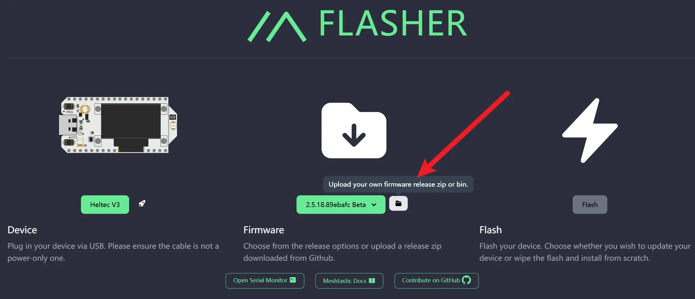

Meshtastic 是一款开源的远程通信工具，通过低功耗无线电模块实现无网络环境下的通信。它适用于户外活动、紧急情况下的团队协作，甚至是偏远地区的通信需求。而 [Flasher](https://flasher.meshtastic.org/) 则是 Meshtastic 官方提供的固件烧录工具，方便用户快速为设备安装或更新固件。

然而，对于中国用户来说，使用 Flasher 网页烧录器时可能会遇到网络限制问题，尤其是在无法访问外网的情况下。尽管 Flasher 本身可以正常打开，但因其需要从国外服务器下载固件文件，网络环境的限制可能导致 Flash 按钮无法激活，呈现无法点击的灰色烧录按钮，设备烧录也因此无法进行。

这类问题不仅给初学者带来了额外的操作难度，还可能影响用户对 Meshtastic 的使用体验。因此，为了解决这些障碍，让所有用户都能顺利完成设备的固件烧录，我们整理了一套针对无法使用 🪜 用户的操作指南，帮助大家在本地环境下完成固件下载和手动烧录。希望通过本教程，能够为社区用户带来更便捷的操作体验。

## 问题描述

在使用 [Meshtastic Flasher](https://flasher.meshtastic.org) 时，用户通常可以通过简单的操作为设备选择固件版本并完成烧录。然而，对于部分无法访问外网的用户来说，会出现以下症状：
- Flash 按钮始终是灰色，即使正确选择了设备型号和固件版本，也无法点击。
- Flash 按钮在用户完成所有必要选择后依然未激活，显示为灰色不可点击状态。
- 即使刷新页面或重新连接设备，也无法解决上述问题。

在中国的许多用户报告了类似的情况，尤其是那些没有翻🧱工具的用户。由于 Flasher 需要从 GitHub 的固件服务器实时获取文件，而这些服务器通常在中国网络中访问不畅，导致了固件文件下载失败的问题。

## 成因

Meshtastic Flasher 是一个基于浏览器的串口烧录工具，它通过以下方式工作：
1. 检测用户连接的设备，并自动识别设备型号。
2. 向远程服务器（通常是 GitHub 的固件存储库）请求对应设备的固件文件。
3. 下载固件后，使用 Web Serial 技术将其写入用户设备的存储中，完成烧录。

当用户选择设备型号和固件版本后，Flasher 网页烧录器会尝试通过网络从远程服务器（通常是 GitHub 的固件存储库）直接获取对应的固件文件。

GitHub 是全球开发者最常用的代码托管平台，Meshtastic 的固件文件也存储在其服务器中。然而，由于 GitHub 的某些资源服务器在国内访问存在不稳定性或直接被屏蔽，导致下载速度极慢甚至无法访问。

当 Flasher 无法成功下载固件时，会直接导致 Flash 按钮无法激活。Flasher 会检测固件文件的下载状态，如果文件未成功加载，Flash 按钮将保持灰色且无法点击的状态，阻止用户继续操作。

## 解决方法

由于网络限制，Flasher 无法直接下载固件文件，我们可以通过手动下载固件、解压选择文件，并使用 Flasher 的文件上传功能绕过这一问题。这种方法完全依赖本地操作，不需要外部网络访问，适用于无法 science 上网的用户。

### 步骤 1：访问固件下载页面

打开 Meshtastic 官方固件发布页面：[GitHub Releases](https://github.com/meshtastic/firmware/releases/latest)。

页面会跳转到最新稳定版固件的下载页面，这里可以看到不同设备固件的 ZIP 文件链接。选择与你设备的 MCU 类型（微控制器型号）相对应的固件 ZIP 文件进行下载。例如：
- 如果使用 ESP32 设备，选择 `firmware-esp32-xxx.zip`。
- 如果使用 nRF52840 MCU 设备（比如 Heltec T114、Lilygo T-Echo），选择 `firmware-nrf52840-xxx.zip`。
- 如果设备搭载的是 ESP32-C6 MCU（比较新的芯片，支持 Wi-Fi 6 和 BLE 5），请选择 `firmware-esp32c6-xxx.zip`。
- 如果你的设备使用的是 ESP32-S3 MCU，请选择 `firmware-esp32s3-xxx.zip`。
- 如果你使用的是 RP2040 MCU（树莓派 Pico），请选择 `firmware-rp2040-xxx.zip`。
- 如果设备基于 STM32 系列 MCU，请选择 `firmware-stm32-xxx.zip`。

设备的 MCU 类型通常可以在设备的产品说明书或官方页面中找到。

### 步骤 2：解压固件文件  
将下载的 ZIP 文件解压到电脑的某个文件夹中。解压后，你会看到多个固件文件，它们分别适用于不同型号的设备。例如：
- `firmware-heltec-mesh-node-t114-xxx.uf2`（适用于 Heltec T114）。  
- `firmware-CDEBYTE_EoRa-S3-xxx.zip`（适用于 Ebyte EoRa-S3）。由于曾经做过促销，[这个型号曾经是社区的宠儿](/announcement-ebyte-out-stock-70-people-community/#趣闻：Ebyte-的-EoRa-S3-被「买到断货」/)。
- `firmware-t-echo-xxx.uf2`（适用于 Lilygo T-Echo）。
- `firmware-heltec-v3-xxx.zip`（适用于 Heltec LoRa32 v3）。 

找到与你设备型号完全匹配的固件文件。

### 步骤 3：使用 Flasher 手动上传固件  
打开 Flasher 网站：[flasher.meshtastic.org](https://flasher.meshtastic.org)。  
在固件选择区域，点击固件版本选择框右侧的小文件图标（文件上传按钮）。选择刚刚解压出的固件文件，例如 `firmware-heltec-v3-xxx.zip`。上传完成后，Flasher 会加载固件，Flash 按钮会从灰色变为绿色。

### 步骤 4：烧录固件  
点击绿色的 Flash 按钮，开始固件烧录。烧录过程通常需要几分钟。在此期间，请勿断开设备连接或刷新页面。烧录完成后，设备会自动重启，运行新固件。

## 总结

在中国网络环境下，由于访问外网资源的限制，Meshtastic Flasher 在固件下载环节可能会遇到问题，导致 Flash 按钮无法点击按下。

通过本教程，用户可以采取以下步骤绕过网络限制，成功完成固件烧录：
1. 手动下载固件：访问 Meshtastic 官方固件发布页面，根据设备型号下载对应的固件 ZIP 文件。
2. 解压并选择固件：解压 ZIP 文件后，找到适配设备的固件文件，例如 T-Echo 的 `firmware-t-echo-xxx.uf2`。
3. 本地上传固件：通过 Flasher 提供的文件上传功能，将本地固件文件加载到工具中。
4. 烧录固件：点击 Flash 按钮完成固件烧录，设备将自动重启并加载新固件。

Meshtastic 中国社区（meshcn.net）是一个开放的技术分享与支持平台，致力于帮助用户解决实际问题。如果您在烧录过程中遇到问题，或者有新的经验和技巧，欢迎通过以下方式参与交流：
- [加入社区的微信交流群](/contact/)，与其他用户分享您的问题与心得。
- 通过社区网站的联系页面[发送邮件](/contact/)，与管理员直接沟通。

## 附录

以下是教程中提到的重要链接，方便用户快速访问相关资源：

- [Meshtastic Flasher](https://flasher.meshtastic.org)  
  用于烧录 Meshtastic 设备固件的官方工具。

- [Meshtastic 固件下载页面](https://github.com/meshtastic/firmware/releases/latest)  
  Meshtastic 官方 GitHub 固件发布页面，可下载设备的最新固件文件。

- [Meshtastic 中国社区 - MeshCN](https://meshcn.net)  
  Meshtastic 中国爱好者的技术社区论坛，提供中文教程、用户支持和交流平台。