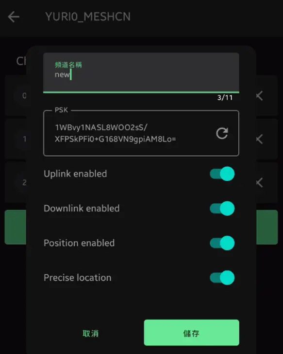
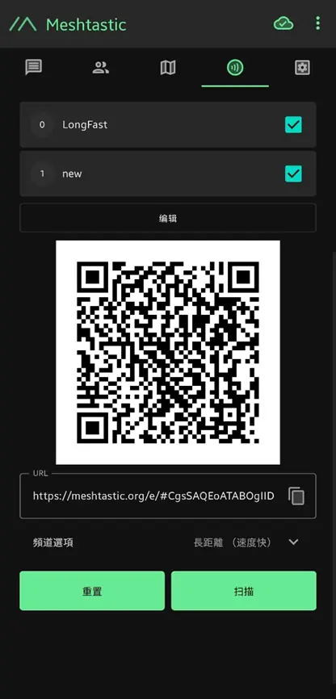
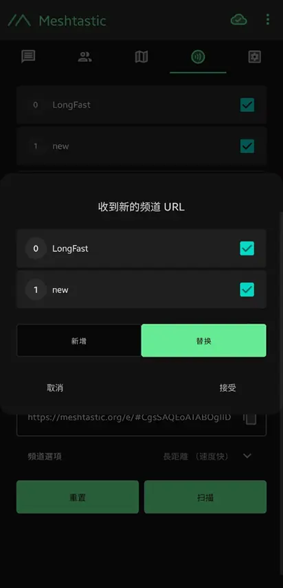
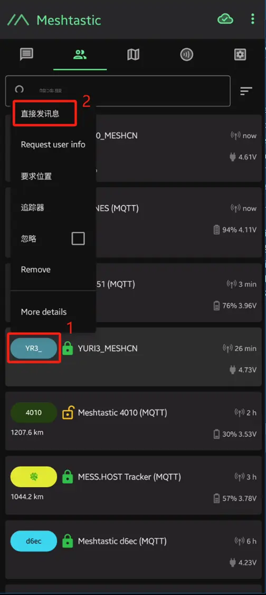

> 投稿来自社区群成员 Yuri_su。谢谢他的耐心整理和分享。

频道可以理解成“微信群”，Meshtastic的频道通过频道号、名称以及公钥（public key）来区分。以下是设置私有频道的步骤，后续可以在 [Channel Configuration | Meshtastic](https://meshtastic.org/) 深入研究：

## 设置步骤

1. 打开设备设置 -> **Channels**，点击右下角“+”号，进入如下界面：
  

2. **频道名称**：可以随便填写，例如这里用“new”。

3. **PSK**（频道的公钥）：  
   公钥是频道的凭证，相同公钥的频道才能收到信息。把公钥复制出来，提供给其他设备用于加入这个频道。例如：  
   `1WBvy1NASL8WOO2sS/XFPSkPFi0+G168VN9gpiAM8Lo=`  
   （发送的信息通过公钥加密）

4. **Uplink**：是否将发送的信息传到MQTT服务器。

5. **Downlink**：是否接收MQTT服务器的信息。

6. **Position enable**：是否同时发送位置信息。启用后，发送信息时会附带位置信息。

7. **Precise location**：是否使用精确位置。如果关闭，则会设置大概位置的范围。

完成上述步骤后，所有节点使用相同的配置即可加入同一个群组。

## 简化配置方法

更简单的方式是先配置好一个节点，然后用二维码共享这些信息：  
- 在页面中选择“扫描二维码”。  
- 注意：扫码时一定要选择“覆盖”的方式，因为“追加”方式可能无法通信（频道号可能被混乱）。  

共享者（已经设置好的节点）需要选择所有频道配置，然后截图发送给接收者（新的节点）扫码即可。

## 与指定节点单独通讯（点对点）

要进行点对点通讯（俗称私信），需要在 **Node 列表** 中看到对方的节点信息，点击对方的节点缩写，然后点击直接发信息。

