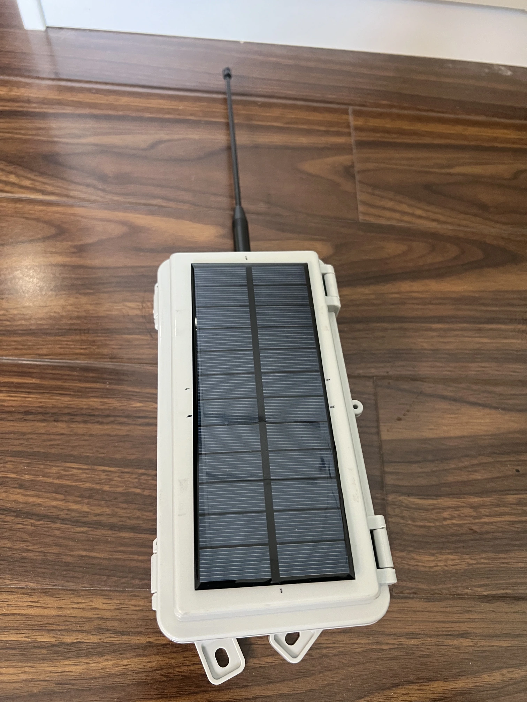
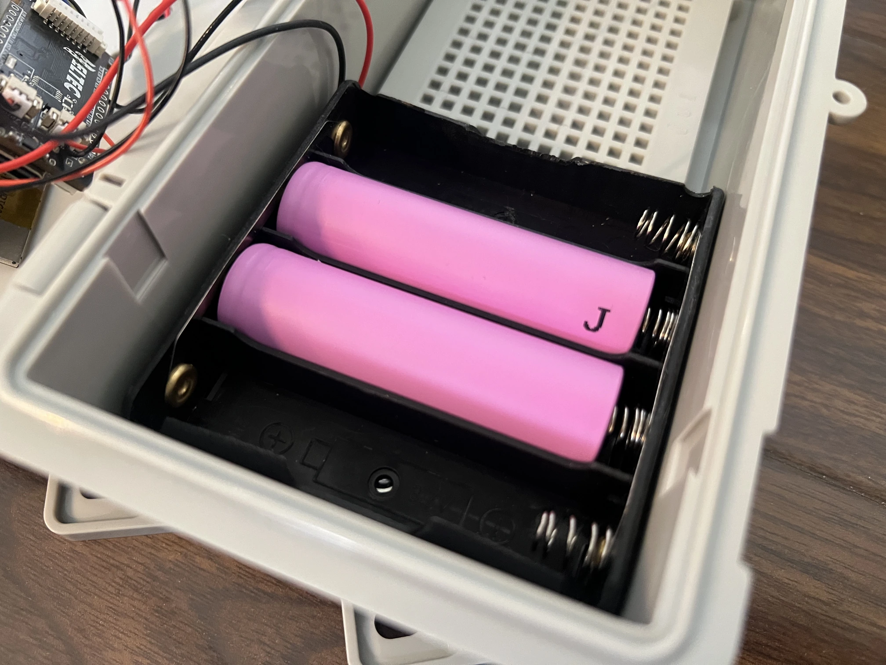
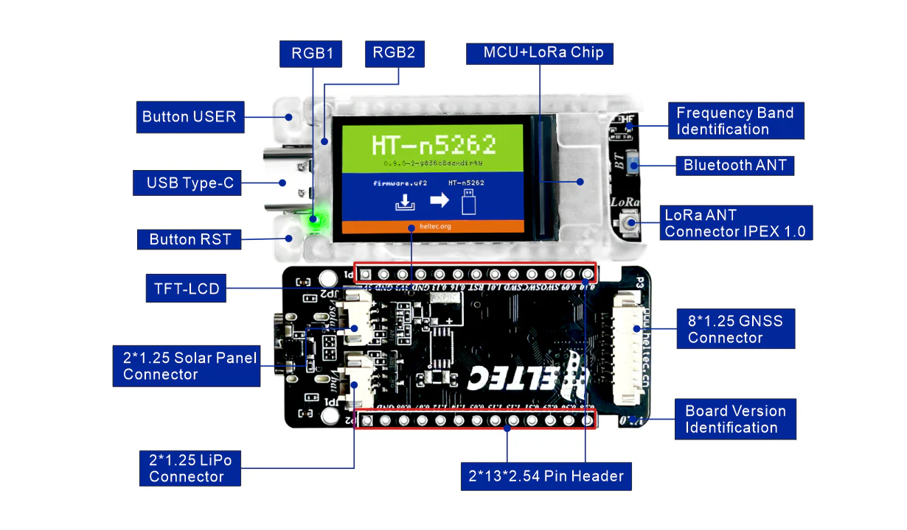
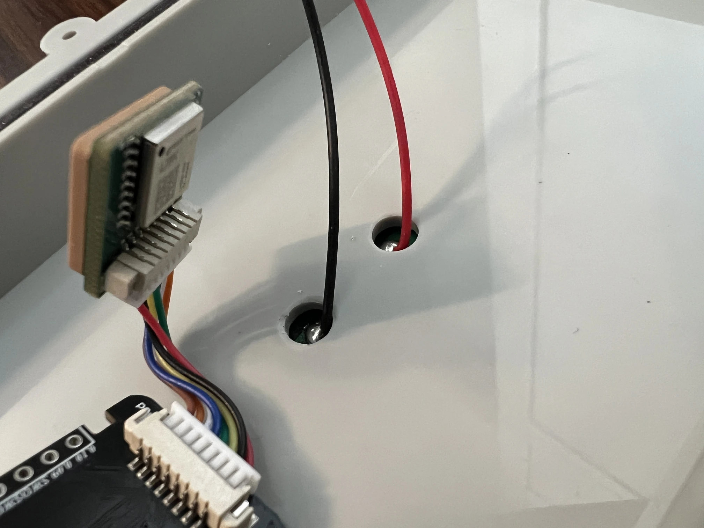
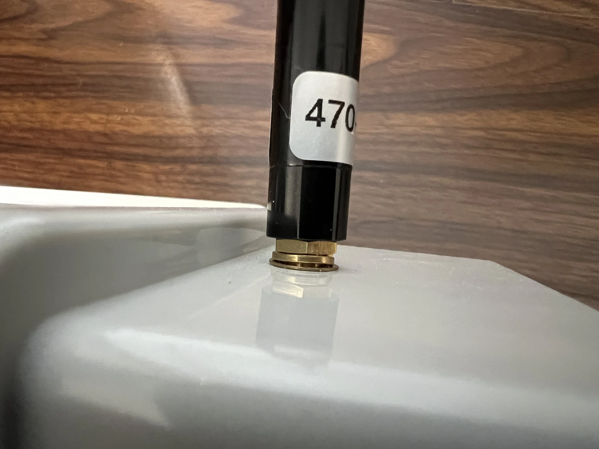
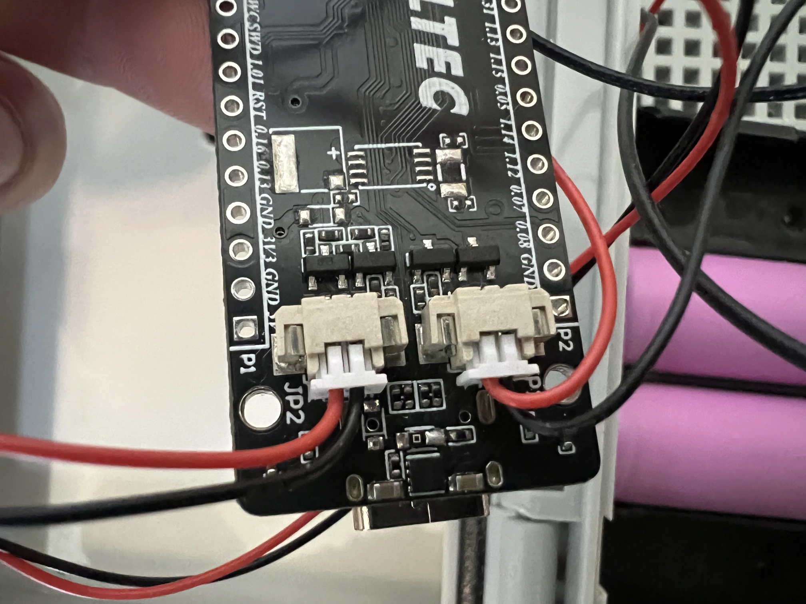
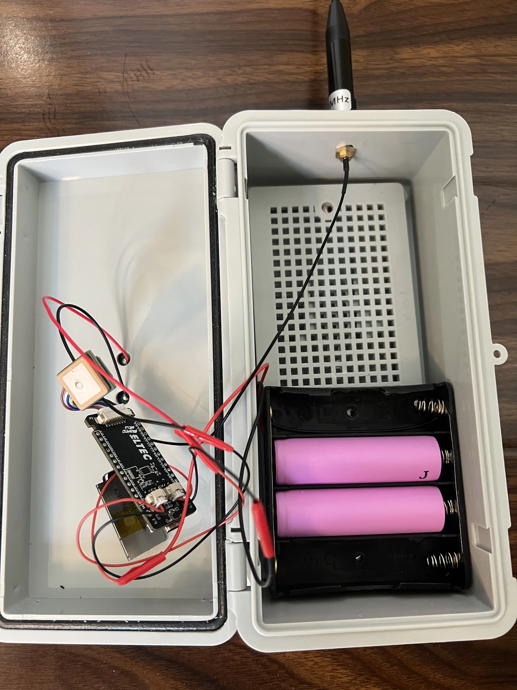

最近有群友反馈，希望博客增加一些能“抄作业”的参考节点案例。这样，即便没有太强的技术背景，也能轻松体验 Meshtastic DIY 的乐趣。为了响应这一需求，我决定分享一下我一个多月前自己动手做的太阳能节点（Meshtastic build）。

Meshtastic 太阳能节点是一个通过太阳能供电的独立 Meshtastic 无线设备，能够在没有传统电力供应的地方为 Meshtastic 网络提供连接。相比其他依赖电池或者外部电源的节点，这种太阳能节点的最大优点在于其可以通过太阳能自动充电，确保在户外环境中长时间、无人值守地运行。

构建一个 Meshtastic 太阳能节点，可以让你为网络提供一个长期稳定的扩展点，同时减少频繁充电的麻烦。当前，用户比较常把太阳能节点放在阳台、天台、以及树上。

## 材料

在构建 Meshtastic 太阳能节点时，选择合适的组件是确保系统稳定性和长期运行的关键。

| 序号 | 材料名称                               | 型号及描述                                           | 价格（大概）      |
|------|----------------------------------------|----------------------------------------------------|-----------|
| 1    | 塑料卡扣户外防水配电箱                 | 200mm x 100mm x 70mm【带底板灰盖】                              | ¥14    |
| 2    | Gizont 433/915MHz 高增益软鞭天线       | 470-510MHz / 24厘米                                  | ¥20   |
| 3    | 18650 电池盒锂电池串并联带              | 18650 4节带线 并联（必须是并联，而不是串联）          | ¥4     |
| 4    | 太阳能单晶多晶滴胶 PET 层压板          | 165*65mm 6V 250mA 滴胶多晶（加了三毛钱多买了两根线） | ¥13    |
| 5    | Heltec T114                            | 建议带 GPS （又称 GNSS）模块购买。GPS 模块可以作为授时工具。     | ¥200-300   |
| 6    | IPEX 转 SMA 连接线                            | SMA外螺内孔转IPEX 1代     | ¥1-2   |
| 7    | 18650 电池                            | 买大品牌的。如果有选择，选带有保护板的     | ¥5-15/每颗（范围很大，取决于容量和品牌）   |

### 太阳能板

太阳能板是整个系统的能源来源，负责将太阳光转化为电能，为设备提供持续的电力供应。

我们使用的是一块小型单晶太阳能板：
- 尺寸为 165mm x 65mm
- 电压为 6V 。
- 电流为 250mA。
- 功率为 1.5W。功率计算公式为电压乘以电流。

经过精挑细选后，我选的这个尺寸刚好能放在防水盒的盖子上。

功率也是够用的。选择太阳能板时，我 [根据 nRF52 节点的功耗来计算所需的功率](/T114-solar-panel-requirement-calculate/)，确保太阳能板能够满足节点在无外部电源情况下的持续工作需求。

为 Meshtastic 节点配备太阳能板的好处在于能够实现自动充电，尤其适合放在天台、郊外等无人值守的应用场景。

### 电池

电池是太阳能节点的关键组件之一，它用于储存太阳能板转换的电能，使节点能够在没有阳光时继续工作。对于 Meshtastic 太阳能节点来说，选择合适的电池配置对于系统的稳定性和长时间运行至关重要。

我们使用的是并联配置的 18650 锂电池，每个电池的标称电压为 3.7V。

> **电池科普小课堂：并联与串联的区别**
> 
> 并联连接是将多个电池的正极连接在一起，负极也连接在一起。这样做的结果是电池的电压保持不变，但电池的容量（mAh）相加，也就是总电量增加。例如，如果你有两块2000mAh、3.7V的电池，连接成并联后，总容量就变成了4000mAh，但电压依然是3.7V。这样做的好处是电池可以提供更长时间的持续供电。
>
> 串联连接则是将一个电池的正极连接到下一个电池的负极。串联后的电池组总电压会是每个电池电压的总和，但是容量保持不变。例如，两块2000mAh、3.7V的电池串联后，电压变为7.4V，但总容量依然是2000mAh。这种方式的好处是可以增加电压，但缺点是如果电池的电压过高，可能会超出某些设备的使用范围，从而导致设备无法正常工作。

之所以选择并联连接，而非串联，是因为 Heltec T114 节点设计时预期使用的电池电压为 3.7V。如果我们使用串联配置，电池组的电压会被增加到 7.4V 或更高，这超出 T114 的电压输入范围，导致设备无法正常工作。

在并联配置中，每个电池的正负极并排连接，而总电压保持不变，依然为 3.7V。但是，多个电池的并联使得电池组的总电流输出能力得以增强，能够为节点提供更长时间的持续供电。

为了方便安装和更换电池，我们选择使用电池盒来容纳这组并联的锂电池。电池盒的使用有几个明显的优点：
1. 方便安装：相比直接焊接电池到电路板，电池盒的安装过程要简单得多，用户只需要将电池放入电池盒并连接相应的端子，而不需要进行繁琐的焊接工作。这使得整个搭建过程更加高效和简便。
2. 更换电池便捷：使用电池盒的另一个优点是，电池出现问题或电量耗尽时，可以方便地更换电池。相比焊接电池，电池盒提供了更加灵活和易操作的替换方式，避免了需要重新焊接的麻烦。

### 防水配电箱

为了保护节点的电子组件免受户外环境的影响，我们使用了一个防水的配电箱。防水配电箱能够有效阻挡雨水、湿气和尘土，保证内部元件的安全和稳定性。我们选用的配电箱型号为 200 x 100 x 70mm，空间很够，可以容纳所有组件，同时具有足够的强度来应对户外环境中的各种挑战。

这个配电箱的防护等级为 IP65，能够确保设备在雨水或者潮湿环境中依然能够正常工作。

除了防水，它还能有效阻挡灰尘和其他外部物质的侵入，增加设备的耐用性。

### Meshtastic 模块——Heltec T114

Heltec T114 是本次节点的核心，它是一款集成了 LoRa 通信模块、省电的 nRF52 微控制器（MCU）、蓝牙和各种接口的设备，专为低功耗无线通信设计。

在选择硬件时，考虑到 ESP32 的功耗较高，制作 Meshtastic 太阳能节点时通常会优先选择 nRF52。而目前市面上能直接买到的 nRF52 Meshtastic 开发板主要有两种选择：RAK 公司和 Heltec 公司的 T114。RAK 在国外社区中非常受欢迎，但价格相对较高，因此我个人还没有尝试过。而 Heltec T114 则因其价格较为亲民、性能稳定而成为我的首选。这次使用的就是 Heltec 的 T114，我手上已经有三块这样的开发板，实际使用中没遇到过明显问题。T114 也是社区中制作太阳能节点的热门选择。MeshCN 博客分享过大量关于 T114 的内容，欢迎 [搜索阅读](/search/?s=T114)。

如果你对 DIY 和性价比感兴趣，还可以关注 [社区中经常提到的 fakeTec 项目](/tags/fakeTec/)。这个项目同样基于 nRF52，极具性价比，但需要一定的焊接技术才能完成组装。由于这篇文章是面向新手，fakeTec 的详细内容就不展开讲了，感兴趣的朋友可以到社区中了解更多。

从硬件设计上看，Heltec T114 自带了锂电池 LiPo 电池接口和太阳能板接口，为我们直接连接电池和太阳能板提供了极大的便利。这样的设计避免了额外焊接或使用第三方充电模块的繁琐，让整个搭建过程更简单，同时也降低了出错的可能性。这对于新手来说是非常友好的。

### 天线

天线是 Meshtastic 太阳能节点与其他 Meshtastic 节点进行通信的关键部件。

我选择了 Gizont 的高增益软鞭天线。最初选择这款天线的原因是，我在 Reddit 社区上看到很多用户对这款天线的评价很高，认为它在性能和价格方面的平衡比较好。最近，社区内的一些成员还使用专业仪器对这款天线进行了测试，测试结果证明了它在 470-510 MHz 频段内具有优秀的性能。

买天线的时候，注意需要买 470-510 MHz 的频率范围，这样才适合 Meshtastic 在中国的频段。

除此之外，还需要买一个 IPEX 一代转 SMA 的转接头。留意，转接头规格应该是外螺内孔，而非外螺内针。

之所以需要使用转接头，是因为 Heltec T114 上的天线接口是 IPEX 一代接口，而 Gizont 天线则采用 SMA 接头。为了让天线与 T114 兼容，必须购买一个 IPEX 到 SMA 的转接头来连接这两者。

## 工具和组装

在开始组装 Meshtastic 太阳能节点之前，确保准备好所有必要的工具和材料。这些工具和步骤的设计目的是帮助你轻松完成节点的安装，并优化节点性能。以下是具体的组装过程，每一步都包含详细的说明和注意事项。

### 1. 太阳能板的准备与安装
首先，为了实现全天候供电，需要将太阳能板的输出电线焊接到正确的端子上。标准做法是使用红色线连接正极端子（标记为“+”），黑色线连接负极端子（标记为“-”）。为了确保连接牢固，焊接时需要稍微加热焊点并使用优质的焊锡。

完成焊接后，将太阳能板固定在防水配电箱的盖子上。在盖子表面钻两个孔，孔的直径应稍大于线缆的外径（通常为 3-5 毫米），这样可以方便电线穿过，并保证密封性。线缆穿过后，可以将线材末端焊接到 Heltec T114 的太阳能接口匹配端子上，再将其插入 T114 的太阳能接口，确保正负极无误。

### 2. 电池盒和电池的安装

为了为设备提供稳定的电源，选用了一个并联的 18650 锂电池组。选择并联而非串联的原因在于 Heltec T114 设计的电池接口预期输入电压为 3.7V，这与并联电池组的输出电压一致。同时，使用电池盒可以大幅简化组装流程，无需对电池直接焊接，从而减少误操作和安全风险。此外，电池盒也便于后期维护，比如更换电池。

将 18650 锂电池依次充满电后，按正确的极性放入电池盒中。注意所有电池的正极应朝向红色连接线一侧，负极则与黑色线对齐。完成后，将电池盒连接到 Heltec T114 的电池接口上。确保接口牢固连接并使用绝缘胶带包裹接头以防意外脱落。

### 3. SMA 转接头和天线的安装

接下来是天线安装部分。Heltec T114 上配备的是 IPEX 一代接口，而高增益 Gizont 天线是标准的 SMA 接头，因此需要一个 IPEX 转 SMA 的转接头才能实现连接。

在防水配电箱上方钻一个直径为 6.1-6.2 毫米的孔，用于安装 SMA 转接头。将转接头的主体从盒子内侧插入，确保 SMA 接头的固定螺母和垫圈位于盒子外部，同时将密封圈放在盒子内部，用以压紧接口，形成有效的防水密封。在螺母上旋紧，建议使用扳手轻轻加固，确保安装牢固不松动。随后，将 SMA 天线旋紧到转接头的外部，转接头内的 IPEX 插头连接到 T114 上。

### 4. 最终的系统接线和检查
将太阳能板、电池盒和天线安装完成后，需要将所有部件连接到 Heltec T114 上，并对接线部分逐一检查。特别要确认：
- 所有端子连接的正负极无误。
- SMA 接口是否紧密，避免震动或风吹时松动。
- 太阳能板的线材是否牢固焊接，防止因拉扯而导致断裂。

完成安装后，合上防水配电箱的盖子，并用螺丝固定，确保每个接口都保持防水状态。

### 5. 启动和测试节点

当所有连接完成后，确保天线已经连接，那就可以将设备启动。可以通过 Meshtastic 应用程序或 Web 界面连接设备，查看节点是否能够正常通信，以及太阳能板是否能够为电池充电。测试完毕后，设备可以部署到实际使用场景中。

## 实际体验

在将这套太阳能节点部署到实际环境中后，我将设备贴在了朝南的窗边，这样可以保证每天都能接收到充足的阳光。

尽管太阳能板的角度几乎是 0 度（因为它贴着窗户），但由于窗户朝南，日照条件较好，太阳能板的充电效果依然很稳定。

使用的是一块功率为 1.5W、规格为 6V 250mA 的太阳能板，尽管角度不理想，整体电力供应却没有出现明显的下降。经过一天的使用，我发现每天大概会消耗 1% 的电量，这意味着系统的能量消耗相对平稳。

电池使用了 18650 锂电池， 并且是并联配置，这样可以确保系统提供足够的电量来维持设备的正常运行。为了避免过度依赖外部电源，设备直接通过太阳能板自带的接口进行充电，而电池则通过 T114 自带的电池接口连接。没有使用 MPPT 模块，而是直接连接太阳能板和电池，尽管如此，设备依旧能够在阳光充足的情况下稳定运行。整体来说，这个系统的设计非常适合户外环境，尤其是在没有电源的地方，它能够自动充电、持续运行。

后续我打算继续优化的部分：

1. 增加 MPPT 模块以提升充电效率  
   尽管现有配置能够维持稳定的工作，但如果加入 MPPT 模块，按照 [之前的太阳能 MPPT 效率文章计算结果](/T114-solar-panel-requirement-calculate/)，充电效率将大幅提升。MPPT（最大功率点追踪）模块能够根据环境光照强度自动调整太阳能板的工作状态，确保太阳能板始终处于最佳的功率输出点。这种方式不仅可以提高低光照条件下的充电效率，还能在阳光较强时避免过度充电。因此，加入 MPPT 模块是提升系统整体性能的一个重要步骤，尤其适用于长期户外使用的太阳能设备。

2. 调整太阳能板角度以提高充电效果  
   当前，太阳能板几乎是贴着窗户的，角度接近 0 度。虽然这样也能提供一定的充电效果，但从最佳太阳能利用角度来看，这个角度远远不足。根据我对太阳能板功率输出的理解，最佳的放置角度应当是 20 度左右。这能够更好地捕捉到太阳光的直射，尤其是在冬季或光照较弱时。建议使用太阳能最佳角度计算器来根据所在地点的纬度来优化太阳能板的角度，最大化电量产出。这些简单的调整将显著提升太阳能板的能量收集效率，确保系统能在不同的光照条件下持续高效工作。

3. 增加防潮和透气功能  
   尽管目前的防水配电箱已经有效地保护了设备的电子组件免受雨水和湿气的侵害，但随着使用时间的增加，设备内可能会积聚一些湿气，尤其是在潮湿环境中。为了避免这种情况发生，我建议为配电箱增加透气阀或排气孔。这些设计可以确保箱体内部的湿气能够顺利排出，同时维持设备的 IP67 防水等级。增加透气功能不仅能够有效防止电子元件因湿气受损，还能延长设备的使用寿命。在户外环境下，防潮和透气的措施尤为重要，尤其是在气候变化多端的地区。

4. 增加电池容量以保证长期稳定运行  
   目前的电池配置是两颗并联的 18650 电池，这样的配置已经能够支持系统的运行，但如果考虑到长时间的阴雨天气或太阳能板充电不足的情况，增加电池容量将使系统更为稳定和可靠。电池盒本身支持最多四颗电池，而整个防水配电箱的空间足够容纳更多电池。因此，可以考虑增加电池数量，例如将电池扩展到四颗或更多，这将确保即使在长时间没有阳光的情况下，系统依然可以稳定运行。增加电池容量的同时，也能够有效提升系统的备用电量，为设备的持续运行提供更充足的保障。

<!-- ## 还能如何改进？

### 充电部分

- [使用 MPPT（最大功率点跟踪）充电控制器](/T114-solar-panel-requirement-calculate/)：传统的太阳能充电模块可能无法充分利用太阳能板的潜力，而 MPPT 控制器能够实时追踪太阳能板的最佳输出功率点，从而大幅提高充电效率。特别是在阳光不够充足或者光照条件变化较大的情况下，MPPT 控制器能够最大限度地将太阳能转化为电能，提高电池的充电速度和充电量。这对于提升阴雨天气下的供电性能非常有帮助。
- 增加太阳能板的功率：如果你发现电池电量经常不足，考虑使用更大功率的太阳能板。增加太阳能板的面积或者选择更高功率的面板，能够在短时间内充满电池，确保设备持续运行。
- 优化太阳能板的角度：确保太阳能板的角度朝向阳光最强的方向。根据你所在的地理位置和季节，调整太阳能板的角度，以确保能够最大限度地吸收太阳能。
- 增加电池容量：如果电池组的容量较小，可以考虑使用更大容量的电池，或者增加备用电池组，以确保即使在较长时间没有阳光的情况下，系统仍然可以运行。

### 2. 如何防潮防水？

尽管你选择了防水配电箱来保护内部电子元件，但在潮湿的环境下，水分仍然有可能渗入设备内部。因此，额外的防潮措施仍然是必要的。以下是一些防潮的建议：

- 增加透气阀/排气孔：确保空气流通，同时维持设备的 IP67 防水等级。这可以防止机壳内积聚湿气，从而避免损坏电子元件。
- 使用硅胶干燥剂包：在防水配电箱内部放置硅胶干燥剂包，能够有效吸收设备内部可能渗入的水分。这些小包可以帮助保持设备内部干燥，避免因湿气导致电路故障。
- 定期检查防水箱：定期检查防水配电箱的密封性，确保没有损坏或者老化。若发现配电箱的密封条有松动或者损坏，及时更换，以确保防水效果。

## 太阳能节点的优势

Meshtastic 太阳能节点为需要无线通信的用户提供了可靠的解决方案，特别适合户外、偏远地区或电力供应不稳定的环境。与传统电池供电系统相比，太阳能节点具有多项优势。它通过太阳能自动充电，确保设备能够长期稳定运行，无需频繁更换电池或充电。这种特性使其非常适合野外探险、应急通信以及偏远地区的使用需求。

太阳能节点的维护成本非常低，除了定期清洁太阳能板以保持良好的充电效率外，几乎不需要其他维护工作。相比之下，传统电池供电系统需要频繁检查、更换电池或者为电池充电，这对长期无人值守的节点来说是一个显著的优势。

通过部署太阳能节点，可以显著提升 Meshtastic mesh 网络的覆盖范围。太阳能节点无需外部电源支持，能够在市区、山区、森林或沙漠等地持续提供无线通信服务。这种自主性使其能够适应灾难或极端天气等特殊场景，即使传统电力中断，它依然可以继续工作，为应急通信和环境监测等应用提供可靠支持。

尽管太阳能节点涉及多个组件，但其设计简单易用。用户只需将太阳能板、电池、天线和无线电模块连接好，放入防水盒中固定即可投入使用。太阳能板还能根据实际需求调整角度以获取最佳充电效果，这种灵活性使其适应各种地形和环境，为用户提供了极大的便利。 -->

## 总结

构建一个 Meshtastic 太阳能节点是一个既有挑战性又富有成就感的项目。通过结合太阳能板、电池和无线通信技术，我们可以打造一个自给自足、长时间稳定运行的无线通信节点。这个节点不仅能够为 Meshtastic 网络提供持续的连接，还能够在没有传统电源供应的偏远地区或户外环境中发挥重要作用。

在本指南中，我们详细讲解了如何选择和组装关键组件，包括太阳能板、电池、天线和无线电模块，并且提供了完整的组装步骤。通过这些步骤，你能够在自己的设备上实现太阳能供电，确保设备在不同环境下持续稳定工作。

- [加入 Meshtastic 中国社区论坛群组](/contact/)：向其他用户寻求帮助。社区成员乐于分享经验，帮助你解决遇到的问题。
- 查阅 Meshtastic 中国社区文章：MeshCN 社区提供了详细的文档，涵盖了硬件搭建、软件配置和故障排查的各个方面。通过仔细阅读这些文档，你可以更好地理解系统，并解决相关问题。

如果你在搭建过程中遇到任何问题，或者有更多想法和经验，[欢迎投稿分享](/meshcn-blog-call-for-articles/)。

非常期待看到你的 Meshtastic 太阳能节点，相信它们会为更多的用户带来帮助！

