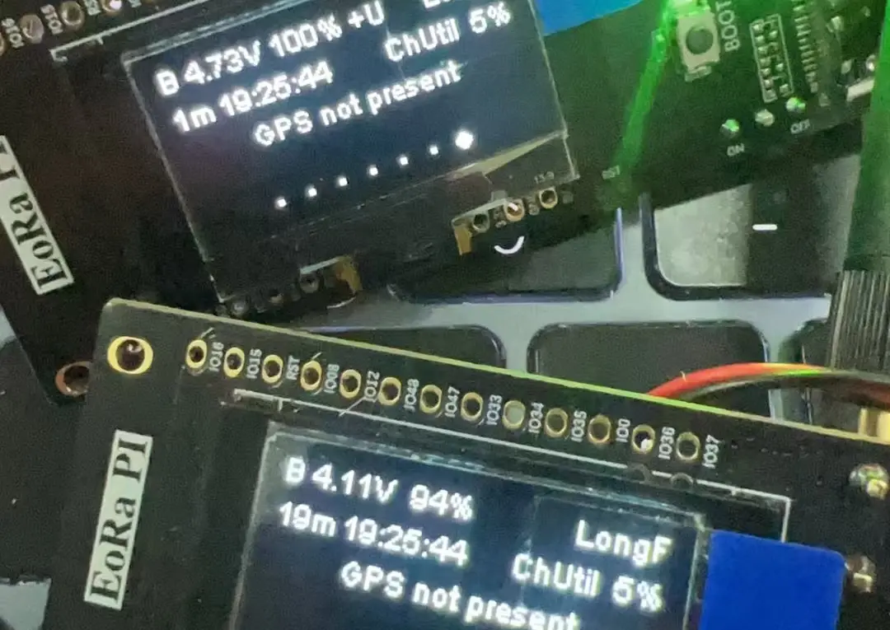

如果你在使用 Meshtastic 设备时发现时间显示不正确，特别是分钟和秒的计时是准确的，但小时数存在误差，那么这很可能是由于时区设置的问题所导致的。对于需要精准时间同步的应用来说，这个问题可能会非常令人沮丧。

经过深入调查，我们发现这一问题的根本原因在于 Meshtastic 设备处理时区的方式存在特殊要求。具体来说， Meshtastic 需要采用 **POSIX时区格式** 来设置时区。

好消息是，你可以通过修改时区设置来解决这个问题。以下是详细的步骤指南，帮助你排查和解决该问题。



## 调查结果

在发现 Meshtastic 设备显示的时间不正确后，可能会先认为这只是一个简单的时区配置问题。通常，你可能会尝试设置或重置时区。但如果这样做后问题仍然存在，即分钟和秒是正确的，但小时数始终不对，那么问题可能在于Meshtastic的固件无法正确解析你输入的时区字符串。

进一步研究发现，Meshtastic 设备需要使用**POSIX时区格式**来进行设置。这种格式不同于我们通常看到的时区名称，例如 “Asia/Hong_Kong” 或 “Asia/Shanghai” 。

## 解决步骤

下面是调整Meshtastic设备时间的详细步骤指南：

1. **确定你所在的时区**
   - Meshtastic使用POSIX时区格式来设置本地时间，因此首先需要确定你所在区域的正确POSIX时区格式。
   - 幸运的是，有一个非常有用的资源可以帮助你查找正确的POSIX时区格式：[POSIX时区数据库CSV文件](https://github.com/nayarsystems/posix_tz_db/blob/master/zones.csv)。
   - 打开上述链接并查找你所在地区的时区。例如，如果你在香港，对应的时区是`HKT-8`；如果你在上海，则是`CST-8`。

2. **访问Meshtastic设备的配置**
   - 为了修改时区设置，你需要连接到Meshtastic设备。你可以使用 **Meshtastic应用程序**（移动端或桌面版）或者 **Meshtastic CLI**，具体取决于你的偏好。
   - 如果你使用 **Meshtastic CLI**，可以通过USB连接设备，并使用相应的串行接口来操作设备的配置。

3. **设置正确的时区**
   - 大多数用户会选择通过 **Meshtastic应用程序** 来设置时区。在应用程序中，你可以在 **设置 -> 设备 -> 时区** 中找到相关选项。
   - 另外，如果你使用 **Meshtastic CLI**，可以使用以下命令来设置时区：
     - **使用 Meshtastic CLI**：执行以下命令更新时区：
       ```
       meshtastic --set time.zone "HKT-8"
       ```
       此命令将设备的时区设置为 **香港时间** (HKT)，并包含 **-8 小时**的偏移量。
     - 如果你在上海，可以使用以下命令设置CST时区：
       ```
       meshtastic --set time.zone "CST-8"
       ```
       需要注意的是，POSIX格式与常见的时区名称有所不同，但对于Meshtastic设备来说，正确使用POSIX格式是确保时间计算正确的关键。

4. **重启设备**
   - 更改时区设置后，Meshtastic模块不会自动重启。你需要手动重启设备以确保新的时区设置生效。

5. **验证更改**
   - 在设置新的时区并重启设备后，你可以通过检查Meshtastic设备上的显示屏或使用CLI来验证时间是否正确。
   - 要使用CLI进行验证，可以运行以下命令：
     ```
     meshtastic --get time
     ```
     该命令将返回设备当前的时间，此时你应该看到正确的本地小时、分钟和秒。
   - 你也可以使用设备上的 **USER 按钮**（即 **BOOT 按钮**）来导航至显示当前时间的屏幕，该屏幕还会显示 **电池电压**、**信道利用率**及 **GPS 信息**。

## 示例

举个例子，如果你之前观察到时间显示存在明显偏差：
- **分钟和秒是正确的**，但**小时数持续不正确**。最初你尝试使用类似于 `Asia/Hong_Kong` 的通用时区名称来设置，但问题依然存在。
- 在参考 **POSIX时区数据库** 后，你将时区更新为 `HKT-8`（香港）或 `CST-8`（上海）。此后，设备上的时间显示便得到了正确同步。

## 其他注意事项

- **为何使用POSIX格式？** POSIX格式广泛应用于嵌入式系统中，因为它能够精确控制时区偏移、夏令时等因素。Meshtastic的固件要求时区以这种特定格式输入，否则将无法正确解析。
- **常见错误**：确保输入的时区字符串正确无误，哪怕是轻微的错误也会导致持续的问题。例如，使用 `HKT-8` 而不是 `Asia/Hong_Kong` 是至关重要的。
- **测试与验证**：设置时区后，建议进行一段时间的测试，尤其是在需要与其他设备保持时间同步的情况下。

## 结论

Meshtastic设备上时间显示不正确的问题主要源于时区配置不当。通过使用正确的**POSIX格式**设置时区，并按照上述步骤操作，你可以确保小时、分钟和秒的显示都准确无误。

参考 [POSIX时区CSV文件](https://github.com/nayarsystems/posix_tz_db/blob/master/zones.csv) 是找到适合你所在区域的时区格式的关键步骤。

遵循这些步骤，并在设置时区后**手动重启设备**，你应该能够解决时间显示的问题，使Meshtastic设备显示正确的本地时间。

