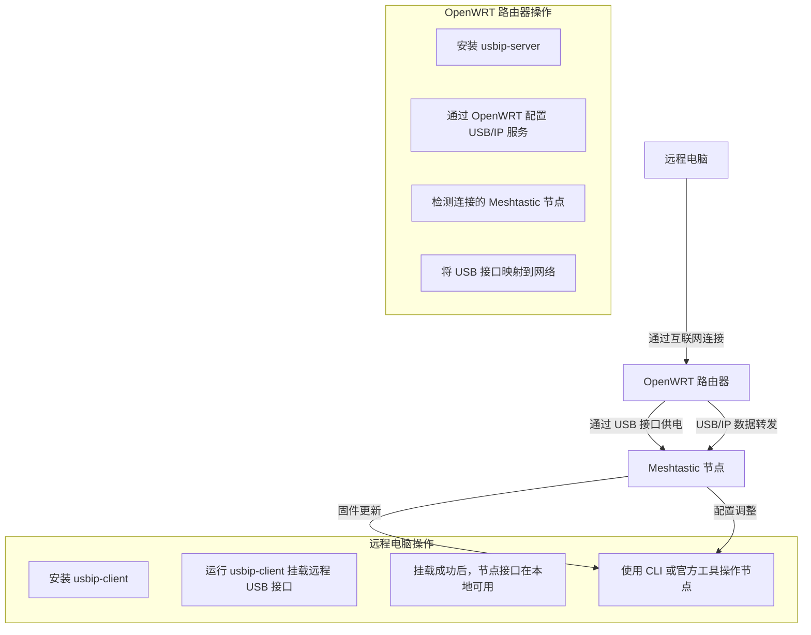

想象这样一个场景：你在一片山区中部署了几个 Meshtastic 节点。这些设备分布在难以到达的高山、塔楼或偏远小村庄中，但幸运的是，这些地方已经通过光纤或卫星接入了互联网。

然而，设备的固件需要定期更新，配置偶尔需要调整，而每次前往这些地方都会耗费大量的时间和精力。

如何在不亲临现场的情况下高效完成这些任务呢？答案来自社区中一位用户的分享——利用 OpenWRT 路由器和 USB/IP 技术，将节点管理变得简单而高效。

## 核心技术与工作原理  

这一方法的核心在于 OpenWRT 路由器和 USB/IP 技术的结合。

> OpenWRT 是一种开源的路由器固件，它赋予普通路由器更强大的功能。

在这种方案中，OpenWRT 路由器不仅提供网络支持，还通过其 USB 接口为 Meshtastic 节点供电。同时，USB/IP 技术让物理 USB 接口通过网络虚拟化，远程电脑可以像操作本地设备一样直接访问节点。

1. 在远程电脑上，通过网络连接到部署在偏远地区的 OpenWRT 路由器。
2. 路由器通过 USB/IP 技术，将 Meshtastic 节点的 USB 接口虚拟化，转发到远程电脑。
3. 路由器的 USB 接口同时为节点供电，确保设备长期运行。
4. 用户通过虚拟化的 USB 接口直接访问节点，进行固件更新、参数调整等操作，就像设备连接在本地一样。

这种架构既充分利用了现有的硬件资源，又让远程管理变得直观、便捷。

## 应用场景  

这一解决方案非常适合那些偏远但已接入互联网的地点。

在山区的通信塔上，设备通常部署在高处，需要专业人员才能触及。但通过 OpenWRT 路由器，这些节点的管理可以转移到远程的电脑上，从而大大减少了现场操作的需求。

在灾害救援的场景中，这一方案也发挥了巨大的潜力。当临时通信网络需要快速调整时，路由器可以通过 USB/IP 技术提供对节点的远程控制，从而避免了救援人员冒险前往危险地区。

除此之外，这一技术还非常适合长期无人值守的通信网络管理。结合太阳能供电，OpenWRT 路由器可以稳定运行，为 Meshtastic 节点提供连续的电源和网络支持。管理者无需频繁造访这些地点，也能确保节点的正常运行和及时更新。

## 真实案例  

在 Meshtastic Reddit 社区中，用户 Tobias Schwarz 分享了他在 [偏远地区管理 Meshtastic 节点的创新做法](https://www.reddit.com/r/meshtastic/comments/1b37lfu/remote_management_and_remote_firmware_updates/) ：

> We have multiple locations that are hard to reach but where we have internet access via an OpenWRT router. The router also has an USB port, so we use that port to power the meshtastic node and use USB/IP to perform remote updates via the IP protocol forwarding the USB port to our local PC.
> 
> 我们有多个难以到达的地点，但这些地方通过 OpenWRT 路由器实现了互联网接入。路由器配备了 USB 接口，我们利用该接口为 Meshtastic 节点供电，并通过 USB/IP 技术将 USB 接口通过 IP 协议转发到本地电脑，从而实现远程更新。

这些地点虽然难以到达，但通过 OpenWRT 路由器实现了互联网接入。借助 USB/IP 技术，他成功地将这些节点的管理转移到远程电脑上，从而大幅简化了设备维护的流程。

首先，他的做法基于一个核心前提：这些难以触及的地点使用了 OpenWRT 路由器作为网络基础设施，同时这些路由器配备了 USB 接口。通过 USB 接口，路由器为 Meshtastic 节点提供稳定的电源支持。此外，他在 OpenWRT 路由器上安装了 `usbip-server`，这是一款用于实现 USB/IP 功能的开源工具。`usbip-server` 的作用是将路由器上的 USB 接口通过网络虚拟化，供远程设备使用。

具体操作流程是这样的：
1. Meshtastic 节点通过 USB 接口连接到 OpenWRT 路由器，并由路由器供电和管理。
2. 安装了 `usbip-server` 的路由器将这个 USB 接口暴露在网络上。
3. 然后，他在自己的 Linux 电脑上安装了 `usbip-client`，这是 `usbip` 技术的客户端工具。
4. 通过 `usbip-client`，他可以将远程路由器上的 USB 接口“挂载”到本地电脑，使其在操作系统中显示为一个本地设备。

这样的架构让他能够像直接将 Meshtastic 节点插入本地电脑一样操作设备。从固件更新到配置调整，所有操作都可以在远程完成，而不需要亲自前往节点所在的地点。这种做法不仅解决了节点维护中的地理限制问题，还使得设备能够始终保持最新的固件版本，从而提高网络的稳定性和可靠性。

这一技术的核心构思在于充分利用了现有的硬件和开源软件工具。OpenWRT 路由器的多功能性为 Meshtastic 节点提供了稳定的电力和网络支持，而 USB/IP 技术则实现了跨越物理距离的设备操作。通过这种方法，他不仅节省了大量时间和人力，还为 Meshtastic 节点的远程管理提供了一个可复制、可扩展的解决方案。

从用途上看，这种做法特别适合那些长期运行在偏远地区的 Meshtastic 节点。无论是山区通信塔、乡村基站、科考站，还是灾害救援中的临时网络，这套方案都展现了其独特的实用性。

此外，这种技术思路也为其他类型的远程设备管理提供了参考。无论是在复杂地形中优化网络，还是在资源受限的环境中实现自动化，这一案例都展示了社区智慧如何转化为实际应用。