> 本次 [投稿](https://meshcn.net/meshcn-blog-call-for-articles/) 来自*西安-QinlingMesh*，他用实际行动展现了 DIY 的无限可能。感谢他的用心分享，为社区带来了如此实用且高性价比的 DIY 方案。
> 同时，也欢迎大家 [踊跃投稿](/meshcn-blog-call-for-articles/)，把你们的创意和经验分享给更多的 Meshtastic 爱好者！

## 编者按

这次的 DIY 文章再一次刷新了我们的认知！本以为上一篇 DIY Meshtastic 节点，用 [nRF52 开发板和现成 LoRa 模块飞线平替 Heltec T114](/meshtastic-diy-nrf52840-lora-sx1262-setup/) 已经够硬核了，没想到这次群友更进一步，直接自己做了 T114 的配套 GPS 模块，连天线都 DIY 了。

不得不说，这位 [Meshtastic 中国群](/contact/) 群友的 DIY 热情和动手能力简直炸裂！

标题里写的「定位模块也能 DIY？生死看淡，价格砍半」，其实是为了押韵，准确性难免有所妥协。说实话，这砍的可不是一半。原本 Heltec T114 套餐里配个 GPS 模块，得多花六七十块钱，如今群友大手一挥，20 块钱就整出了个一模一样的，还保留了原版的性能。这哪是砍半，这分明是手起刀落，价格直接腰斩还多！

无论如何，DIY 的乐趣和性价比永远让人心动。感谢群友为 MeshCN 社区带来的分享，让更多人受益！

另外，为了让更多对技术不是很熟悉的读者也能轻松理解这篇文章，我在原文基础上加入了大量的解释和描述。同时，对章节的顺序进行了调整，使内容更符合实际操作的流程，方便大家一步步跟着做，不迷路！

## Heltec T114 的定位模块

Heltec T114 是社区里颇为流行的 Meshtastic 方案。在社区博客右上角点击放大镜图标 🔍 搜索 T114，你能发现大量文章。

而在购买 T114 时，往往有不同规格组合可供选择。每个组合覆盖了不同用户的需求，从最低功耗的基础版本到全功能的顶配版本，可谓选择丰富。

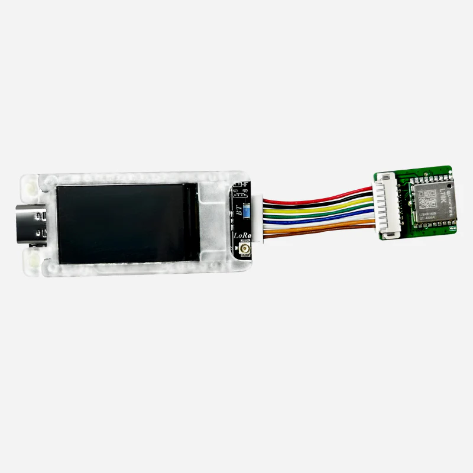

但仔细分析后你会发现，加装 GNSS 模块的版本普遍贵了不少，这也是为什么要 DIY 的原因，除了享受动手的乐趣，更重要的是可以省下不少钱呢。

「等等，GNSS 模块是什么东西？我只听过 GPS 呢。」是的，很多人都听过 GPS，但对 GNSS 可能感到陌生。其实，GPS 是 GNSS（全球导航卫星系统）的一部分，属于美国的卫星定位系统，而 GNSS 是一个更大的概念，包含了全球多个国家和地区的导航系统，比如中国的北斗（BDS）、欧洲的伽利略（Galileo）、俄罗斯的格洛纳斯（GLONASS）等。

简单来说，GPS 是 GNSS 的一个「分支」，而 GNSS 则是所有导航系统的「大家庭」。使用 GNSS 模块的好处在于，它能结合多个系统进行定位，提供更高的精度和更广的覆盖范围。

在 Meshtastic 领域里，一个 GNSS 模块除了提供精确定位外，也有另外一个重要作用——提供精确时间。后续 MeshCN 社区会推出文章针对这部分详细解释。

## 为什么要 DIY GNSS 模块？

| 套餐组合名称   | 屏幕 | 外壳 | GNSS模块 | 价格 (¥) | 备注                     |
|----------------|----------|----------|--------------|--------------|------------------------------|
| 极限待机       | ❌       | ❌       | ❌           | 189          | 最基础版本，适合低功耗需求   |
| 极限待机       | ❌       | ❌       | ✅           | 259          | 加装GNSS模块，定位功能齐全   |
| 官方标配       | ✅       | ❌       | ❌           | 209          | 默认配置，方便查看屏幕信息   |
| 官方标配       | ✅       | ❌       | ✅           | 269          | GNSS模块加持，屏幕显示定位   |
| 极限通信       | ✅       | ✅       | ❌           | 236          | 带外壳的高级版本，无GNSS     |
| 极限通信       | ✅       | ✅       | ✅           | 299          | 带屏幕和外壳的顶配版本       |

我们先来看各个套餐的差价：  

1. 极限待机版：基础款（无 GNSS 模块）售价 ¥189，而带 GNSS 模块的版本要 ¥259，多了 ¥70。  
2. 官方标配版：无 GNSS 的售价 ¥209，带 GNSS 的则要 ¥269，差价 ¥60。  
3. 极限通信版：包含屏幕和外壳的版本，无 GNSS 售价 ¥236，而有 GNSS 的售价 ¥299，整整贵了 ¥63。

可以看出，几乎所有套餐中，只要加装 GNSS 模块，价格都会提升 60 到 70 块。这一差价远高于我们自己 DIY 的成本（仅需 ¥20.5），而且 DIY 的模块在性能上毫不逊色甚至更优。通过动手制作，不仅能体验 DIY 的乐趣，还能有效降低成本。

对于追求性价比和喜欢动手的小伙伴来说，DIY GNSS 模块是一个非常划算的选择！

值得一提的是，官方 T114 套餐中配备的 GNSS 模块正是本文 DIY 的核心部件——移远 L76K。这是一款性能可靠的双模定位模块，DIY 使用的模块与官方模块完全相同，因此在兼容性上无需担心，完全无缝对接！通过 DIY，我们可以用更低的成本复刻官方配置。

事不宜迟，我们开始 DIY 的旅程！撸起袖子，开始动手。

## 原本 Heltec T114 的设计

首先，我们要研究下原本 Heltec T114 是怎么设计的。

### Heltec T114 GPS/GNSS 部分接线端子图

Heltec T114 的 GNSS 接线端子是其设计的重要部分，它的布局和接口方式决定了其与 GNSS 模块的兼容性。在设计上，T114 直接为移远 L76KB-A58 模块预留了标准的连接接口。通过这样的设计，移远 L76KB-A58 模块可以直接插入并使用（Plug and Play），无需额外调整接线或接口逻辑。

我们在 DIY 时需要参考 Heltec T114 的接线方式，确保制作出的模块能够与其完全兼容。这样不仅简化了操作，也避免了因接口不匹配而导致的调试问题，真正实现了即插即用。

从以下原理图中，能看到 Heltec T114 GNSS 端子每个引脚的定义。  

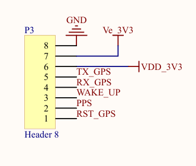

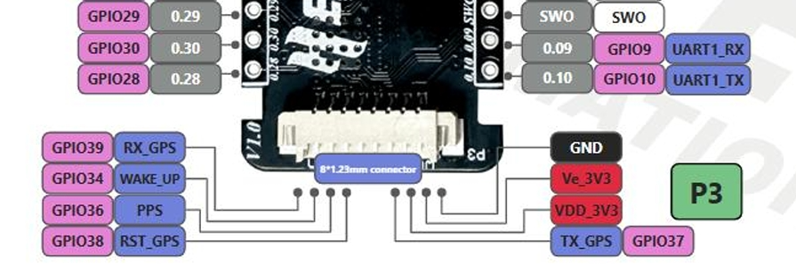

### GNSS 定位模块——移远 L76KB-A58

我们看完 Heltec T114 后，接下来，则要研究下 GNSS 模块本身是怎么个通讯法。

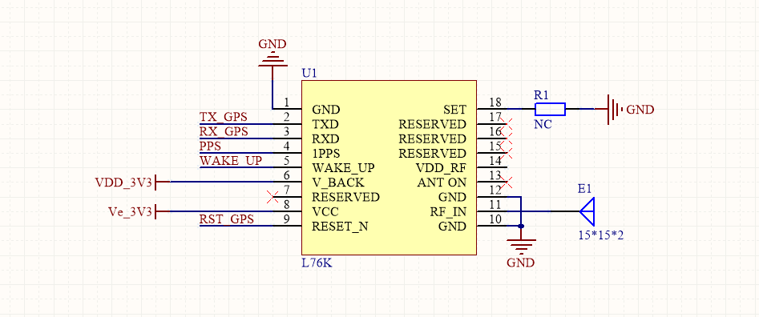

这张电路图展示了移远 L76K GNSS 模块的连接设计，包括电源、信号接口和天线部分。

电源由 VDD_3V3 引脚提供 3.3V 主供电，Ve_3V3 引脚则用于备份电源，支持 RTC 和数据保存，即使断电也能保留定位信息。

信号接口通过 TX GPS 和 RX GPS 实现模块与外部设备的 UART 通信，PPS 引脚输出每秒同步脉冲信号用于时间同步，WAKE UP 引脚用于唤醒模块，RESET_N 引脚实现模块复位。天线部分通过 RF_IN 引脚连接到外部陶瓷天线，确保信号接收，并由 ANT ON 引脚控制有源天线的供电。

## 开始设计

既然搞懂了原本是怎么设计，接下来我们就可以开始动手设计了。

按照正常的 PCB 工业设计流程，我们会先画原理图，后根据原理图布线，最终画出 PCB 图。有了 PCB 图，我们就可以导出成生产文件 Gerbers，这个格式发给 PCB 制作商就能在几天内收到自己亲手设计的 GNSS 模块板子啦。

### 原理图

没错，这就是我们设计的原理图。

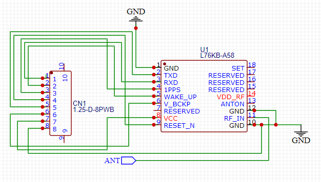

左侧是要与 T114 自带 GNSS 接口兼容的 8 个引脚端子，右侧则是我们的主角——移远 L76KB-A58 GNSS 模块。除此以外，还有接地、和天线部分。

电源方面，VCC 引脚为模块提供主电源（3.3V），V_BCKP 引脚用于维持 RTC 和备份存储器供电，VDD_RF 引脚为射频电路供电，多个 GND 引脚确保电气参考点的稳定性。

信号接口通过 UART 串口实现通信，TXD 引脚输出 GNSS 数据，RXD 引脚接收外部命令，1PPS 引脚提供每秒同步脉冲信号，WAKE_UP 引脚唤醒模块，RESET_N 引脚复位模块。

天线部分通过 RF_IN 引脚接收 GNSS 信号，外部天线连接到 ANT 接口以增强定位性能。实物中，我们天线使用了陶瓷天线，直接焊接在电路板上。

### PCB 图

原理图完工后，就要设计 PCB。基本上，按照前文设计的原理图去做就好了。

搞定，这就是我们设计的 PCB。👇

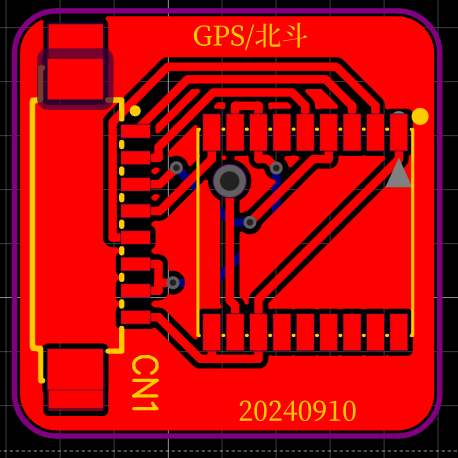

在让 PCB 制造商生产的时候，建议设置电路板厚度为 1.6mm，天线的引脚与电路板的厚度刚好匹配，做到无缝嵌合。

## 组装

### 材料选购（BoM）

| 材料名称          | 规格/类型              | 价格（元） | 备注                   |
|-------------------|-----------------------|-----------|------------------------|
| L76KB-A58 移远双模模块 | -                   | 16.00     | 旗舰店参考售价              |
| GPS 陶瓷天线       | 20x20                | 3.00      | 抓星速度快，推荐规格       |
| 接插件            | 8P 1.25 卧式贴片插座  | 0.18      | -                      |
| GPS 连接线        | 8P 1.25 双头反向      | 0.83      | -                      |
| 自制电路板 PCB         | -                   | 0.50      | 建议电路板厚度 1.6mm     |
| **合计成本**       | -                   | **￥20.51** | **每枚总成本**          |

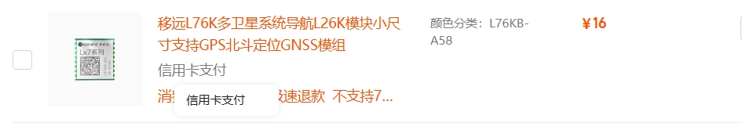
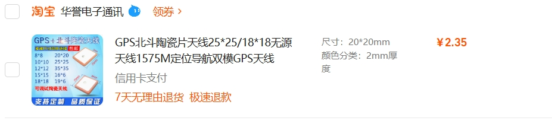

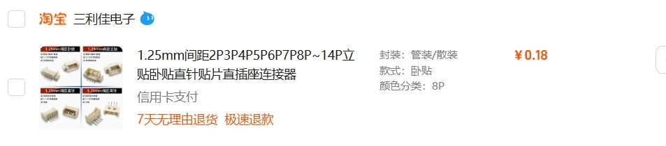
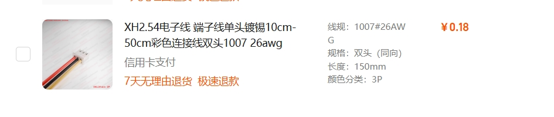

上述截图仅供参考，目的是让大家更方便地找到这些材料，并不是说必须选择我购买的那家店。

强烈建议大家货比三家，根据实际需求和预算，选择性价比最高、最适合自己的商家。

DIY 的魅力就在于灵活与个性化，希望大家都能找到满意的材料！

### 把元器件焊到 PCB 上

PCB 到手后，我们就可以把元器件组装到 PCB 上了。

要注意的是，陶瓷天线的引脚需直接焊接在电路板上。

实物组装起来就是这样啦 👇！

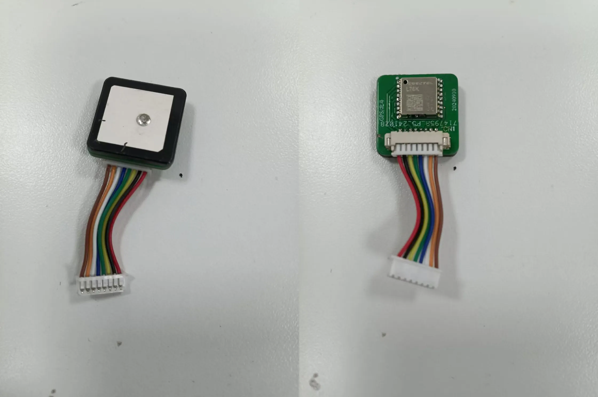

左图能看到陶瓷天线完美嵌合在 PCB 上；右侧则能看到 GNSS 模块以及和 T114 完美兼容即插即用的 8P 端子。

## 温馨提醒 💡

Meshtastic 终端元器件中 GPS 定位模块是重要的功耗大户。尤其是终端长期在室内使用时，系统接收不到定位信息会「很焦虑」，频繁通信，导致电池待机时间大幅减少。因此，建议开机时在室外使用。

另外，陶瓷天线建议选择 20x20 规格，抓星会更快，实测效果良好。
