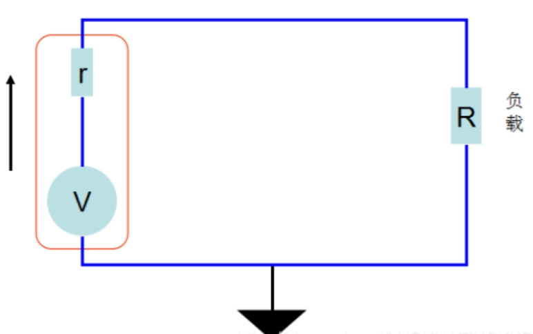
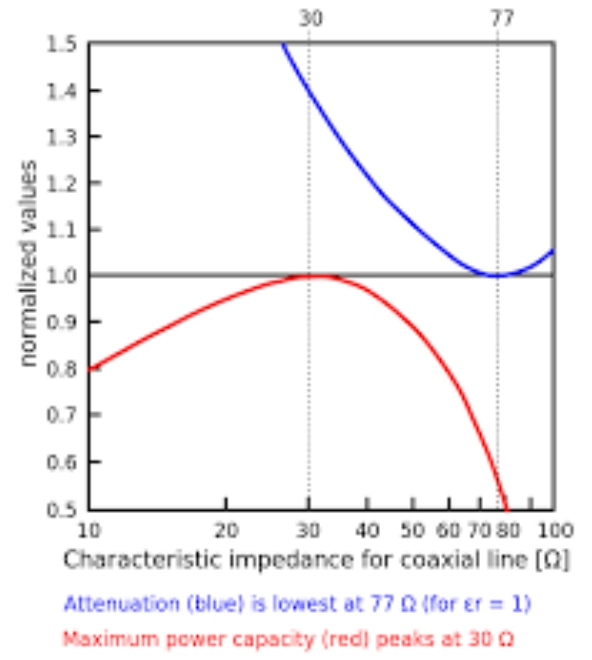
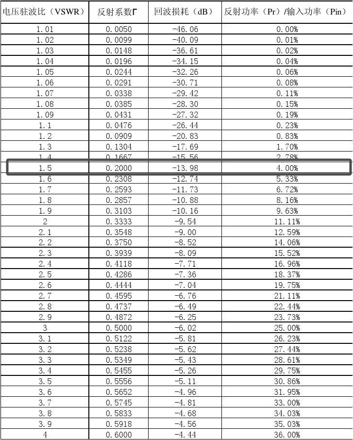
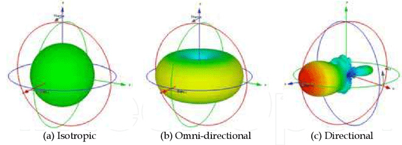
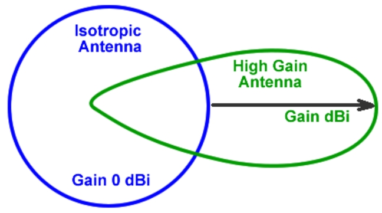

我将从两个不同的方面去帮你理解增益、驻波和方向性。

## 从定义出发

天线是电磁波的发射或接收设备，用于无线通信中，它将电信号转换为电磁波（或者反之），在不同的应用场景中，天线的设计和性能对通信质量起着至关重要的作用。常见的天线参数包括驻波比（VSWR）、增益、定向性等，下面将逐一介绍这些概念以及它们在天线设计中的应用。

### 1. 驻波（Standing Wave）

驻波是指在传输线（如同轴电缆）上由于信号反射而形成的波动现象。简单来说，它是由于信号的传输波和反射波在某些条件下相遇并叠加，导致在某些地方波幅最大（波腹），而在某些地方波幅为零（波节点）的现象。

在天线设计中，驻波通常由匹配不良的天线和馈线系统引起，这会导致信号的反射，从而降低系统的效率。驻波比（VSWR，Voltage Standing Wave  Ratio）是用来衡量信号反射程度的指标，它是最大电压与最小电压之比。理想情况下，驻波比应接近1：1，表示没有反射，所有信号都被有效传输。

### 2. 增益（Gain）

天线的增益是衡量天线在某一方向上相对于一个理想天线（通常是全向天线或偶极子天线）的辐射能力。增益通常以分贝（dB）为单位来表示，表示天线在某个方向上输出功率的提升。

增益不仅取决于天线的设计和尺寸，还受到天线形状、工作频率和环境的影响。增益越高，天线在某一方向上辐射的功率越集中。增益可以分为两种：

- **方向性增益**：指天线在某一特定方向上辐射功率的集中程度。
- **总增益**：指天线所有方向上的辐射总能量。

### 3. 定向天线（Directional Antenna）

定向天线是指具有较强方向性的天线，它的辐射能量集中在一个特定的方向上。定向天线通常用于需要较长距离传输或者高信号质量的场合，因为它能够在指定的方向上提高信号的强度和稳定性。常见的定向天线包括抛物面天线、碟形天线、Yagi天线等。

定向天线的优点在于它可以减少信号的损耗和干扰，特别是在长距离传输中。缺点则是需要精确对准目标方向，否则会导致信号丢失或衰减。

### 4. 全向天线（Omni-Directional Antenna）

全向天线是指能够在水平方向上辐射均匀电磁波的天线。换句话说，它能够在360度范围内均匀地发射或接收信号，适用于需要广泛覆盖的无线网络或通信系统。

常见的全向天线有偶极子天线和垂直天线等。全向天线的优点是无需特别对准方向，适用于覆盖大范围区域的场景（如Wi-Fi热点、手机通信等）。然而，其缺点是由于其辐射能量在所有方向上均匀分布，因此相对于定向天线，单个方向上的增益较低。

### 5. 定向天线与全向天线的比较

| 特性       | 定向天线                                 | 全向天线                              |
| ---------- | ---------------------------------------- | ------------------------------------- |
| 辐射模式   | 辐射能量集中在某一特定方向               | 辐射能量均匀分布在水平方向上（360度） |
| 增益       | 高增益，适用于远距离传输                 | 低增益，适用于短距离传输和广域覆盖    |
| 适用场景   | 长距离、点对点通信，如卫星通信、微波链路 | 广域覆盖，如Wi-Fi、移动通信等         |
| 安装与对准 | 需要精准对准目标方向                     | 不需要特别对准方向                    |
| 方向性     | 强方向性（例如，Yagi天线、抛物面天线）   | 无方向性，辐射覆盖全方位              |

> [!NOTE]
>
> 选自《天线原理和技术》

------

是不是很枯燥，接下来我将从工程的角度帮你解析。

## 从工程角度出发

驻波是发射机与天线之间阻抗匹配的程度取决于双方，增益是指天线衡量天线某一方向上的辐射能力，且具有方向性仅取决于天线本身的特性。

> [!IMPORTANT]
>
> 能量守恒定律是接下来每次所谈论的中心

### 1.驻波

VSWR=1时，这意味着所有的信号都被有效传输到天线并辐射出去，而没有任何反射回发射机或馈线，此时的阻抗完全匹配功率达到最大。

用我们初中所学的例子：

什么时候负载功率最大？答：当负载电阻与电源内阻相同时。同理天线也一样，但我们在设计天线或者购买天线的时候怎么知道发射端的阻抗是多少？

#### 50欧姆

其实厂家们通常把阻抗设计到50欧姆，这算是行业的标准，如果不统一这会导致天线也不统一你需要有多个阻抗不同的天线。最主要的原因是50欧姆的同轴电缆性能处于中间位置（并不是工程师喜欢50欧姆）。损耗小的同轴电缆其特征阻抗分别是30欧姆和77欧姆。其中，30欧姆的同轴电缆可以传输的功率是最大的，77欧姆的同轴电缆传输信号的损耗是最小的。30欧姆和77欧姆的算术平均值为53.5欧，方便计算我们取50欧。

接着我们回到驻波上，若并未完全匹配剩下的能量去哪了？由能量守恒定律可以知道能量不能凭空消失，天线未发射出去的能量是又返回到了发射端，**这就是为什么我们在未接入天线的时候不可发射信号！！！** 此时根本没有负载能将能量「发泄」出去而是全部返回到了发射端。

那么VSWR=1在实际情况为理想条件，大多数的情况为1.5左右，可以通过查表的方式判断我们的发射效率。例如VSWR=1.5时，我们的损耗功率为4%，也就是说发射端为100W，天线能辐射出去96W。

### 2.增益

增益不要被「增」所误导，无源天线并**没有放大能量的能力**（因为能量守恒），他只是可以将能量集中起来。我们常见的单位是dBi通常可以等同于dB。

那么什么是全向天线什么是定向天线？这个就是字面意思了。全向天线类似光源在源点光线360°的发射，定向天线可以类似于手电筒指在那个方向哪里就亮，后者很能理解出这是通过能量集中的方式。但为什么全向天线还有增益？根据能量守恒全向天线360°应该1W进，1W出呀，为什么这个表中全向天线增益是2dBi？这不是放大了一定的倍数么？

确实是「放大了」，但所谓的360°我们是指的是**水平方向**的，现实中还有**垂直方向**的，我们可以看下图的方向图（b）类似一个苹果，能看到其实就是把垂直方向的能量集中到水平方向，故就导致「增大了」。

定向天线也是同理

> [!IMPORTANT]
>
> **能量守恒！！！**

所以说小时候动卫星锅，容易挨揍，是因为定向天线需要「瞄准」！！！