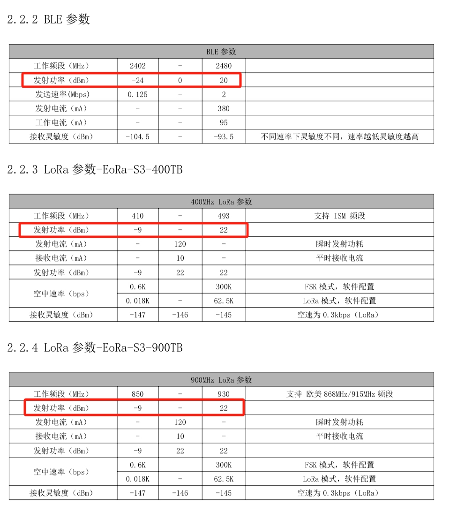

本文将详细介绍天线常见的单位dB，并用最通俗易懂的语言帮助你理解。

## 什么是dB？

在Meshtastic app里常有这一项，这具体是指的什么意思呢？其实这就是一种表示功率大小的单位。

**dB（分贝）** 是一个用来表示 **信号强度、功率、幅度比** 的单位。你可以把它看作一种 **"衡量变化"** 的工具，它告诉我们两个量之间的 **相对大小**。它的作用就像我们测量声音的音量一样，不是直接用数字去表示，而是用一个方便的方式来表示它们之间的比值。

## 通俗理解 dB：

想象一下，你在一个安静的房间里听到了一些声音。当你把音量增加一倍时，声音会变得更加响亮。如果你增加更多的音量，它就变得更加响亮，但你听到的变化是 **逐渐递增** 的。

分贝就是用来 **度量这种变化** 的单位，它并不是一个简单的线性数值，而是 **对数** 的度量方式。对数让我们能够把非常大的变化浓缩成一个更容易理解的范围。

------

## 1. **为什么用 dB？**

- **简化计算**：我们的世界中有很多非常大或非常小的数值，例如，声音的音量可以从微弱的耳语到震耳欲聋的噪音，功率可以从微弱的信号到强大的电力。直接用这些大数字表达不方便，而用 dB 表示这些变化，就会更容易处理。比如说你在坐标轴上要表示1000000000000W是非常困难的，但作为无线电爱好者我们可以用120dB去表示。
- **符合人类的感知**：我们的耳朵对于声音的感知是对数性的。也就是说，声音的强度翻倍时，我们感觉到的“响度”并不是线性增加的，而是以某种比例增加的。所以 dB 这种单位也很符合我们的直觉感受。

## 2. **如何理解 dB 的变化？**

- **举个例子**：假设你有两个人在说话，一个说得很小声，另一个说得很大声。如果你用 dB 来表示，假设小声的声音是 30 dB，大声的声音是 60 dB。**60 dB 的声音比 30 dB 的声音强一百倍**，但你并不是直接用“100倍”来表示，而是用 dB 来浓缩这个变化。
- **dB的增加**：每增加 10 dB，听起来大概是 **声音强度翻倍**。如果你从 30 dB 增加到 40 dB，声音大约会变得两倍响亮。如果你再增加 10 dB，从 40 dB 增加到 50 dB，声音又会变得两倍响亮。所以，dB 让我们可以表达这种“倍数变化”的关系。

## 3. **dB 的常见用途**

- **声音的音量**：音响系统、电视、耳机等常用 dB 来表示音量的大小。例如，耳机的最大输出可能是 120 dB，意味着它可以非常响，而一个安静的环境可能是 30 dB。
- **信号强度**：在无线通信中，dB 用来表示信号的强度。信号的强度可能会因为距离、障碍物等原因减弱，dB 就帮助我们量化这种衰减。例如，如果你离发射器很远，信号强度会减少很多，可能是 -30 dB，表示信号已经非常弱。
- **功率比**：如果你想知道两个设备的功率差距，可以用 dB 来表示。例如，10 dB 的差距就表示一个设备的功率是另一个的 **10倍**。

## 4. **如何理解 dB 和物理单位的关系**

 **dB 本身没有单位！！！**，但它总是与某个物理量（如功率、电压或幅度）相联系，通常你会看到 dB 与某个参考单位一起出现：

- **dBW（分贝瓦特）**：表示功率的比值，相对于 1 瓦特的功率。
- **dBm（分贝毫瓦）**：表示功率的比值，相对于 1 毫瓦特的功率。
- **dBV（分贝伏特）**：表示电压的比值，相对于 1 伏特的电压。
- **dBμV（分贝微伏）**：表示电压的比值，相对于 1 微伏特的电压

## 5. **如何计算 dB？**

- 对功率的 dB 计算公式是：
  $$
  \text{dB} = 10 \times \log_{10}\left(\frac{P_2}{P_1}\right)
  $$
  这里，**P2**和**P1** 分别是两个功率的数值。计算出来的结果就告诉你功率之间的差距。

## 6. **实际常用**：

### 1. **一倍和两倍的直观理解**

假设我们谈论的是 **功率** 或 **信号强度**，那么：

- **一倍**：如果两个信号或两个功率值相等，我们可以说它们的比例是 **1:1**，或者说它们是 **“一样强”** 的。这个比例对应的 **dB** 值是 **0 dB**。
- **两倍**：如果其中一个信号或功率值是另一个的 **两倍**，它们之间的比例是 **2:1**。这个比例对应的 **dB** 值并不是简单的 **+2 dB**，而是根据对数公式计算的。

### 2. **功率的两倍（3dB）**

- **功率增加一倍**：当功率从 **P1** 增加到 **两倍** 时，dB 的变化是 **+3 dB**。也就是说，功率 **翻倍** 相当于在 dB 中增加 3 个单位，**P2=2×P1**功率翻倍，代入公式计算：
  $$
  \text{dB} = 10 \times \log_{10}\left(\frac{P_2}{P_1}\right)=10×log⁡10(2)≈3 \text{dB}
  $$
  所以，功率翻倍相当于增加 **3 dB**。

- **功率减少一半**：如果功率减少到原来的一半，dB 的变化是 **-3 dB**。

> [!CAUTION]
>
> 我需要在强调一点的是**dB**本身是一个无单位的相对单位，它本身没有固定的单位。这意味着 dB 用来 **表示两个数值之间的比值**或**比例**，而不是直接表示某种物理量（如功率、电压、音量等）的绝对数值。它是一个度量 **相对变化** 或**增减比**的工具。

**dB默认是dBW分贝瓦,dBw为分贝毫瓦**

**1 W** → **0 dB**

**2 W** → **0 + 3 dB = +3 dB**

**4 W** → **0 + 3 + 3 dB = +6 dB**

**10 W** → **0 + 10 dB = +10 dB**

**20 W** → **0 + 10 + 3 dB = +13 dB**

**100 W** → **0 + 10 + 10 dB = +20 dB**

**1 mW** → **0 dBm**

**2 mW** → **0 + 3 dBm = +3 dBm**

**1000 mW** → **0 + 10 + 10 +10 dB = +30 dBm**

------

## 接下来你肯定也知道了这都是什么意思了！！！

